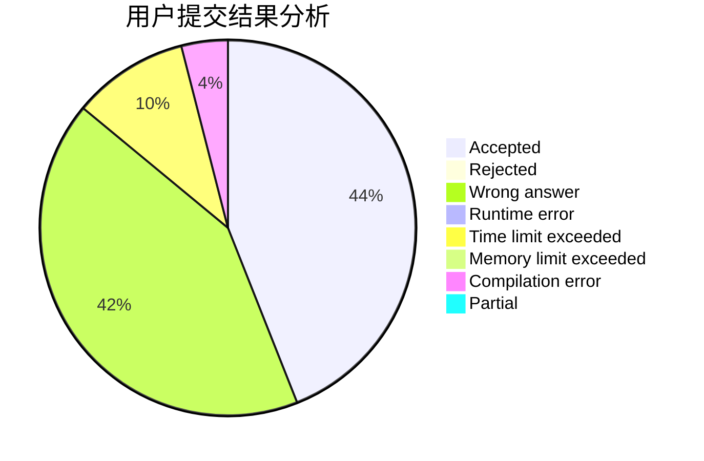
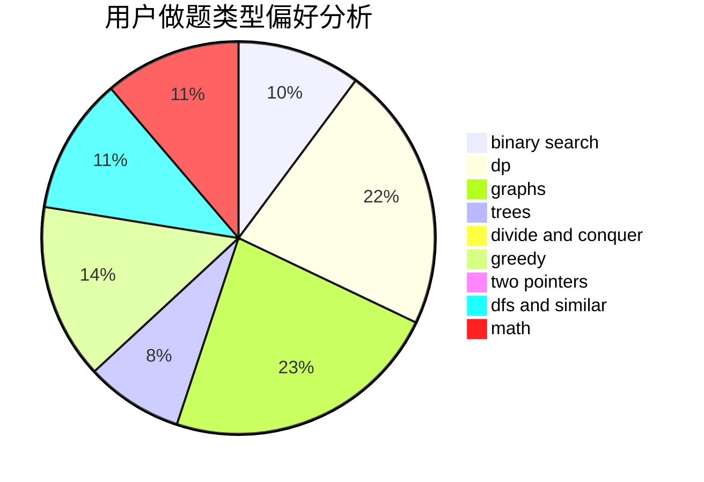

# e792a8

<!-- tabs:start -->

#### **用户提交结果分析**

#### **用户做题类型偏好分析**

<!-- tabs:end -->
# 推荐题目
[1446E](https://codeforces.com/contest/1446/problem/E)
[19A](https://codeforces.com/contest/19/problem/A)
[300E](https://codeforces.com/contest/300/problem/E)
[1146A](https://codeforces.com/contest/1146/problem/A)
[923D](https://codeforces.com/contest/923/problem/D)
[884D](https://codeforces.com/contest/884/problem/D)
[1434E](https://codeforces.com/contest/1434/problem/E)
[609E](https://codeforces.com/contest/609/problem/E)
[1099D](https://codeforces.com/contest/1099/problem/D)
[454A](https://codeforces.com/contest/454/problem/A)
