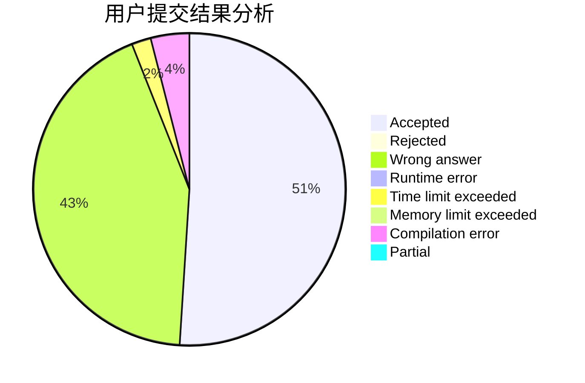
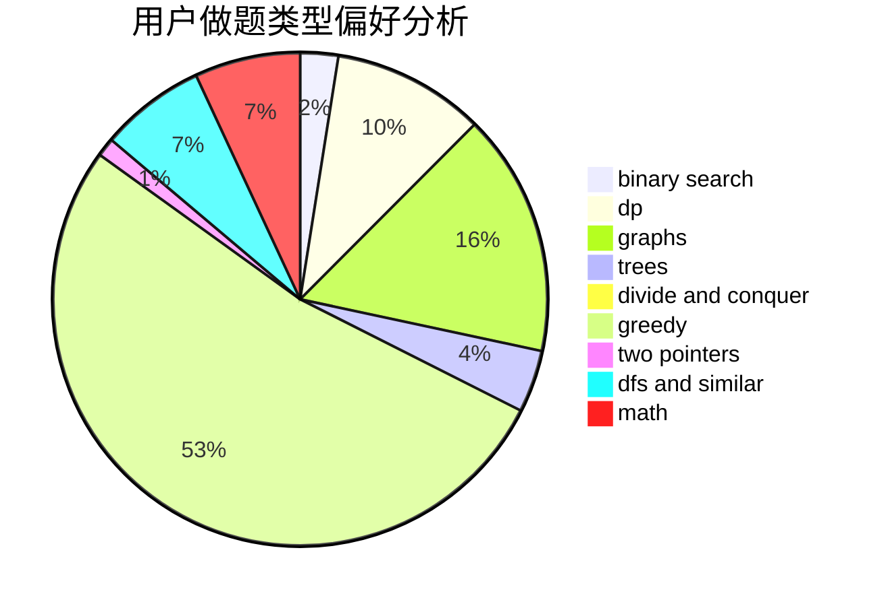

# eastred

<!-- tabs:start -->

#### **用户提交结果分析**

#### **用户做题类型偏好分析**

<!-- tabs:end -->
# 推荐题目
[1388D](https://codeforces.com/contest/1388/problem/D)
[1447B](https://codeforces.com/contest/1447/problem/B)
[819A](https://codeforces.com/contest/819/problem/A)
[266B](https://codeforces.com/contest/266/problem/B)
[1153C](https://codeforces.com/contest/1153/problem/C)
[1091A](https://codeforces.com/contest/1091/problem/A)
[906C](https://codeforces.com/contest/906/problem/C)
[765C](https://codeforces.com/contest/765/problem/C)
[494B](https://codeforces.com/contest/494/problem/B)
[933A](https://codeforces.com/contest/933/problem/A)
