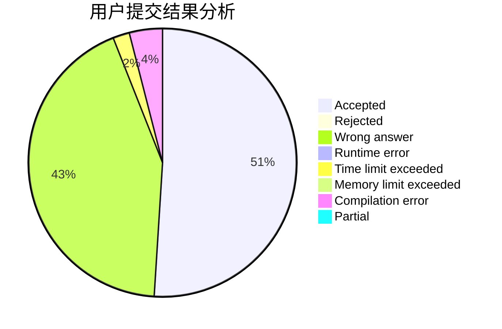
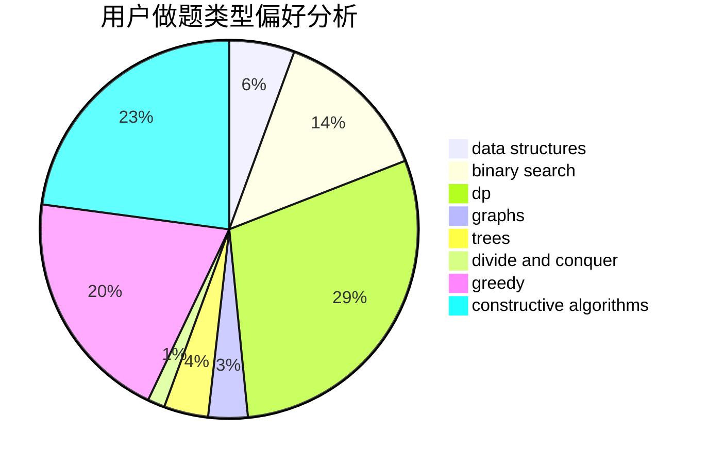
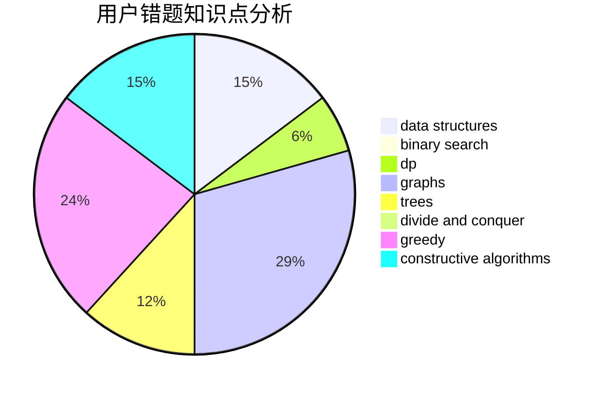

# eastred

<!-- tabs:start -->

#### **用户提交结果分析**

#### **用户做题类型偏好分析**

#### **用户错题知识点分析**

<!-- tabs:end -->
# 推荐题目
[1379D](https://codeforces.com/contest/1379/problem/D)		binary search,
                        brute force,
                        data structures,
                        sortings,
                        two pointers		  
[1437E](https://codeforces.com/contest/1437/problem/E)		binary search,
                        constructive algorithms,
                        data structures,
                        dp,
                        implementation		  
[803C](https://codeforces.com/contest/803/problem/C)		constructive algorithms,
                        greedy,
                        math		  
[245H](https://codeforces.com/contest/245/problem/H)		dp,
                        hashing,
                        strings		  
[1151C](https://codeforces.com/contest/1151/problem/C)		constructive algorithms,
                        math		  
[1090D](https://codeforces.com/contest/1090/problem/D)		constructive algorithms		  
[887B](https://codeforces.com/contest/887/problem/B)		brute force,
                        implementation		  
[746A](https://codeforces.com/contest/746/problem/A)		implementation,
                        math		  
[475B](https://codeforces.com/contest/475/problem/B)		brute force,
                        dfs and similar,
                        graphs,
                        implementation		  
[914B](https://codeforces.com/contest/914/problem/B)		games,
                        greedy,
                        implementation		  
