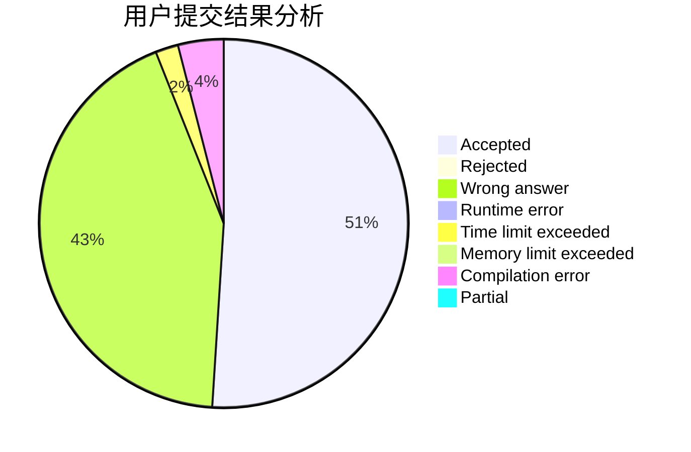
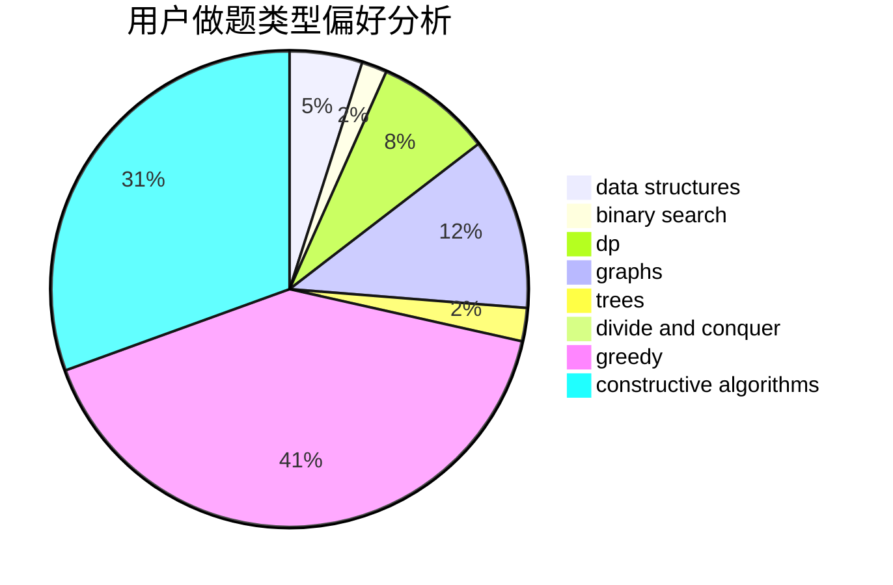
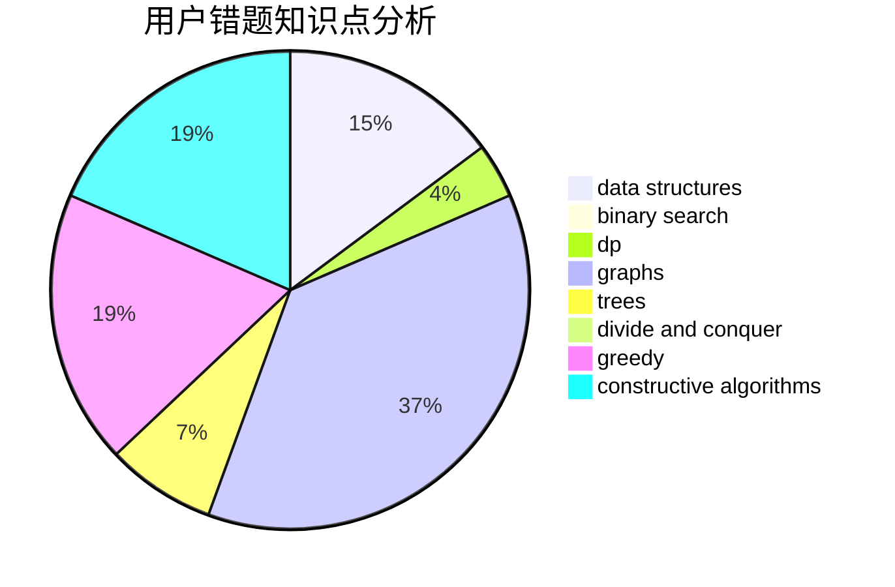

# eastred

<!-- tabs:start -->

#### **用户提交结果分析**

#### **用户做题类型偏好分析**

#### **用户错题知识点分析**

<!-- tabs:end -->
# 推荐题目
[1388D](https://codeforces.com/contest/1388/problem/D)		data structures,
                        dfs and similar,
                        graphs,
                        greedy,
                        implementation,
                        trees		  
[1447B](https://codeforces.com/contest/1447/problem/B)		greedy,
                        math		  
[819A](https://codeforces.com/contest/819/problem/A)		games,
                        greedy		  
[266B](https://codeforces.com/contest/266/problem/B)		constructive algorithms,
                        graph matchings,
                        implementation,
                        shortest paths		  
[1153C](https://codeforces.com/contest/1153/problem/C)		greedy,
                        strings		  
[1091A](https://codeforces.com/contest/1091/problem/A)		brute force,
                        implementation,
                        math		  
[906C](https://codeforces.com/contest/906/problem/C)		bitmasks,
                        brute force,
                        dp,
                        graphs		  
[765C](https://codeforces.com/contest/765/problem/C)		math		  
[494B](https://codeforces.com/contest/494/problem/B)		dp,
                        strings		  
[933A](https://codeforces.com/contest/933/problem/A)		dp		  
