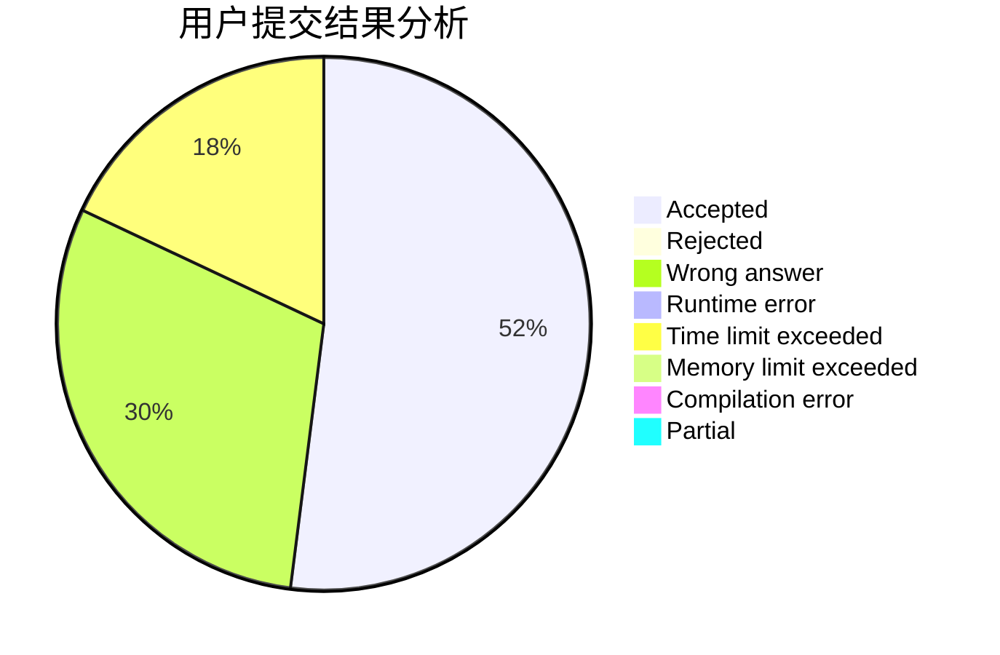
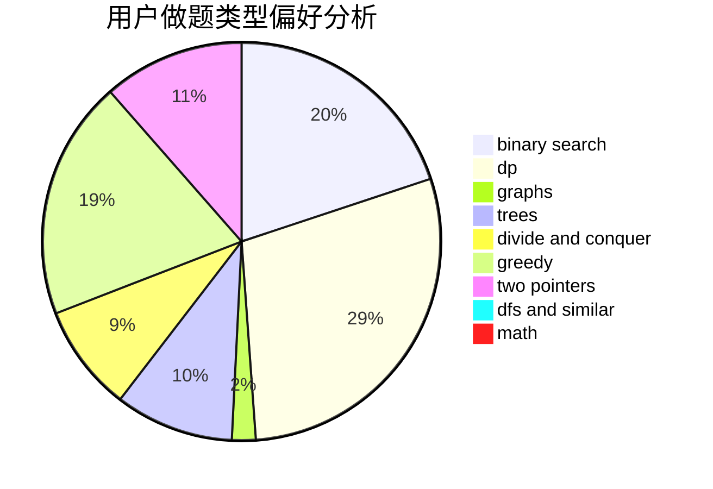

# eddyboy

<!-- tabs:start -->

#### **用户提交结果分析**

#### **用户做题类型偏好分析**

<!-- tabs:end -->
# 推荐题目
[463C](https://codeforces.com/contest/463/problem/C)
[1059A](https://codeforces.com/contest/1059/problem/A)
[58E](https://codeforces.com/contest/58/problem/E)
[750F](https://codeforces.com/contest/750/problem/F)
[996F](https://codeforces.com/contest/996/problem/F)
[379D](https://codeforces.com/contest/379/problem/D)
[1461F](https://codeforces.com/contest/1461/problem/F)
[165A](https://codeforces.com/contest/165/problem/A)
[1041D](https://codeforces.com/contest/1041/problem/D)
[194E](https://codeforces.com/contest/194/problem/E)
