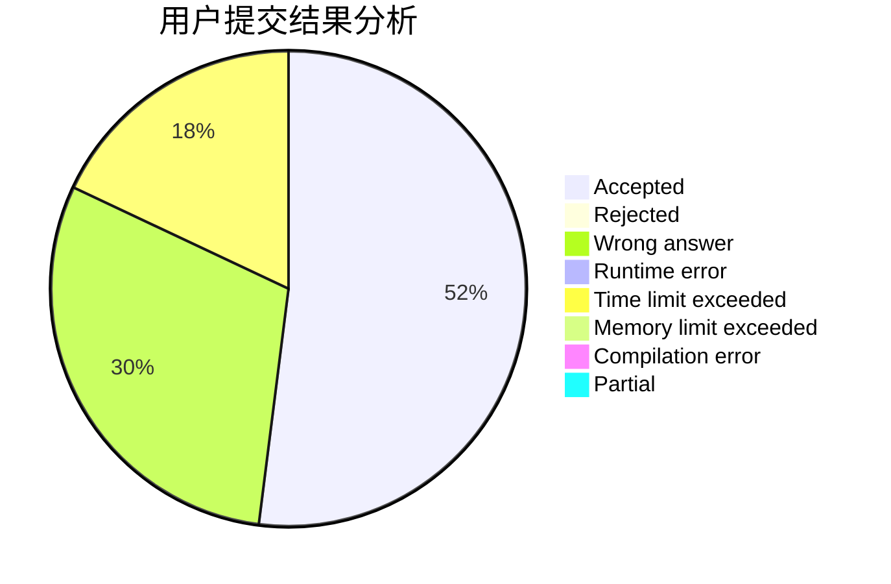
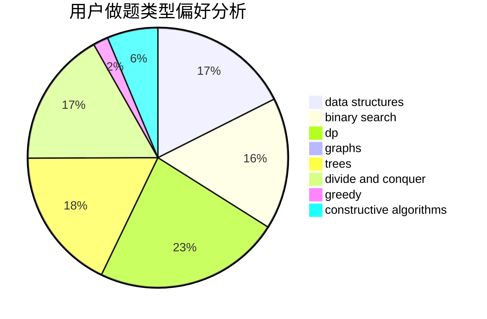
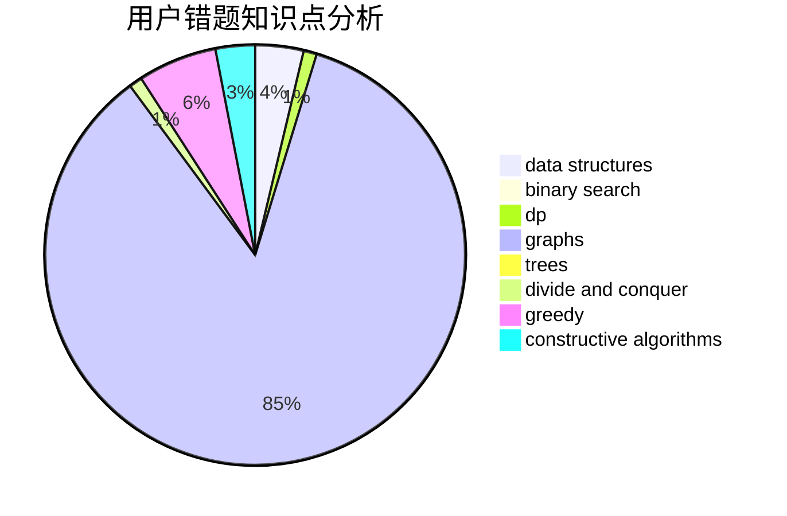

# eddyboy

<!-- tabs:start -->

#### **用户提交结果分析**

#### **用户做题类型偏好分析**

#### **用户错题知识点分析**

<!-- tabs:end -->
# 推荐题目
[463C](https://codeforces.com/contest/463/problem/C)		greedy,
                        hashing,
                        implementation		  
[1059A](https://codeforces.com/contest/1059/problem/A)		implementation		  
[58E](https://codeforces.com/contest/58/problem/E)		dp		  
[750F](https://codeforces.com/contest/750/problem/F)		constructive algorithms,
                        implementation,
                        interactive,
                        trees		  
[996F](https://codeforces.com/contest/996/problem/F)		dsu,graphs,sortings,trees		  
[379D](https://codeforces.com/contest/379/problem/D)		bitmasks,
                        brute force,
                        dp		  
[1461F](https://codeforces.com/contest/1461/problem/F)		constructive algorithms,
                        dp,
                        greedy		  
[165A](https://codeforces.com/contest/165/problem/A)		implementation		  
[1041D](https://codeforces.com/contest/1041/problem/D)		binary search,
                        data structures,
                        two pointers		  
[194E](https://codeforces.com/contest/194/problem/E)		dsu,graphs,sortings,trees		  
