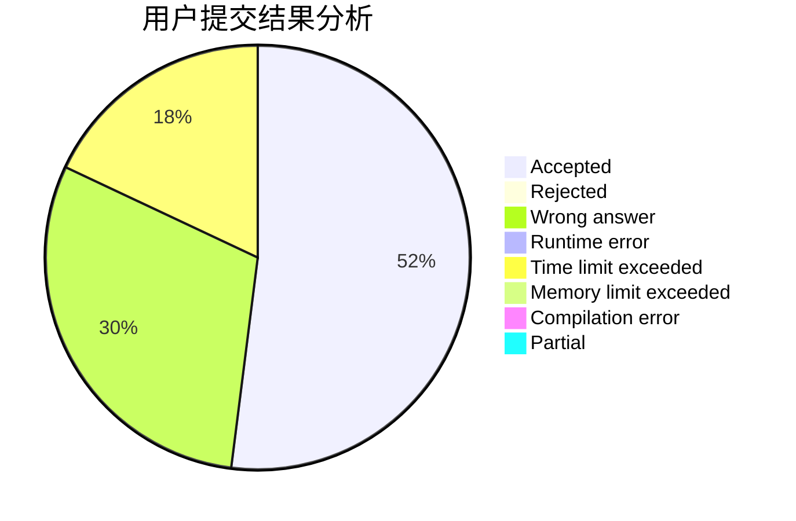
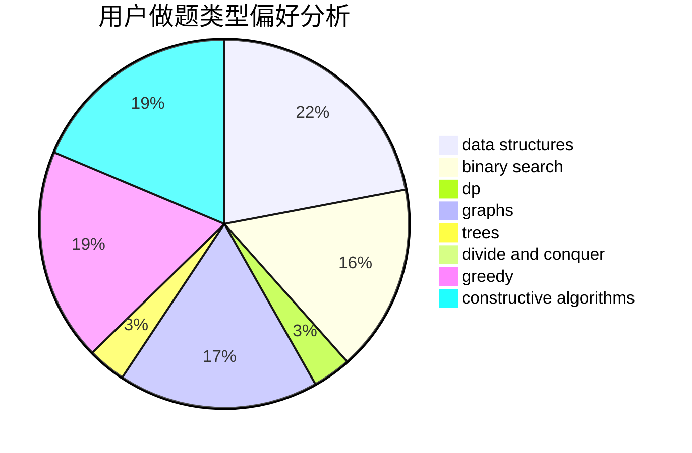
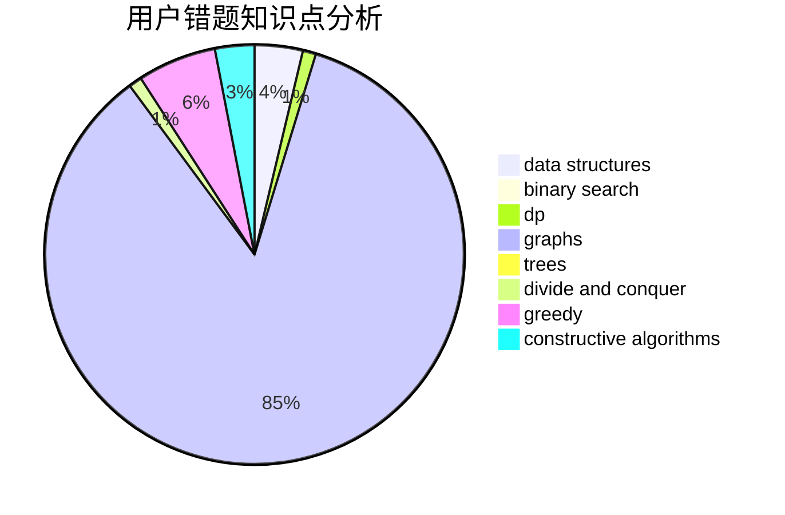

# eddyboy

<!-- tabs:start -->

#### **用户提交结果分析**

#### **用户做题类型偏好分析**

#### **用户错题知识点分析**

<!-- tabs:end -->
# 推荐题目
[442E](https://codeforces.com/contest/442/problem/E)		geometry		  
[1058C](https://codeforces.com/contest/1058/problem/C)		dsu,graphs,sortings,trees		  
[56B](https://codeforces.com/contest/56/problem/B)		implementation		  
[733A](https://codeforces.com/contest/733/problem/A)		implementation		  
[981E](https://codeforces.com/contest/981/problem/E)		bitmasks,
                        data structures,
                        divide and conquer,
                        dp		  
[352E](https://codeforces.com/contest/352/problem/E)		dsu,graphs,sortings,trees		  
[1452C](https://codeforces.com/contest/1452/problem/C)		greedy		  
[1510E](https://codeforces.com/contest/1510/problem/E)		nan		  
[1041A](https://codeforces.com/contest/1041/problem/A)		greedy,
                        implementation,
                        sortings		  
[167E](https://codeforces.com/contest/167/problem/E)		dfs and similar,
                        graphs,
                        math,
                        matrices		  
