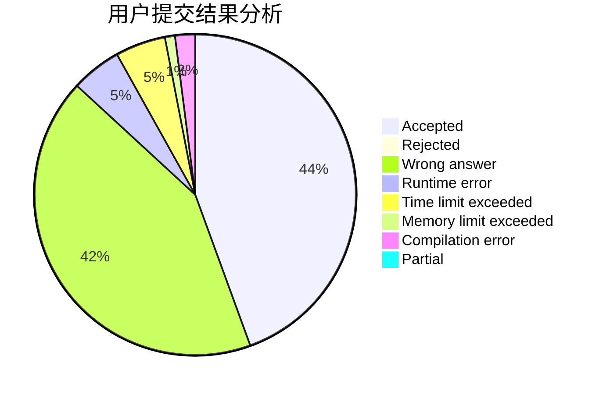
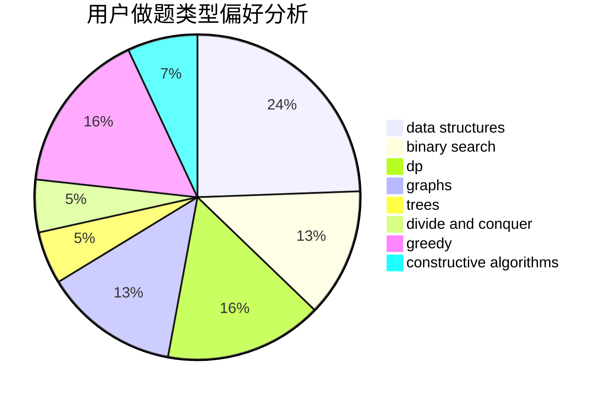
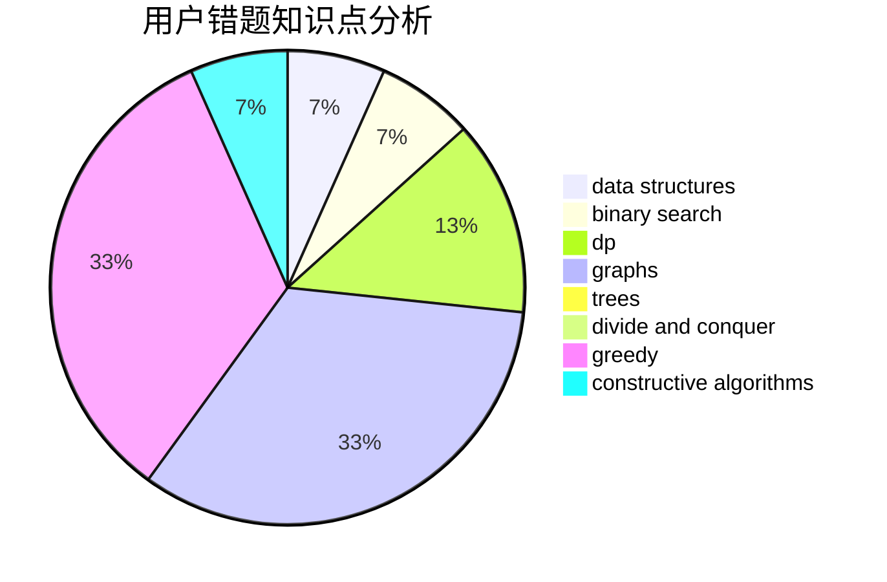

# eee_hoho

<!-- tabs:start -->

#### **用户提交结果分析**

#### **用户做题类型偏好分析**

#### **用户错题知识点分析**

<!-- tabs:end -->
# 推荐题目
[9E](https://codeforces.com/contest/9/problem/E)		dfs and similar,
                        dsu,
                        graphs		  
[1228E](https://codeforces.com/contest/1228/problem/E)		combinatorics,
                        dp,
                        math		  
[229D](https://codeforces.com/contest/229/problem/D)		dp,
                        greedy,
                        two pointers		  
[689B](https://codeforces.com/contest/689/problem/B)		dfs and similar,
                        graphs,
                        greedy,
                        shortest paths		  
[509C](https://codeforces.com/contest/509/problem/C)		dp,
                        greedy,
                        implementation		  
[1096D](https://codeforces.com/contest/1096/problem/D)		dp		  
[656A](https://codeforces.com/contest/656/problem/A)		*special problem		  
[938B](https://codeforces.com/contest/938/problem/B)		brute force,
                        greedy		  
[875A](https://codeforces.com/contest/875/problem/A)		brute force,
                        math		  
[1099D](https://codeforces.com/contest/1099/problem/D)		dsu,graphs,sortings,trees		  
