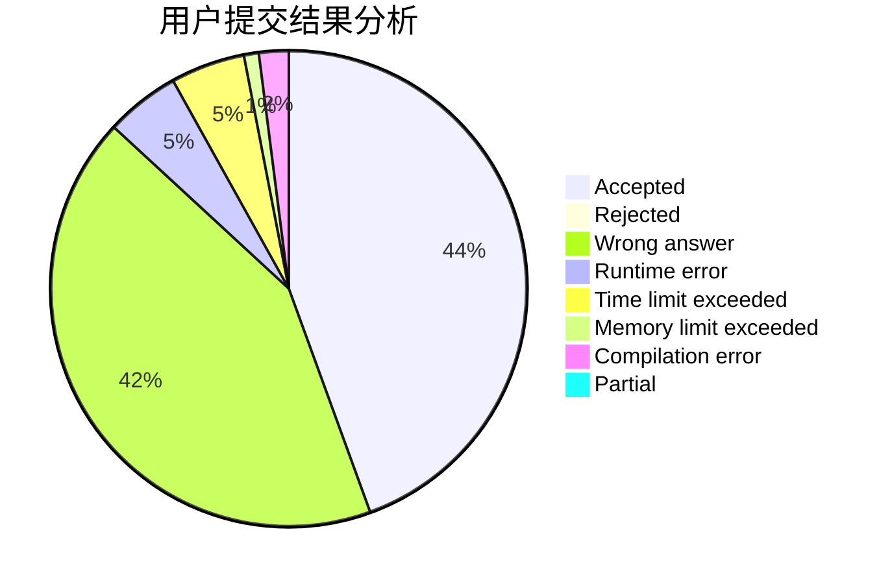
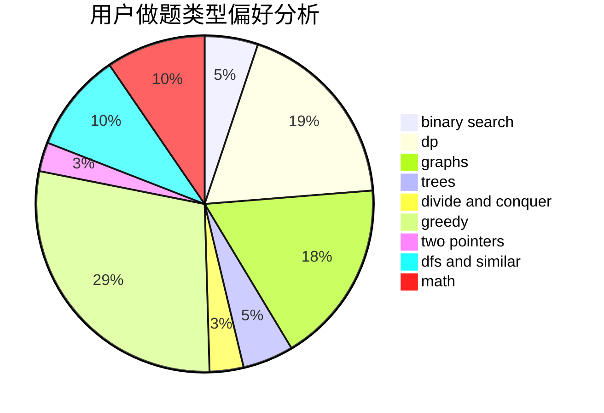

# eee_hoho

<!-- tabs:start -->

#### **用户提交结果分析**

#### **用户做题类型偏好分析**

<!-- tabs:end -->
# 推荐题目
[9E](https://codeforces.com/contest/9/problem/E)
[1228E](https://codeforces.com/contest/1228/problem/E)
[229D](https://codeforces.com/contest/229/problem/D)
[689B](https://codeforces.com/contest/689/problem/B)
[509C](https://codeforces.com/contest/509/problem/C)
[1096D](https://codeforces.com/contest/1096/problem/D)
[656A](https://codeforces.com/contest/656/problem/A)
[938B](https://codeforces.com/contest/938/problem/B)
[875A](https://codeforces.com/contest/875/problem/A)
[1099D](https://codeforces.com/contest/1099/problem/D)
