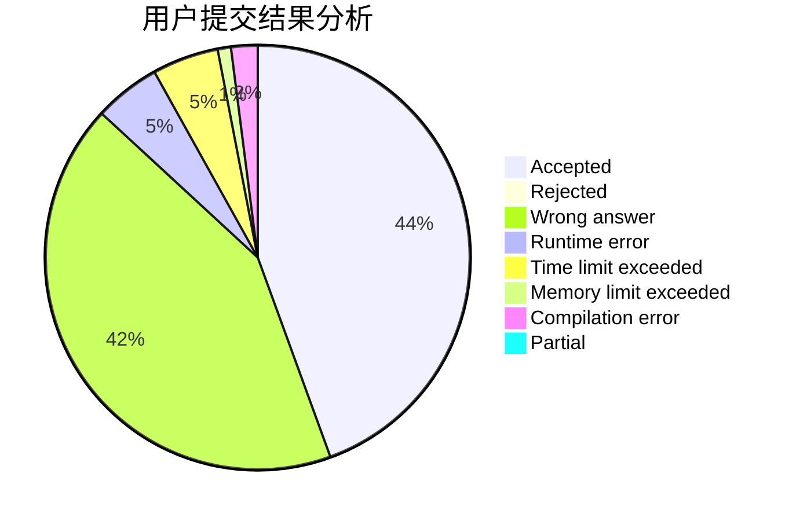
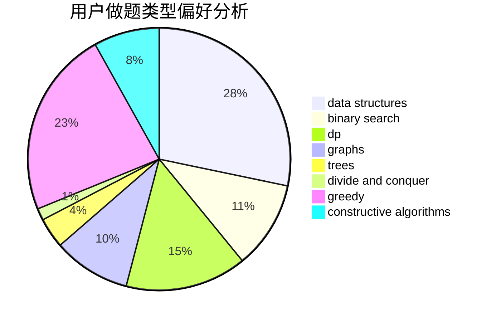
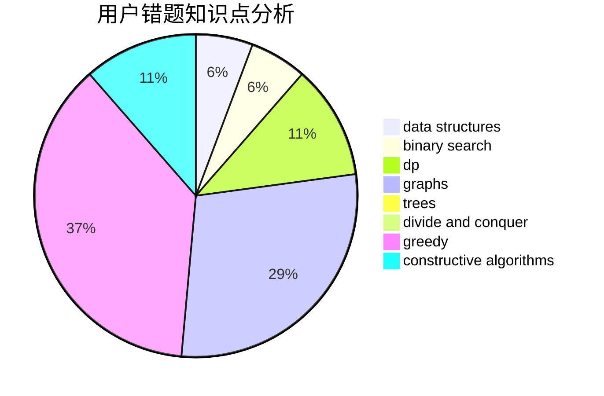

# eee_hoho

<!-- tabs:start -->

#### **用户提交结果分析**

#### **用户做题类型偏好分析**

#### **用户错题知识点分析**

<!-- tabs:end -->
# 推荐题目
[985D](https://codeforces.com/contest/985/problem/D)		binary search,
                        constructive algorithms,
                        math		  
[1220E](https://codeforces.com/contest/1220/problem/E)		dfs and similar,
                        dp,
                        dsu,
                        graphs,
                        greedy,
                        trees		  
[205B](https://codeforces.com/contest/205/problem/B)		brute force,
                        greedy		  
[667B](https://codeforces.com/contest/667/problem/B)		constructive algorithms,
                        geometry		  
[489B](https://codeforces.com/contest/489/problem/B)		dfs and similar,
                        dp,
                        graph matchings,
                        greedy,
                        sortings,
                        two pointers		  
[1096A](https://codeforces.com/contest/1096/problem/A)		greedy,
                        implementation,
                        math		  
[628B](https://codeforces.com/contest/628/problem/B)		dp		  
[917D](https://codeforces.com/contest/917/problem/D)		dp,
                        math,
                        matrices,
                        trees		  
[855F](https://codeforces.com/contest/855/problem/F)		binary search,
                        data structures		  
[1099A](https://codeforces.com/contest/1099/problem/A)		implementation		  
