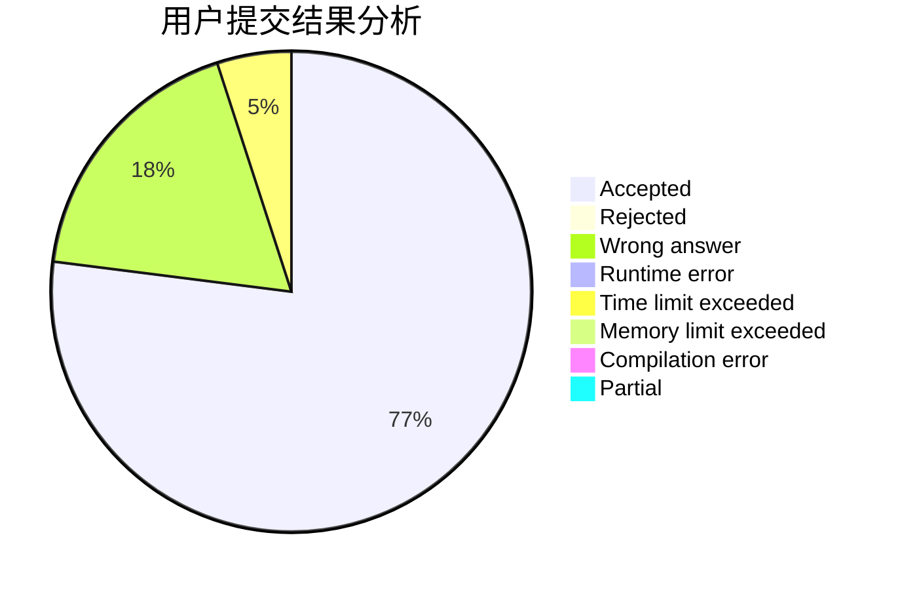
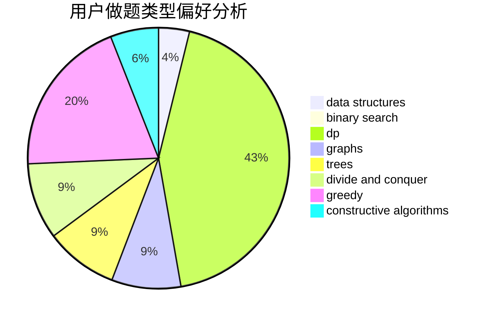
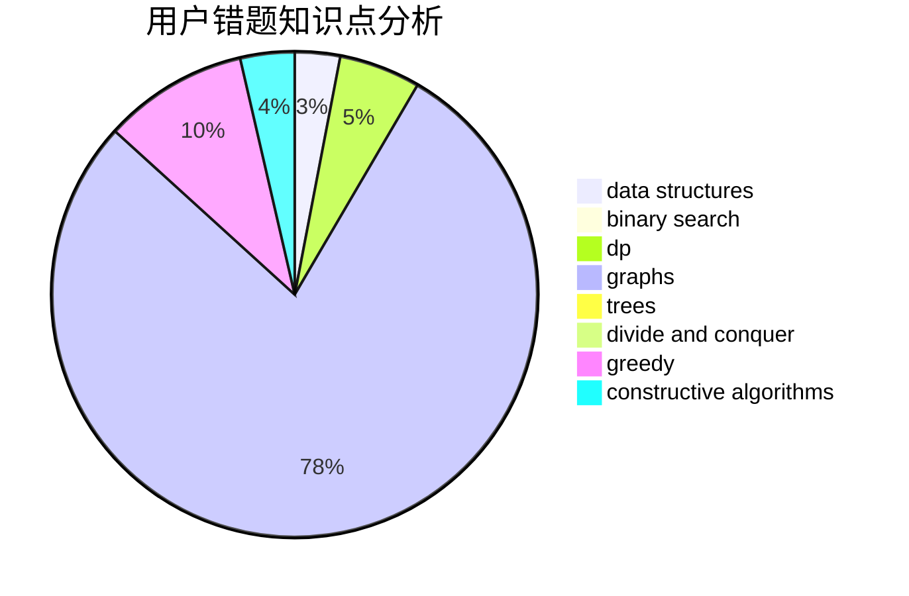

# elitedj

<!-- tabs:start -->

#### **用户提交结果分析**

#### **用户做题类型偏好分析**

#### **用户错题知识点分析**

<!-- tabs:end -->
# 推荐题目
[1456A](https://codeforces.com/contest/1456/problem/A)		dsu,graphs,sortings,trees		  
[479A](https://codeforces.com/contest/479/problem/A)		brute force,
                        math		  
[701A](https://codeforces.com/contest/701/problem/A)		greedy,
                        implementation		  
[676D](https://codeforces.com/contest/676/problem/D)		graphs,
                        implementation,
                        shortest paths		  
[1030G](https://codeforces.com/contest/1030/problem/G)		number theory		  
[618C](https://codeforces.com/contest/618/problem/C)		geometry,
                        implementation		  
[4C](https://codeforces.com/contest/4/problem/C)		data structures,
                        hashing,
                        implementation		  
[12A](https://codeforces.com/contest/12/problem/A)		implementation		  
[1320E](https://codeforces.com/contest/1320/problem/E)		data structures,
                        dfs and similar,
                        dp,
                        shortest paths,
                        trees		  
[1077D](https://codeforces.com/contest/1077/problem/D)		binary search,
                        sortings		  
