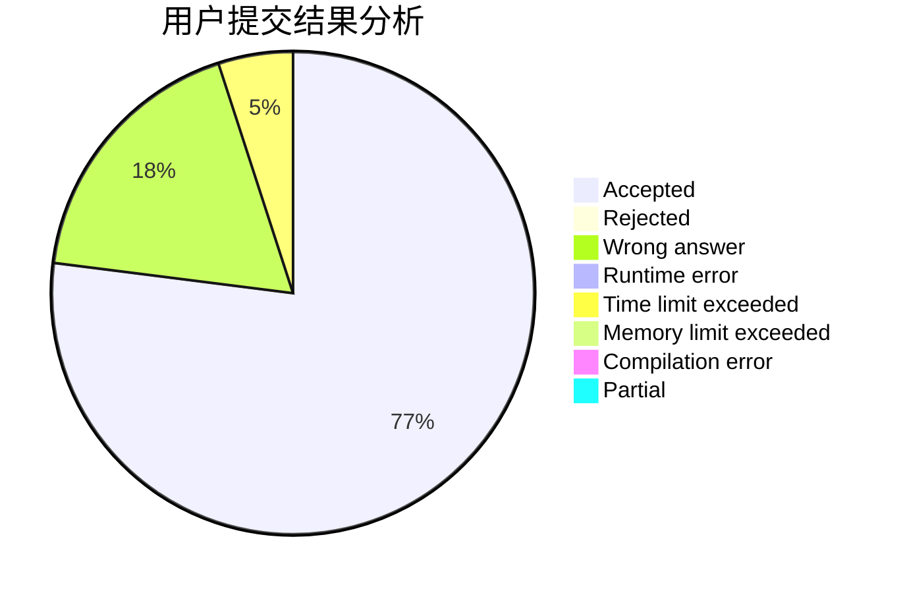
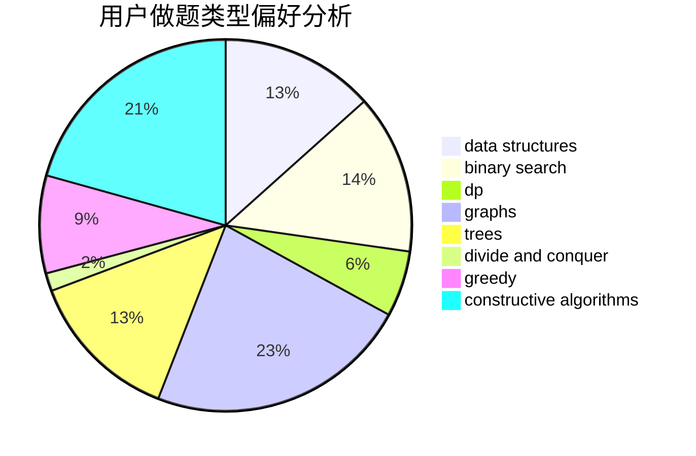
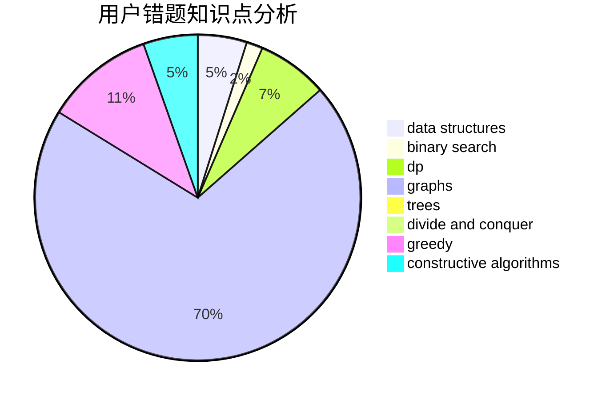

# elitedj

<!-- tabs:start -->

#### **用户提交结果分析**

#### **用户做题类型偏好分析**

#### **用户错题知识点分析**

<!-- tabs:end -->
# 推荐题目
[1446E](https://codeforces.com/contest/1446/problem/E)		constructive algorithms,
                        dfs and similar		  
[45D](https://codeforces.com/contest/45/problem/D)		greedy,
                        meet-in-the-middle,
                        sortings		  
[677A](https://codeforces.com/contest/677/problem/A)		implementation		  
[652E](https://codeforces.com/contest/652/problem/E)		dfs and similar,
                        dsu,
                        graphs,
                        trees		  
[1030C](https://codeforces.com/contest/1030/problem/C)		implementation		  
[59B](https://codeforces.com/contest/59/problem/B)		implementation,
                        number theory		  
[47B](https://codeforces.com/contest/47/problem/B)		implementation		  
[1292F](https://codeforces.com/contest/1292/problem/F)		bitmasks,
                        combinatorics,
                        dp		  
[1311D](https://codeforces.com/contest/1311/problem/D)		brute force,
                        math		  
[1077C](https://codeforces.com/contest/1077/problem/C)		nan		  
