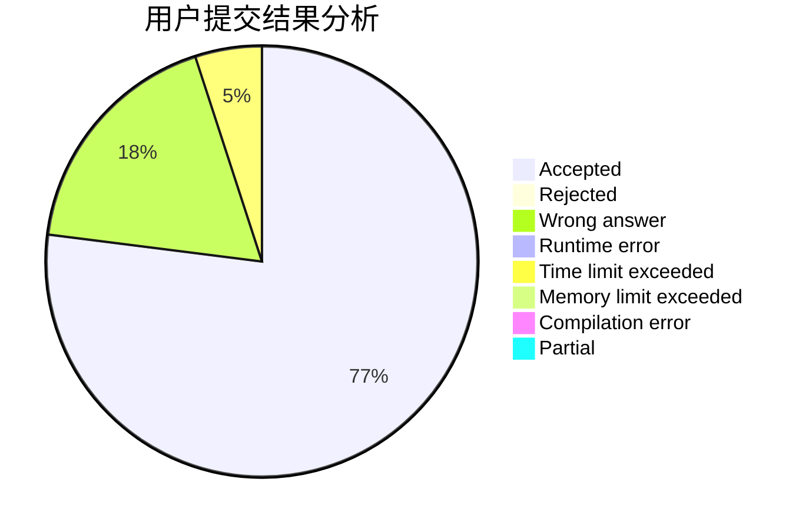
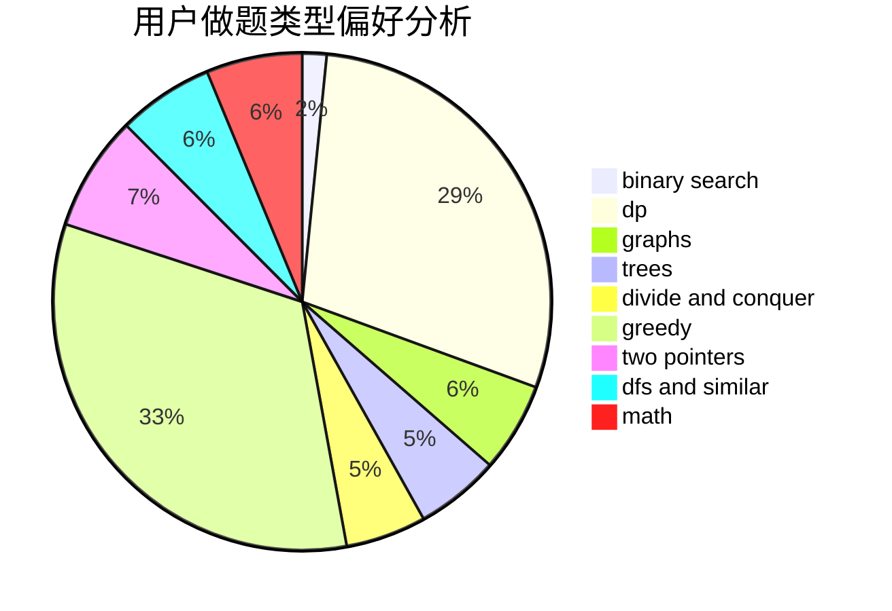

# elitedj

<!-- tabs:start -->

#### **用户提交结果分析**

#### **用户做题类型偏好分析**

<!-- tabs:end -->
# 推荐题目
[1456A](https://codeforces.com/contest/1456/problem/A)
[479A](https://codeforces.com/contest/479/problem/A)
[701A](https://codeforces.com/contest/701/problem/A)
[676D](https://codeforces.com/contest/676/problem/D)
[1030G](https://codeforces.com/contest/1030/problem/G)
[618C](https://codeforces.com/contest/618/problem/C)
[4C](https://codeforces.com/contest/4/problem/C)
[12A](https://codeforces.com/contest/12/problem/A)
[1320E](https://codeforces.com/contest/1320/problem/E)
[1077D](https://codeforces.com/contest/1077/problem/D)
