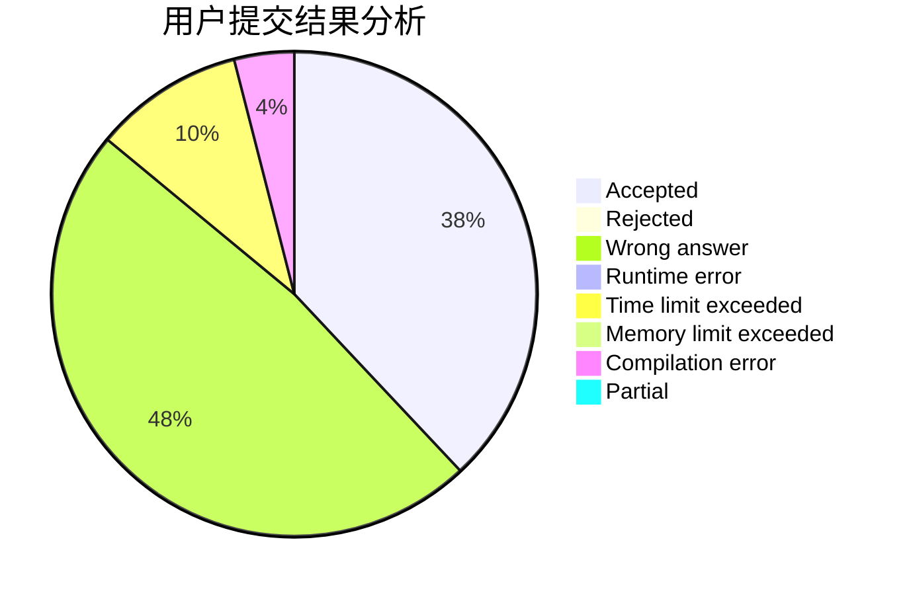
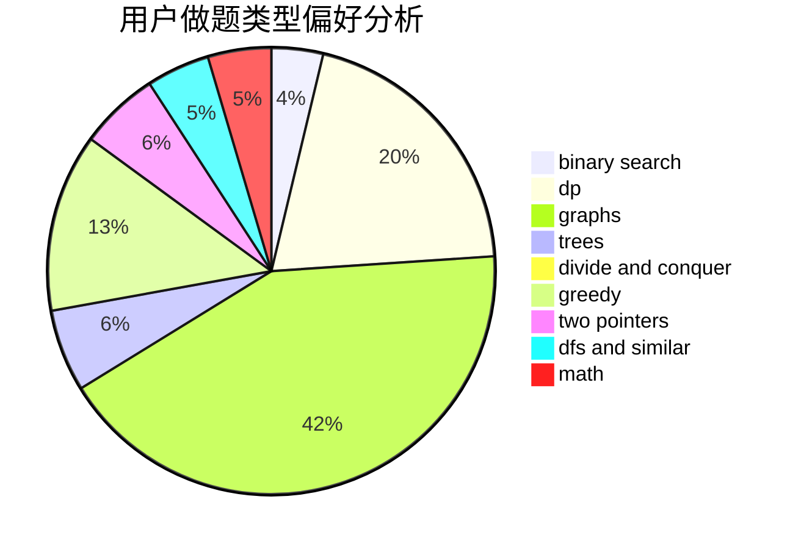

# elvispan

<!-- tabs:start -->

#### **用户提交结果分析**

#### **用户做题类型偏好分析**

<!-- tabs:end -->
# 推荐题目
[687C](https://codeforces.com/contest/687/problem/C)
[896A](https://codeforces.com/contest/896/problem/A)
[1067B](https://codeforces.com/contest/1067/problem/B)
[990F](https://codeforces.com/contest/990/problem/F)
[1213F](https://codeforces.com/contest/1213/problem/F)
[13931](https://codeforces.com/contest/1393/problem/1)
[886C](https://codeforces.com/contest/886/problem/C)
[722F](https://codeforces.com/contest/722/problem/F)
[10024](https://codeforces.com/contest/1002/problem/4)
[264C](https://codeforces.com/contest/264/problem/C)
