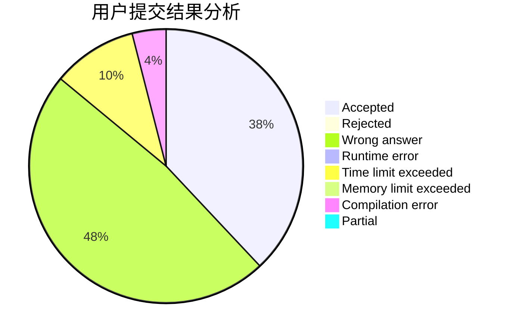
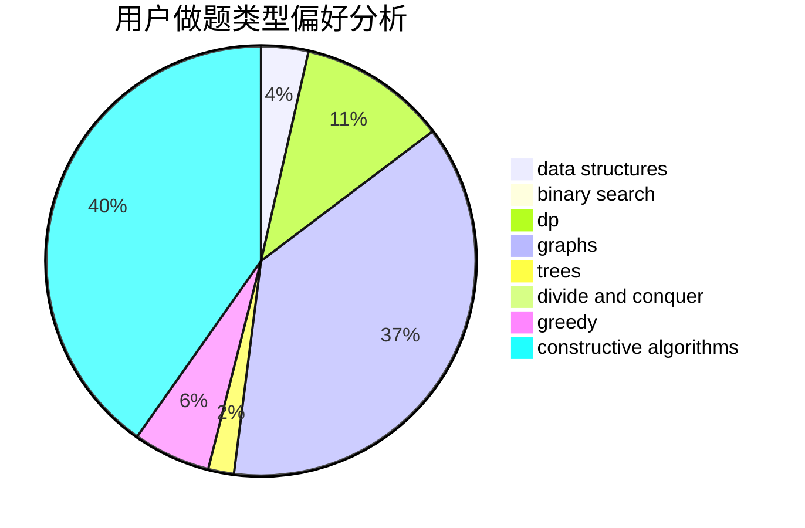
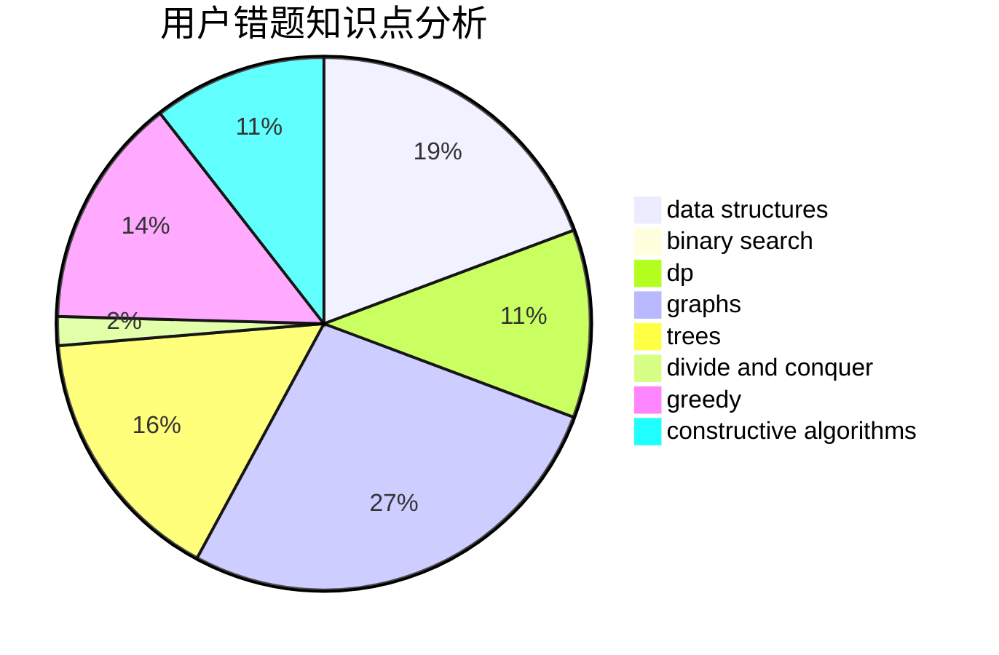

# elvispan

<!-- tabs:start -->

#### **用户提交结果分析**

#### **用户做题类型偏好分析**

#### **用户错题知识点分析**

<!-- tabs:end -->
# 推荐题目
[687C](https://codeforces.com/contest/687/problem/C)		dp		  
[896A](https://codeforces.com/contest/896/problem/A)		binary search,
                        dfs and similar		  
[1067B](https://codeforces.com/contest/1067/problem/B)		dfs and similar,
                        graphs,
                        shortest paths		  
[990F](https://codeforces.com/contest/990/problem/F)		dfs and similar,
                        dp,
                        greedy,
                        trees		  
[1213F](https://codeforces.com/contest/1213/problem/F)		data structures,
                        dfs and similar,
                        dsu,
                        graphs,
                        greedy,
                        implementation,
                        strings		  
[13931](https://codeforces.com/contest/1393/problem/1)		dsu,graphs,sortings,trees		  
[886C](https://codeforces.com/contest/886/problem/C)		dsu,
                        greedy,
                        implementation,
                        trees		  
[722F](https://codeforces.com/contest/722/problem/F)		chinese remainder theorem,
                        data structures,
                        implementation,
                        number theory,
                        two pointers		  
[10024](https://codeforces.com/contest/1002/problem/4)		dsu,graphs,sortings,trees		  
[264C](https://codeforces.com/contest/264/problem/C)		dp		  
