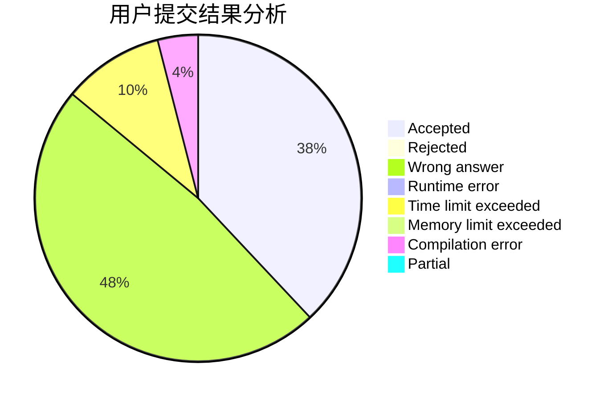
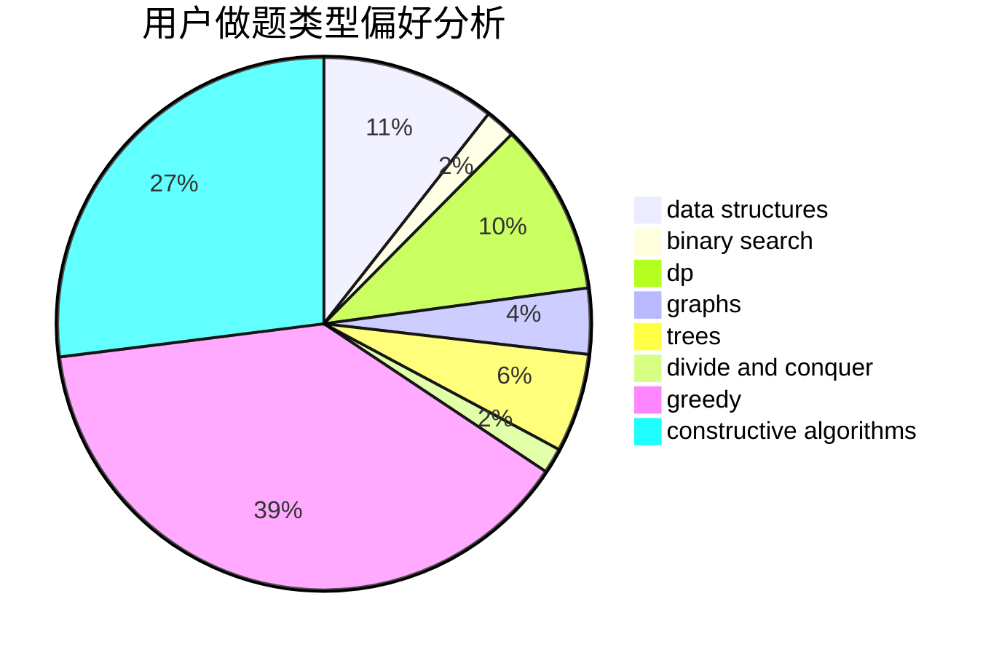
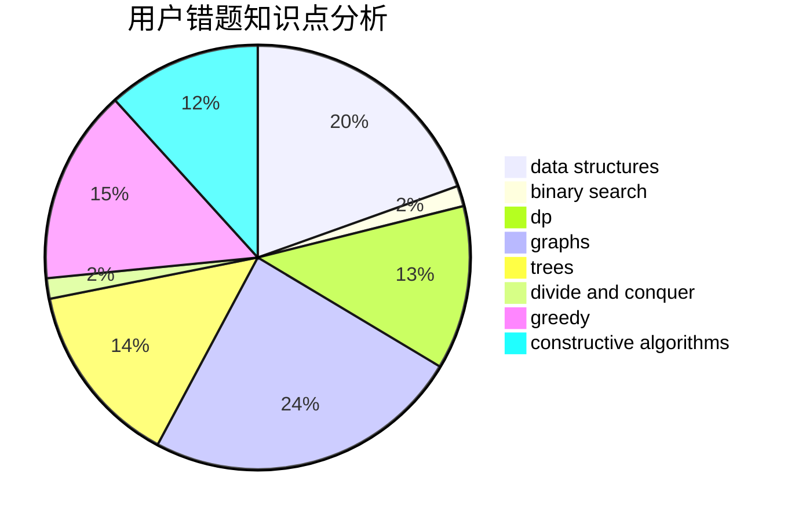

# elvispan

<!-- tabs:start -->

#### **用户提交结果分析**

#### **用户做题类型偏好分析**

#### **用户错题知识点分析**

<!-- tabs:end -->
# 推荐题目
[666C](https://codeforces.com/contest/666/problem/C)		combinatorics,
                        strings		  
[875F](https://codeforces.com/contest/875/problem/F)		dsu,
                        graphs,
                        greedy		  
[1066E](https://codeforces.com/contest/1066/problem/E)		data structures,
                        implementation,
                        math		  
[977A](https://codeforces.com/contest/977/problem/A)		implementation		  
[1208B](https://codeforces.com/contest/1208/problem/B)		binary search,
                        brute force,
                        implementation,
                        two pointers		  
[1383B](https://codeforces.com/contest/1383/problem/B)		bitmasks,
                        constructive algorithms,
                        dp,
                        games,
                        greedy,
                        math		  
[865G](https://codeforces.com/contest/865/problem/G)		combinatorics,
                        math,
                        matrices		  
[703D](https://codeforces.com/contest/703/problem/D)		data structures		  
[1002C2](https://codeforces.com/contest/1002C/problem/2)		nan		  
[243B](https://codeforces.com/contest/243/problem/B)		graphs,
                        sortings		  
