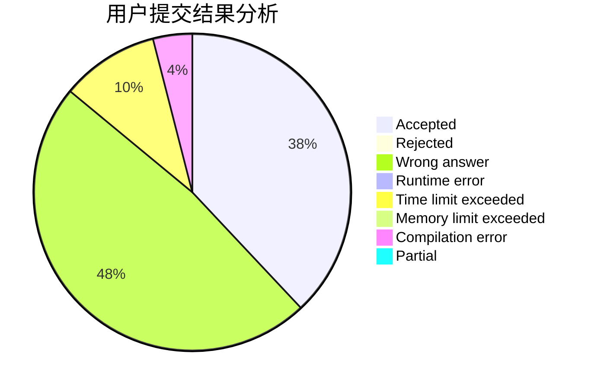
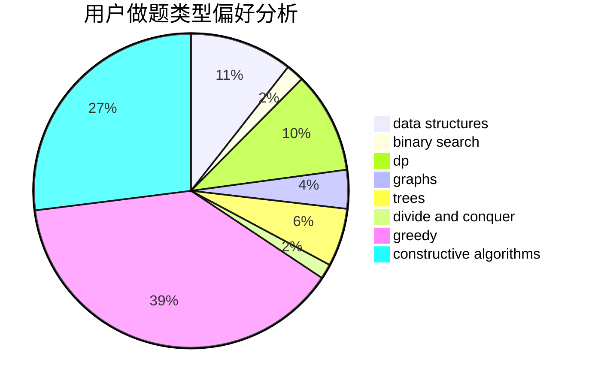
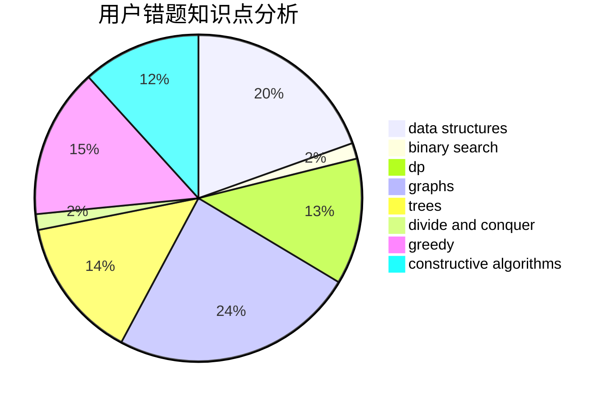

# elvispan
<!-- tabs:start -->
#### **用户提交结果分析**

#### **用户做题类型偏好分析**

#### **用户错题知识点分析**

<!-- tabs:end -->
# 推荐题目
[Good Triple](http://codeforces.com/problemset/problem/1168/B)		brute force,
                        two pointers		  
[Mishka and Interesting sum](http://codeforces.com/problemset/problem/703/D)		data structures		  
[Palindrome XOR](http://codeforces.com/problemset/problem/1147/D)		dfs and similar,
                        graphs		  
[Royal Questions](http://codeforces.com/problemset/problem/875/F)		dsu,
                        graphs,
                        greedy		  
[GameGame](http://codeforces.com/problemset/problem/1383/B)		bitmasks,
                        constructive algorithms,
                        dp,
                        games,
                        greedy,
                        math		  
[Birds](http://codeforces.com/problemset/problem/922/E)		dp		  
[Fair Numbers](http://codeforces.com/problemset/problem/1411/B)		brute force,
                        number theory		  
[Wrong Subtraction](http://codeforces.com/problemset/problem/977/A)		implementation		  
[Binary Numbers AND Sum](http://codeforces.com/problemset/problem/1066/E)		data structures,
                        implementation,
                        math		  
[Mahmoud and Ehab and the even-odd game](http://codeforces.com/problemset/problem/959/A)		games,
                        math		  
<!-- tabs:start -->
#### **data structures**
[Good Triple](http://codeforces.com/problemset/problem/703/D)		data structures		  
[Mishka and Interesting sum](http://codeforces.com/problemset/problem/1066/E)		data structures,
                        implementation,
                        math		  
[Palindrome XOR](http://codeforces.com/problemset/problem/1023/G)		data structures,
                        flows,
                        trees		  
[Royal Questions](http://codeforces.com/problemset/problem/446/B)		brute force,
                        data structures,
                        greedy		  
[GameGame](http://codeforces.com/problemset/problem/1189/C)		data structures,
                        dp,
                        implementation,
                        math		  
[Birds](http://codeforces.com/problemset/problem/1491/C)		brute force,
                        data structures,
                        dp,
                        greedy,
                        implementation		  
[Fair Numbers](http://codeforces.com/problemset/problem/1492/C)		binary search,
                        data structures,
                        dp,
                        greedy,
                        two pointers		  
[Wrong Subtraction](http://codeforces.com/problemset/problem/1490/G)		binary search,
                        data structures,
                        math		  
[Binary Numbers AND Sum](http://codeforces.com/problemset/problem/1479/D)		binary search,
                        bitmasks,
                        brute force,
                        data structures,
                        probabilities,
                        trees		  
[Mahmoud and Ehab and the even-odd game](http://codeforces.com/problemset/problem/1497/A)		brute force,
                        data structures,
                        greedy,
                        sortings		  
#### **binary search**
[Good Triple](http://codeforces.com/problemset/problem/1208/B)		binary search,
                        brute force,
                        implementation,
                        two pointers		  
[Mishka and Interesting sum](http://codeforces.com/problemset/problem/1129/E)		binary search,
                        interactive,
                        trees		  
[Palindrome XOR](http://codeforces.com/problemset/problem/653/D)		binary search,
                        flows,
                        graphs		  
[Royal Questions](http://codeforces.com/problemset/problem/1492/C)		binary search,
                        data structures,
                        dp,
                        greedy,
                        two pointers		  
[GameGame](http://codeforces.com/problemset/problem/1463/D)		binary search,
                        constructive algorithms,
                        greedy,
                        two pointers		  
[Birds](http://codeforces.com/problemset/problem/1490/G)		binary search,
                        data structures,
                        math		  
[Fair Numbers](http://codeforces.com/problemset/problem/1479/D)		binary search,
                        bitmasks,
                        brute force,
                        data structures,
                        probabilities,
                        trees		  
[Wrong Subtraction](http://codeforces.com/problemset/problem/1436/E)		binary search,
                        data structures,
                        two pointers		  
[Binary Numbers AND Sum](http://codeforces.com/problemset/problem/1461/D)		binary search,
                        brute force,
                        data structures,
                        divide and conquer,
                        implementation,
                        sortings		  
[Mahmoud and Ehab and the even-odd game](http://codeforces.com/problemset/problem/1493/C)		binary search,
                        brute force,
                        constructive algorithms,
                        greedy,
                        strings		  
#### **dp**
[Good Triple](http://codeforces.com/problemset/problem/1383/B)		bitmasks,
                        constructive algorithms,
                        dp,
                        games,
                        greedy,
                        math		  
[Mishka and Interesting sum](http://codeforces.com/problemset/problem/922/E)		dp		  
[Palindrome XOR](http://codeforces.com/problemset/problem/1189/C)		data structures,
                        dp,
                        implementation,
                        math		  
[Royal Questions](http://codeforces.com/problemset/problem/1015/F)		dp,
                        strings		  
[GameGame](http://codeforces.com/problemset/problem/489/C)		dp,
                        greedy,
                        implementation		  
[Birds](http://codeforces.com/problemset/problem/1491/C)		brute force,
                        data structures,
                        dp,
                        greedy,
                        implementation		  
[Fair Numbers](http://codeforces.com/problemset/problem/1433/F)		dp		  
[Wrong Subtraction](http://codeforces.com/problemset/problem/1492/C)		binary search,
                        data structures,
                        dp,
                        greedy,
                        two pointers		  
[Binary Numbers AND Sum](https://codeforces.com/contest/1457/problem/C)		brute force,
                        dp,
                        implementation		  
[Mahmoud and Ehab and the even-odd game](http://codeforces.com/problemset/problem/1491/C)		brute force,
                        data structures,
                        dp,
                        greedy,
                        implementation		  
#### **graph**
[Good Triple](http://codeforces.com/problemset/problem/1147/D)		dfs and similar,
                        graphs		  
[Mishka and Interesting sum](http://codeforces.com/problemset/problem/875/F)		dsu,
                        graphs,
                        greedy		  
[Palindrome XOR](http://codeforces.com/problemset/problem/574/B)		brute force,
                        dfs and similar,
                        graphs,
                        hashing		  
[Royal Questions](http://codeforces.com/problemset/problem/243/B)		graphs,
                        sortings		  
[GameGame](http://codeforces.com/problemset/problem/802/J)		dfs and similar,
                        graphs,
                        trees		  
[Birds](http://codeforces.com/problemset/problem/653/D)		binary search,
                        flows,
                        graphs		  
[Fair Numbers](http://codeforces.com/problemset/problem/1487/C)		brute force,
                        constructive algorithms,
                        dfs and similar,
                        graphs,
                        greedy,
                        implementation,
                        math		  
[Wrong Subtraction](http://codeforces.com/problemset/problem/1437/C)		dp,
                        flows,
                        graph matchings,
                        greedy,
                        math,
                        sortings		  
[Binary Numbers AND Sum](http://codeforces.com/problemset/problem/1470/D)		constructive algorithms,
                        dfs and similar,
                        graph matchings,
                        graphs,
                        greedy		  
[Mahmoud and Ehab and the even-odd game](http://codeforces.com/problemset/problem/1476/C)		dp,
                        graphs,
                        greedy		  
#### **trees**
[Good Triple](http://codeforces.com/problemset/problem/1023/G)		data structures,
                        flows,
                        trees		  
[Mishka and Interesting sum](http://codeforces.com/problemset/problem/802/J)		dfs and similar,
                        graphs,
                        trees		  
[Palindrome XOR](http://codeforces.com/problemset/problem/1129/E)		binary search,
                        interactive,
                        trees		  
[Royal Questions](http://codeforces.com/problemset/problem/1479/D)		binary search,
                        bitmasks,
                        brute force,
                        data structures,
                        probabilities,
                        trees		  
[GameGame](http://codeforces.com/problemset/problem/1511/C)		brute force,
                        data structures,
                        implementation,
                        trees		  
[Birds](http://codeforces.com/problemset/problem/1499/F)		combinatorics,
                        dfs and similar,
                        dp,
                        trees		  
[Fair Numbers](http://codeforces.com/problemset/problem/1491/E)		brute force,
                        dfs and similar,
                        divide and conquer,
                        number theory,
                        trees		  
[Wrong Subtraction](http://codeforces.com/problemset/problem/1466/D)		data structures,
                        greedy,
                        sortings,
                        trees		  
[Binary Numbers AND Sum](http://codeforces.com/problemset/problem/1495/D)		combinatorics,
                        dfs and similar,
                        graphs,
                        math,
                        shortest paths,
                        trees		  
[Mahmoud and Ehab and the even-odd game](http://codeforces.com/problemset/problem/1303/G)		data structures,
                        divide and conquer,
                        geometry,
                        trees		  
#### **divide and conquer**
[Good Triple](http://codeforces.com/problemset/problem/438/E)		combinatorics,
                        divide and conquer,
                        fft,
                        number theory		  
[Mishka and Interesting sum](http://codeforces.com/problemset/problem/1461/D)		binary search,
                        brute force,
                        data structures,
                        divide and conquer,
                        implementation,
                        sortings		  
[Palindrome XOR](http://codeforces.com/problemset/problem/1466/G)		combinatorics,
                        divide and conquer,
                        hashing,
                        math,
                        string suffix structures,
                        strings		  
[Royal Questions](http://codeforces.com/problemset/problem/1490/D)		dfs and similar,
                        divide and conquer,
                        implementation		  
[GameGame](https://codeforces.com/contest/1483/problem/C)		data structures,
                        divide and conquer,
                        dp		  
[Birds](http://codeforces.com/problemset/problem/1491/E)		brute force,
                        dfs and similar,
                        divide and conquer,
                        number theory,
                        trees		  
[Fair Numbers](http://codeforces.com/problemset/problem/1303/G)		data structures,
                        divide and conquer,
                        geometry,
                        trees		  
[Wrong Subtraction](http://codeforces.com/problemset/problem/1494/D)		constructive algorithms,
                        data structures,
                        dfs and similar,
                        divide and conquer,
                        dsu,
                        greedy,
                        sortings,
                        trees		  
[Binary Numbers AND Sum](http://codeforces.com/problemset/problem/1482/E)		data structures,
                        divide and conquer,
                        dp		  
[Mahmoud and Ehab and the even-odd game](http://codeforces.com/problemset/problem/566/C)		dfs and similar,
                        divide and conquer,
                        trees		  
#### **greedy**
[Good Triple](http://codeforces.com/problemset/problem/875/F)		dsu,
                        graphs,
                        greedy		  
[Mishka and Interesting sum](http://codeforces.com/problemset/problem/1383/B)		bitmasks,
                        constructive algorithms,
                        dp,
                        games,
                        greedy,
                        math		  
[Palindrome XOR](http://codeforces.com/problemset/problem/446/B)		brute force,
                        data structures,
                        greedy		  
[Royal Questions](http://codeforces.com/problemset/problem/489/C)		dp,
                        greedy,
                        implementation		  
[GameGame](http://codeforces.com/problemset/problem/1491/C)		brute force,
                        data structures,
                        dp,
                        greedy,
                        implementation		  
[Birds](http://codeforces.com/problemset/problem/1221/A)		brute force,
                        greedy,
                        math		  
[Fair Numbers](http://codeforces.com/problemset/problem/1295/A)		greedy		  
[Wrong Subtraction](http://codeforces.com/problemset/problem/1492/C)		binary search,
                        data structures,
                        dp,
                        greedy,
                        two pointers		  
[Binary Numbers AND Sum](https://codeforces.com/contest/1496/problem/C)		geometry,
                        greedy,
                        math,
                        sortings		  
[Mahmoud and Ehab and the even-odd game](http://codeforces.com/problemset/problem/1493/A)		constructive algorithms,
                        greedy		  
#### **constructive algorithms**
[Good Triple](http://codeforces.com/problemset/problem/1383/B)		bitmasks,
                        constructive algorithms,
                        dp,
                        games,
                        greedy,
                        math		  
[Mishka and Interesting sum](http://codeforces.com/problemset/problem/449/C)		constructive algorithms,
                        number theory		  
[Palindrome XOR](http://codeforces.com/problemset/problem/1493/A)		constructive algorithms,
                        greedy		  
[Royal Questions](http://codeforces.com/problemset/problem/1463/D)		binary search,
                        constructive algorithms,
                        greedy,
                        two pointers		  
[GameGame](https://codeforces.com/contest/1456/problem/B)		bitmasks,
                        brute force,
                        constructive algorithms		  
[Birds](http://codeforces.com/problemset/problem/1492/D)		bitmasks,
                        constructive algorithms,
                        greedy,
                        math		  
[Fair Numbers](https://codeforces.com/contest/1504/problem/D)		constructive algorithms,
                        games,
                        interactive		  
[Wrong Subtraction](https://codeforces.com/contest/1483/problem/A)		brute force,
                        constructive algorithms,
                        greedy,
                        implementation		  
[Binary Numbers AND Sum](https://codeforces.com/contest/1457/problem/D)		bitmasks,
                        brute force,
                        constructive algorithms		  
[Mahmoud and Ehab and the even-odd game](http://codeforces.com/problemset/problem/1513/A)		constructive algorithms,
                        implementation		  
#### **sortings**
[Good Triple](http://codeforces.com/problemset/problem/243/B)		graphs,
                        sortings		  
[Mishka and Interesting sum](https://codeforces.com/contest/1496/problem/C)		geometry,
                        greedy,
                        math,
                        sortings		  
[Palindrome XOR](http://codeforces.com/problemset/problem/1495/A)		geometry,
                        greedy,
                        math,
                        sortings		  
[Royal Questions](http://codeforces.com/problemset/problem/1497/A)		brute force,
                        data structures,
                        greedy,
                        sortings		  
[GameGame](http://codeforces.com/problemset/problem/1427/A)		math,
                        sortings		  
[Birds](http://codeforces.com/problemset/problem/1461/D)		binary search,
                        brute force,
                        data structures,
                        divide and conquer,
                        implementation,
                        sortings		  
[Fair Numbers](http://codeforces.com/problemset/problem/1437/C)		dp,
                        flows,
                        graph matchings,
                        greedy,
                        math,
                        sortings		  
[Wrong Subtraction](http://codeforces.com/problemset/problem/1473/A)		greedy,
                        implementation,
                        math,
                        sortings		  
[Binary Numbers AND Sum](http://codeforces.com/problemset/problem/1486/B)		binary search,
                        geometry,
                        shortest paths,
                        sortings		  
[Mahmoud and Ehab and the even-odd game](http://codeforces.com/problemset/problem/1480/B)		greedy,
                        implementation,
                        sortings		  
<!-- tabs:end -->
