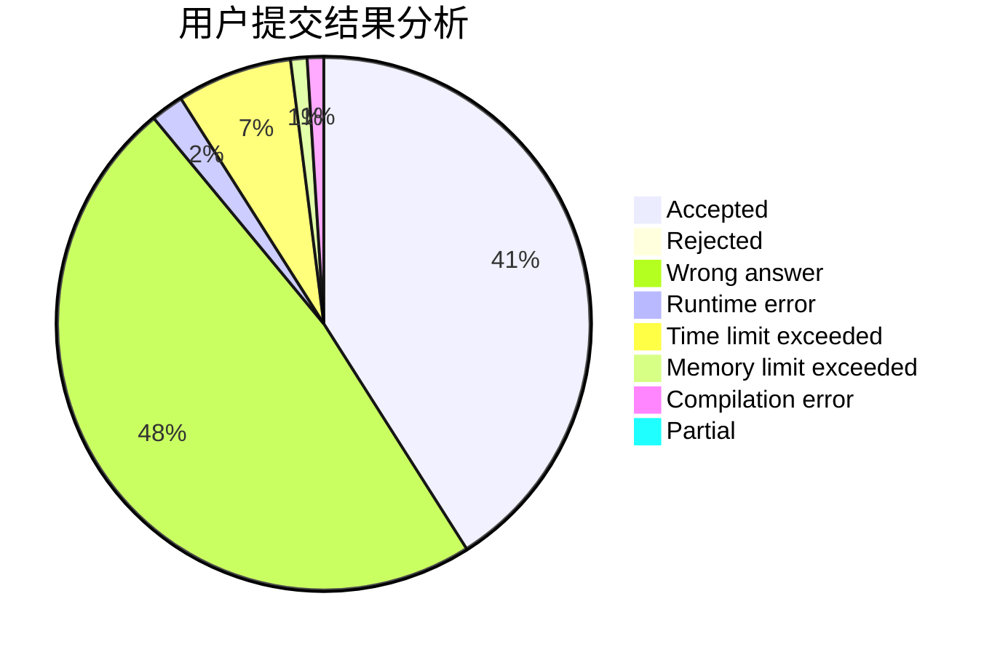
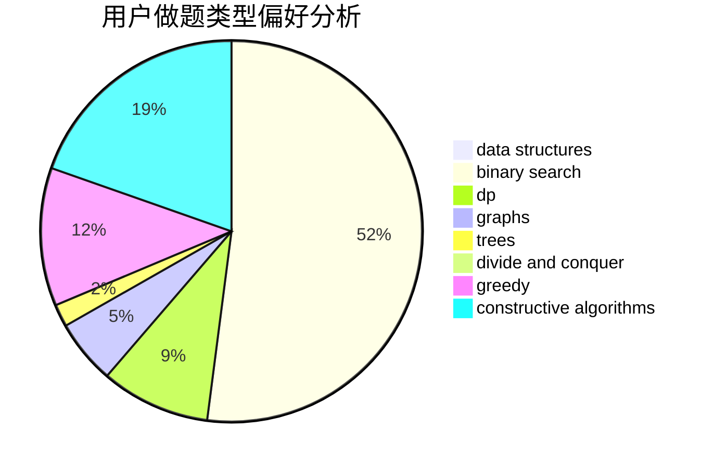
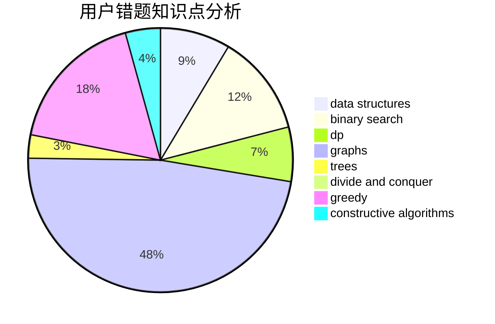

# emofunc

<!-- tabs:start -->

#### **用户提交结果分析**

#### **用户做题类型偏好分析**

#### **用户错题知识点分析**

<!-- tabs:end -->
# 推荐题目
[106A](https://codeforces.com/contest/106/problem/A)		implementation		  
[827D](https://codeforces.com/contest/827/problem/D)		data structures,
                        dfs and similar,
                        graphs,
                        trees		  
[279E](https://codeforces.com/contest/279/problem/E)		dp,
                        games,
                        greedy,
                        number theory		  
[315A](https://codeforces.com/contest/315/problem/A)		brute force		  
[946F](https://codeforces.com/contest/946/problem/F)		combinatorics,
                        dp,
                        matrices		  
[1267A](https://codeforces.com/contest/1267/problem/A)		nan		  
[171H](https://codeforces.com/contest/171/problem/H)		*special problem,
                        implementation		  
[496A](https://codeforces.com/contest/496/problem/A)		brute force,
                        implementation,
                        math		  
[1197C](https://codeforces.com/contest/1197/problem/C)		greedy,
                        sortings		  
[1145D](https://codeforces.com/contest/1145/problem/D)		implementation		  
