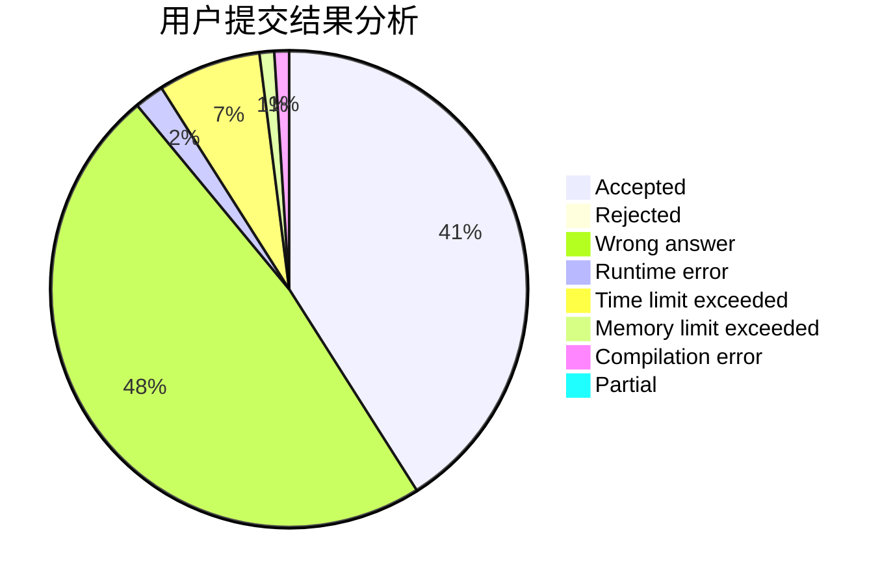
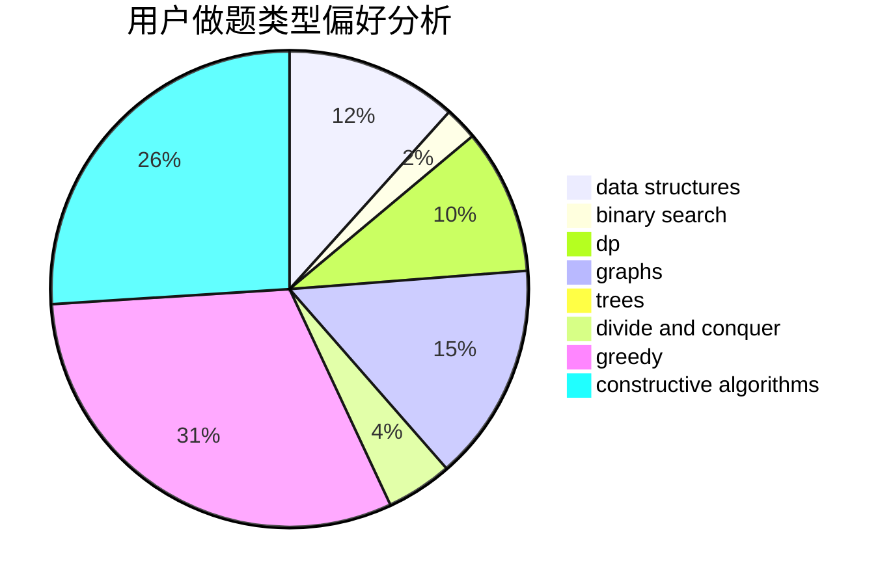
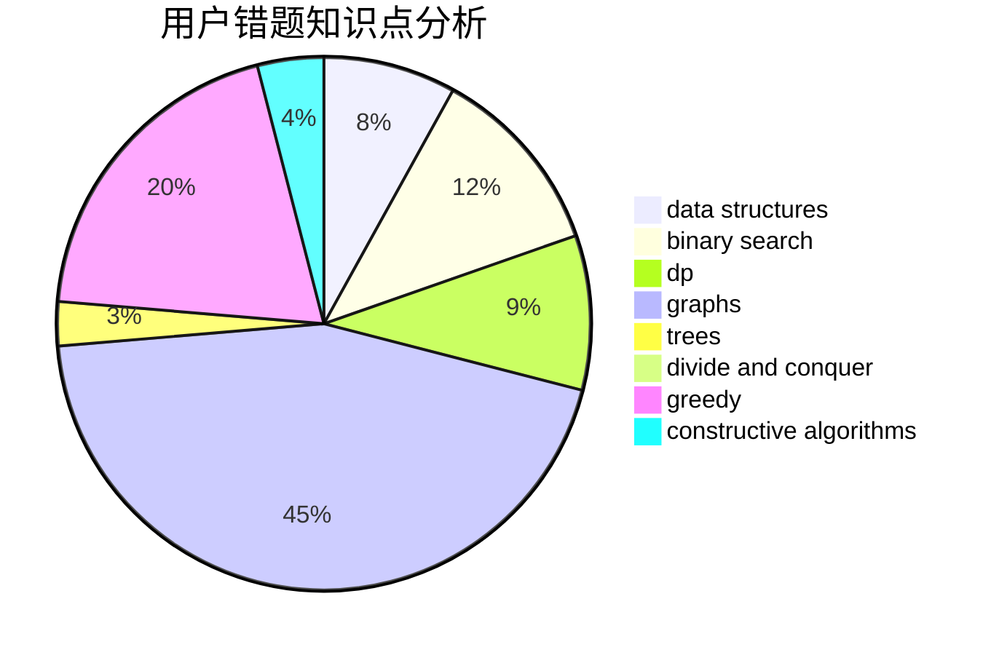

# emofunc

<!-- tabs:start -->

#### **用户提交结果分析**

#### **用户做题类型偏好分析**

#### **用户错题知识点分析**

<!-- tabs:end -->
# 推荐题目
[1068C](https://codeforces.com/contest/1068/problem/C)		constructive algorithms,
                        graphs		  
[809E](https://codeforces.com/contest/809/problem/E)		divide and conquer,
                        math,
                        number theory,
                        trees		  
[261B](https://codeforces.com/contest/261/problem/B)		dp,
                        math,
                        probabilities		  
[297E](https://codeforces.com/contest/297/problem/E)		data structures		  
[923A](https://codeforces.com/contest/923/problem/A)		math,
                        number theory		  
[1261B2](https://codeforces.com/contest/1261B/problem/2)		dsu,graphs,sortings,trees		  
[1513A](https://codeforces.com/contest/1513/problem/A)		constructive algorithms,
                        implementation		  
[476C](https://codeforces.com/contest/476/problem/C)		math		  
[1191D](https://codeforces.com/contest/1191/problem/D)		dsu,graphs,sortings,trees		  
[1143D](https://codeforces.com/contest/1143/problem/D)		dsu,graphs,sortings,trees		  
