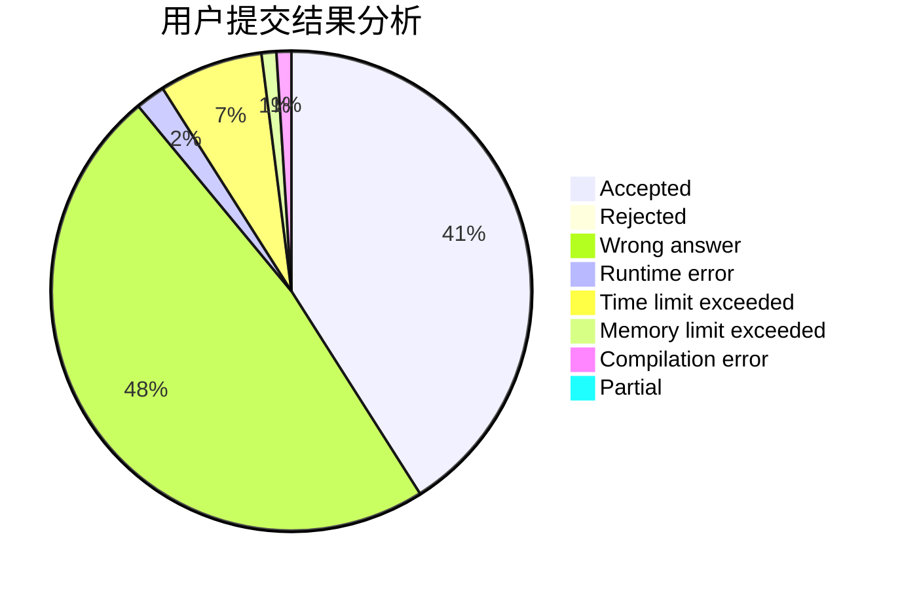
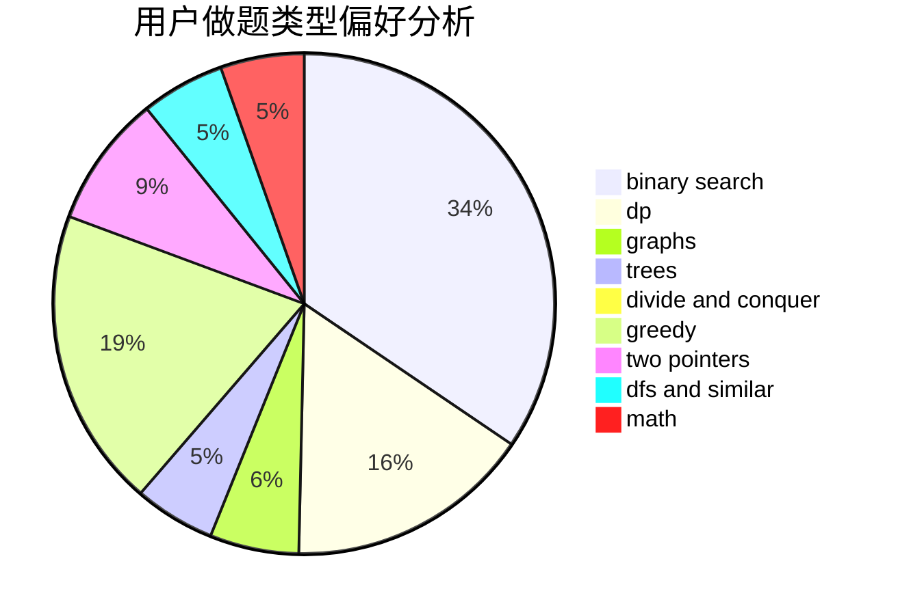

# emofunc

<!-- tabs:start -->

#### **用户提交结果分析**

#### **用户做题类型偏好分析**

<!-- tabs:end -->
# 推荐题目
[106A](https://codeforces.com/contest/106/problem/A)
[827D](https://codeforces.com/contest/827/problem/D)
[279E](https://codeforces.com/contest/279/problem/E)
[315A](https://codeforces.com/contest/315/problem/A)
[946F](https://codeforces.com/contest/946/problem/F)
[1267A](https://codeforces.com/contest/1267/problem/A)
[171H](https://codeforces.com/contest/171/problem/H)
[496A](https://codeforces.com/contest/496/problem/A)
[1197C](https://codeforces.com/contest/1197/problem/C)
[1145D](https://codeforces.com/contest/1145/problem/D)
