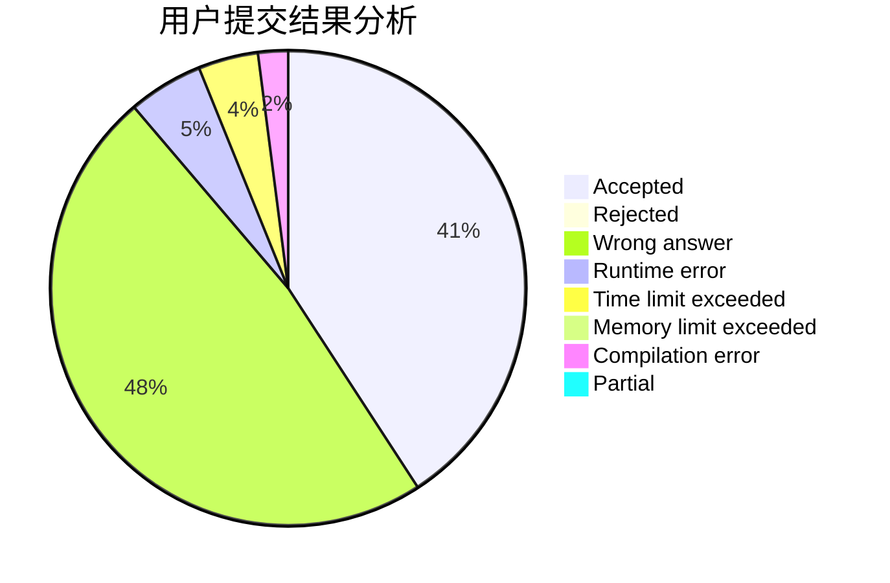
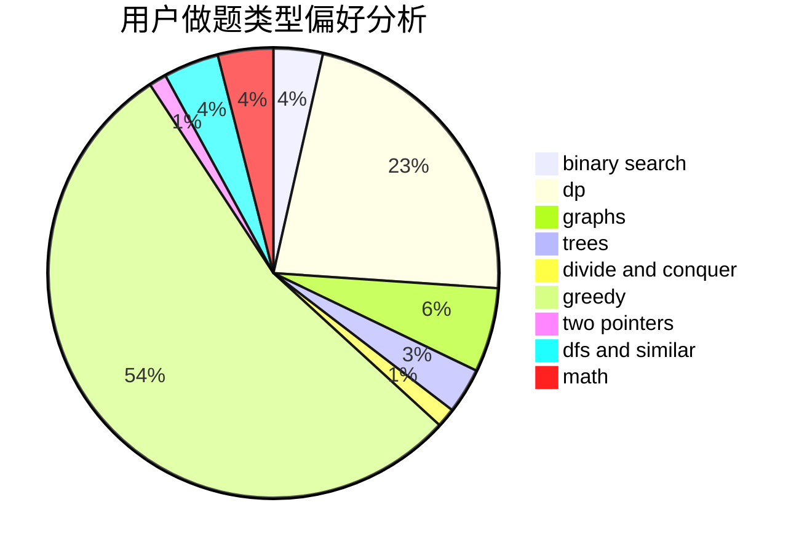

# endless-chase

<!-- tabs:start -->

#### **用户提交结果分析**

#### **用户做题类型偏好分析**

<!-- tabs:end -->
# 推荐题目
[1484B](https://codeforces.com/contest/1484/problem/B)
[185A](https://codeforces.com/contest/185/problem/A)
[1473G](https://codeforces.com/contest/1473/problem/G)
[13573](https://codeforces.com/contest/1357/problem/3)
[814C](https://codeforces.com/contest/814/problem/C)
[736D](https://codeforces.com/contest/736/problem/D)
[954C](https://codeforces.com/contest/954/problem/C)
[835E](https://codeforces.com/contest/835/problem/E)
[897B](https://codeforces.com/contest/897/problem/B)
[630R](https://codeforces.com/contest/630/problem/R)
