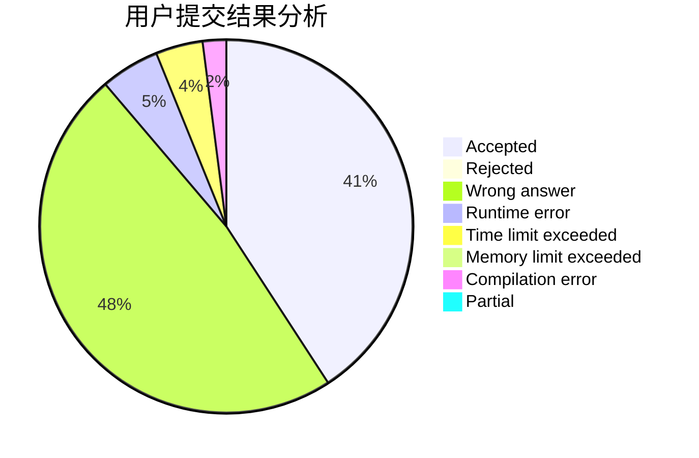
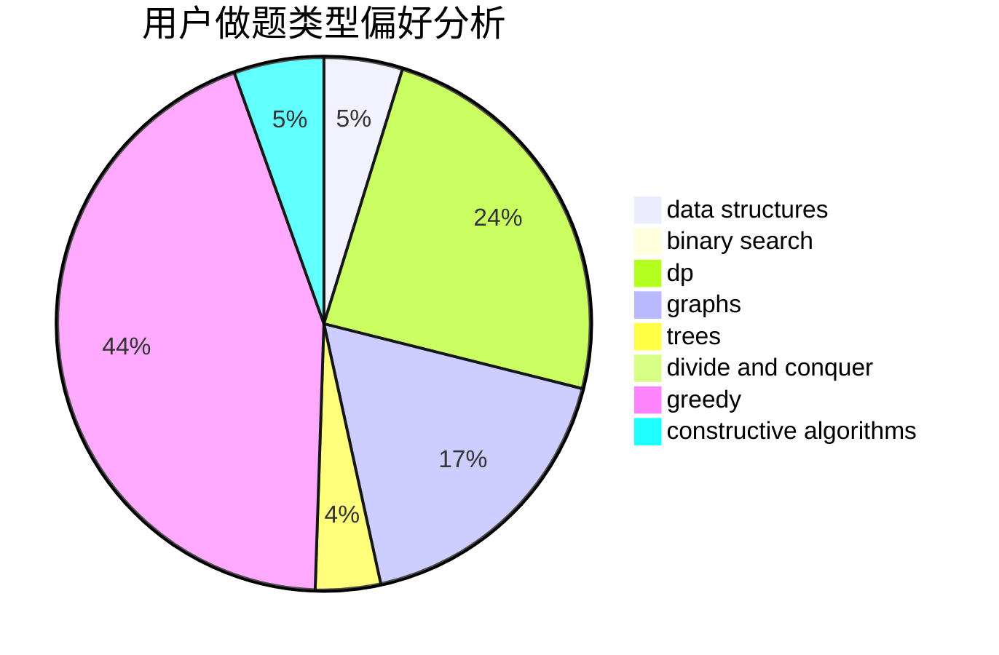
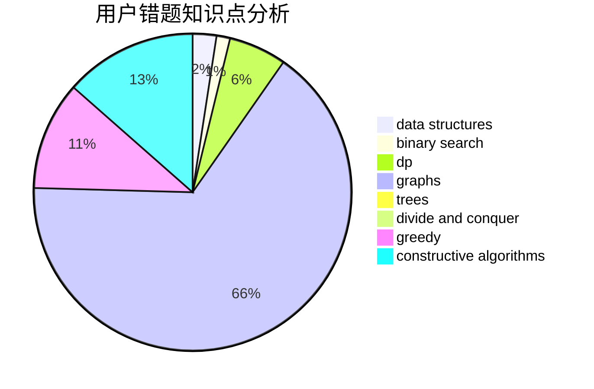

# endless-chase
<!-- tabs:start -->
#### **用户提交结果分析**

#### **用户做题类型偏好分析**

#### **用户错题知识点分析**

<!-- tabs:end -->
# 推荐题目
[Reading Books (easy version)](http://codeforces.com/problemset/problem/1374/E1)		data structures,
                        greedy,
                        sortings		  
[Advertising Agency](http://codeforces.com/problemset/problem/1475/E)		combinatorics,
                        math,
                        sortings		  
[Unlucky Ticket](http://codeforces.com/problemset/problem/160/B)		greedy,
                        sortings		  
[Efim and Strange Grade](https://codeforces.com/contest/719/problem/C)		dp,
                        implementation,
                        math		  
[Karen and Test](https://codeforces.com/contest/816/problem/D)		brute force,
                        combinatorics,
                        constructive algorithms,
                        math		  
[Sergey's problem](http://codeforces.com/problemset/problem/1019/C)		constructive algorithms,
                        graphs		  
[New Year and Cake](http://codeforces.com/problemset/problem/611/G)		geometry,
                        two pointers		  
[Package Delivery](https://codeforces.com/contest/634/problem/D)		data structures,
                        divide and conquer,
                        greedy		  
[New Year Cards](http://codeforces.com/problemset/problem/140/B)		brute force,
                        greedy,
                        implementation		  
[Soap Time! - 2](http://codeforces.com/problemset/problem/185/E)		binary search,
                        data structures		  
<!-- tabs:start -->
#### **data structures**
[Reading Books (easy version)](http://codeforces.com/problemset/problem/1374/E1)		data structures,
                        greedy,
                        sortings		  
[Advertising Agency](https://codeforces.com/contest/634/problem/D)		data structures,
                        divide and conquer,
                        greedy		  
[Unlucky Ticket](http://codeforces.com/problemset/problem/185/E)		binary search,
                        data structures		  
[Efim and Strange Grade](https://codeforces.com/contest/876/problem/F)		binary search,
                        bitmasks,
                        combinatorics,
                        data structures,
                        divide and conquer		  
[Karen and Test](http://codeforces.com/problemset/problem/174/C)		data structures,
                        greedy		  
[Sergey's problem](http://codeforces.com/problemset/problem/983/E)		binary search,
                        data structures,
                        trees		  
[New Year and Cake](http://codeforces.com/problemset/problem/1469/F)		binary search,
                        data structures,
                        greedy		  
[Package Delivery](http://codeforces.com/problemset/problem/777/E)		brute force,
                        data structures,
                        dp,
                        greedy,
                        sortings		  
[New Year Cards](http://codeforces.com/problemset/problem/609/E)		data structures,
                        dfs and similar,
                        dsu,
                        graphs,
                        trees		  
[Soap Time! - 2](http://codeforces.com/problemset/problem/1437/G)		data structures,
                        string suffix structures,
                        strings,
                        trees		  
#### **binary search**
[Reading Books (easy version)](http://codeforces.com/problemset/problem/185/E)		binary search,
                        data structures		  
[Advertising Agency](https://codeforces.com/contest/876/problem/F)		binary search,
                        bitmasks,
                        combinatorics,
                        data structures,
                        divide and conquer		  
[Unlucky Ticket](http://codeforces.com/problemset/problem/983/E)		binary search,
                        data structures,
                        trees		  
[Efim and Strange Grade](http://codeforces.com/problemset/problem/1469/F)		binary search,
                        data structures,
                        greedy		  
[Karen and Test](http://codeforces.com/problemset/problem/1492/C)		binary search,
                        data structures,
                        dp,
                        greedy,
                        two pointers		  
[Sergey's problem](http://codeforces.com/problemset/problem/1463/D)		binary search,
                        constructive algorithms,
                        greedy,
                        two pointers		  
[New Year and Cake](http://codeforces.com/problemset/problem/1490/G)		binary search,
                        data structures,
                        math		  
[Package Delivery](http://codeforces.com/problemset/problem/1479/D)		binary search,
                        bitmasks,
                        brute force,
                        data structures,
                        probabilities,
                        trees		  
[New Year Cards](http://codeforces.com/problemset/problem/1436/E)		binary search,
                        data structures,
                        two pointers		  
[Soap Time! - 2](http://codeforces.com/problemset/problem/1461/D)		binary search,
                        brute force,
                        data structures,
                        divide and conquer,
                        implementation,
                        sortings		  
#### **dp**
[Reading Books (easy version)](https://codeforces.com/contest/719/problem/C)		dp,
                        implementation,
                        math		  
[Advertising Agency](http://codeforces.com/problemset/problem/78/C)		dp,
                        games,
                        number theory		  
[Unlucky Ticket](https://codeforces.com/contest/1345/problem/E)		dfs and similar,
                        dp,
                        graphs,
                        math		  
[Efim and Strange Grade](https://codeforces.com/contest/480/problem/B)		dp,
                        graphs		  
[Karen and Test](http://codeforces.com/problemset/problem/777/E)		brute force,
                        data structures,
                        dp,
                        greedy,
                        sortings		  
[Sergey's problem](http://codeforces.com/problemset/problem/868/E)		dp,
                        graphs,
                        trees		  
[New Year and Cake](http://codeforces.com/problemset/problem/1492/C)		binary search,
                        data structures,
                        dp,
                        greedy,
                        two pointers		  
[Package Delivery](https://codeforces.com/contest/1457/problem/C)		brute force,
                        dp,
                        implementation		  
[New Year Cards](http://codeforces.com/problemset/problem/1491/C)		brute force,
                        data structures,
                        dp,
                        greedy,
                        implementation		  
[Soap Time! - 2](http://codeforces.com/problemset/problem/1437/C)		dp,
                        flows,
                        graph matchings,
                        greedy,
                        math,
                        sortings		  
#### **graph**
[Reading Books (easy version)](http://codeforces.com/problemset/problem/1019/C)		constructive algorithms,
                        graphs		  
[Advertising Agency](https://codeforces.com/contest/699/problem/D)		constructive algorithms,
                        dfs and similar,
                        dsu,
                        graphs,
                        trees		  
[Unlucky Ticket](https://codeforces.com/contest/1345/problem/E)		dfs and similar,
                        dp,
                        graphs,
                        math		  
[Efim and Strange Grade](https://codeforces.com/contest/480/problem/B)		dp,
                        graphs		  
[Karen and Test](http://codeforces.com/problemset/problem/609/E)		data structures,
                        dfs and similar,
                        dsu,
                        graphs,
                        trees		  
[Sergey's problem](http://codeforces.com/problemset/problem/1000/E)		dfs and similar,
                        graphs,
                        trees		  
[New Year and Cake](http://codeforces.com/problemset/problem/1242/B)		dfs and similar,
                        dsu,
                        graphs,
                        sortings		  
[Package Delivery](http://codeforces.com/problemset/problem/868/E)		dp,
                        graphs,
                        trees		  
[New Year Cards](http://codeforces.com/problemset/problem/1487/C)		brute force,
                        constructive algorithms,
                        dfs and similar,
                        graphs,
                        greedy,
                        implementation,
                        math		  
[Soap Time! - 2](http://codeforces.com/problemset/problem/1437/C)		dp,
                        flows,
                        graph matchings,
                        greedy,
                        math,
                        sortings		  
#### **trees**
[Reading Books (easy version)](https://codeforces.com/contest/699/problem/D)		constructive algorithms,
                        dfs and similar,
                        dsu,
                        graphs,
                        trees		  
[Advertising Agency](http://codeforces.com/problemset/problem/983/E)		binary search,
                        data structures,
                        trees		  
[Unlucky Ticket](http://codeforces.com/problemset/problem/609/E)		data structures,
                        dfs and similar,
                        dsu,
                        graphs,
                        trees		  
[Efim and Strange Grade](http://codeforces.com/problemset/problem/1437/G)		data structures,
                        string suffix structures,
                        strings,
                        trees		  
[Karen and Test](http://codeforces.com/problemset/problem/1000/E)		dfs and similar,
                        graphs,
                        trees		  
[Sergey's problem](http://codeforces.com/problemset/problem/868/E)		dp,
                        graphs,
                        trees		  
[New Year and Cake](http://codeforces.com/problemset/problem/1466/D)		data structures,
                        greedy,
                        sortings,
                        trees		  
[Package Delivery](http://codeforces.com/problemset/problem/1479/D)		binary search,
                        bitmasks,
                        brute force,
                        data structures,
                        probabilities,
                        trees		  
[New Year Cards](http://codeforces.com/problemset/problem/1511/C)		brute force,
                        data structures,
                        implementation,
                        trees		  
[Soap Time! - 2](http://codeforces.com/problemset/problem/1499/F)		combinatorics,
                        dfs and similar,
                        dp,
                        trees		  
#### **divide and conquer**
[Reading Books (easy version)](https://codeforces.com/contest/634/problem/D)		data structures,
                        divide and conquer,
                        greedy		  
[Advertising Agency](https://codeforces.com/contest/876/problem/F)		binary search,
                        bitmasks,
                        combinatorics,
                        data structures,
                        divide and conquer		  
[Unlucky Ticket](http://codeforces.com/problemset/problem/1466/G)		combinatorics,
                        divide and conquer,
                        hashing,
                        math,
                        string suffix structures,
                        strings		  
[Efim and Strange Grade](http://codeforces.com/problemset/problem/848/C)		data structures,
                        divide and conquer		  
[Karen and Test](http://codeforces.com/problemset/problem/1461/D)		binary search,
                        brute force,
                        data structures,
                        divide and conquer,
                        implementation,
                        sortings		  
[Sergey's problem](http://codeforces.com/problemset/problem/1466/G)		combinatorics,
                        divide and conquer,
                        hashing,
                        math,
                        string suffix structures,
                        strings		  
[New Year and Cake](http://codeforces.com/problemset/problem/1490/D)		dfs and similar,
                        divide and conquer,
                        implementation		  
[Package Delivery](https://codeforces.com/contest/1483/problem/C)		data structures,
                        divide and conquer,
                        dp		  
[New Year Cards](http://codeforces.com/problemset/problem/1491/E)		brute force,
                        dfs and similar,
                        divide and conquer,
                        number theory,
                        trees		  
[Soap Time! - 2](http://codeforces.com/problemset/problem/1303/G)		data structures,
                        divide and conquer,
                        geometry,
                        trees		  
#### **greedy**
[Reading Books (easy version)](http://codeforces.com/problemset/problem/1374/E1)		data structures,
                        greedy,
                        sortings		  
[Advertising Agency](http://codeforces.com/problemset/problem/160/B)		greedy,
                        sortings		  
[Unlucky Ticket](https://codeforces.com/contest/634/problem/D)		data structures,
                        divide and conquer,
                        greedy		  
[Efim and Strange Grade](http://codeforces.com/problemset/problem/140/B)		brute force,
                        greedy,
                        implementation		  
[Karen and Test](http://codeforces.com/problemset/problem/174/C)		data structures,
                        greedy		  
[Sergey's problem](http://codeforces.com/problemset/problem/1474/E)		constructive algorithms,
                        greedy		  
[New Year and Cake](http://codeforces.com/problemset/problem/1077/B)		greedy		  
[Package Delivery](http://codeforces.com/problemset/problem/1469/F)		binary search,
                        data structures,
                        greedy		  
[New Year Cards](http://codeforces.com/problemset/problem/777/E)		brute force,
                        data structures,
                        dp,
                        greedy,
                        sortings		  
[Soap Time! - 2](http://codeforces.com/problemset/problem/623/D)		greedy,
                        math,
                        probabilities		  
#### **constructive algorithms**
[Reading Books (easy version)](https://codeforces.com/contest/816/problem/D)		brute force,
                        combinatorics,
                        constructive algorithms,
                        math		  
[Advertising Agency](http://codeforces.com/problemset/problem/1019/C)		constructive algorithms,
                        graphs		  
[Unlucky Ticket](https://codeforces.com/contest/699/problem/D)		constructive algorithms,
                        dfs and similar,
                        dsu,
                        graphs,
                        trees		  
[Efim and Strange Grade](http://codeforces.com/problemset/problem/932/C)		brute force,
                        constructive algorithms		  
[Karen and Test](http://codeforces.com/problemset/problem/737/F)		constructive algorithms,
                        math		  
[Sergey's problem](http://codeforces.com/problemset/problem/1474/E)		constructive algorithms,
                        greedy		  
[New Year and Cake](http://codeforces.com/problemset/problem/1153/B)		constructive algorithms,
                        greedy		  
[Package Delivery](http://codeforces.com/problemset/problem/1493/A)		constructive algorithms,
                        greedy		  
[New Year Cards](http://codeforces.com/problemset/problem/1463/D)		binary search,
                        constructive algorithms,
                        greedy,
                        two pointers		  
[Soap Time! - 2](https://codeforces.com/contest/1456/problem/B)		bitmasks,
                        brute force,
                        constructive algorithms		  
#### **sortings**
[Reading Books (easy version)](http://codeforces.com/problemset/problem/1374/E1)		data structures,
                        greedy,
                        sortings		  
[Advertising Agency](http://codeforces.com/problemset/problem/1475/E)		combinatorics,
                        math,
                        sortings		  
[Unlucky Ticket](http://codeforces.com/problemset/problem/160/B)		greedy,
                        sortings		  
[Efim and Strange Grade](http://codeforces.com/problemset/problem/710/B)		brute force,
                        sortings		  
[Karen and Test](http://codeforces.com/problemset/problem/777/E)		brute force,
                        data structures,
                        dp,
                        greedy,
                        sortings		  
[Sergey's problem](http://codeforces.com/problemset/problem/1242/B)		dfs and similar,
                        dsu,
                        graphs,
                        sortings		  
[New Year and Cake](http://codeforces.com/problemset/problem/1466/D)		data structures,
                        greedy,
                        sortings,
                        trees		  
[Package Delivery](https://codeforces.com/contest/1496/problem/C)		geometry,
                        greedy,
                        math,
                        sortings		  
[New Year Cards](http://codeforces.com/problemset/problem/1495/A)		geometry,
                        greedy,
                        math,
                        sortings		  
[Soap Time! - 2](http://codeforces.com/problemset/problem/1497/A)		brute force,
                        data structures,
                        greedy,
                        sortings		  
<!-- tabs:end -->
