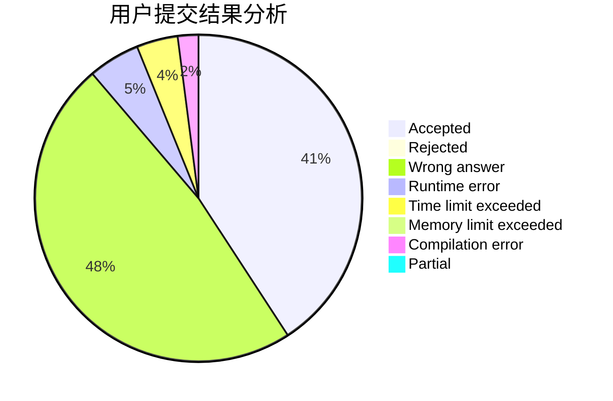
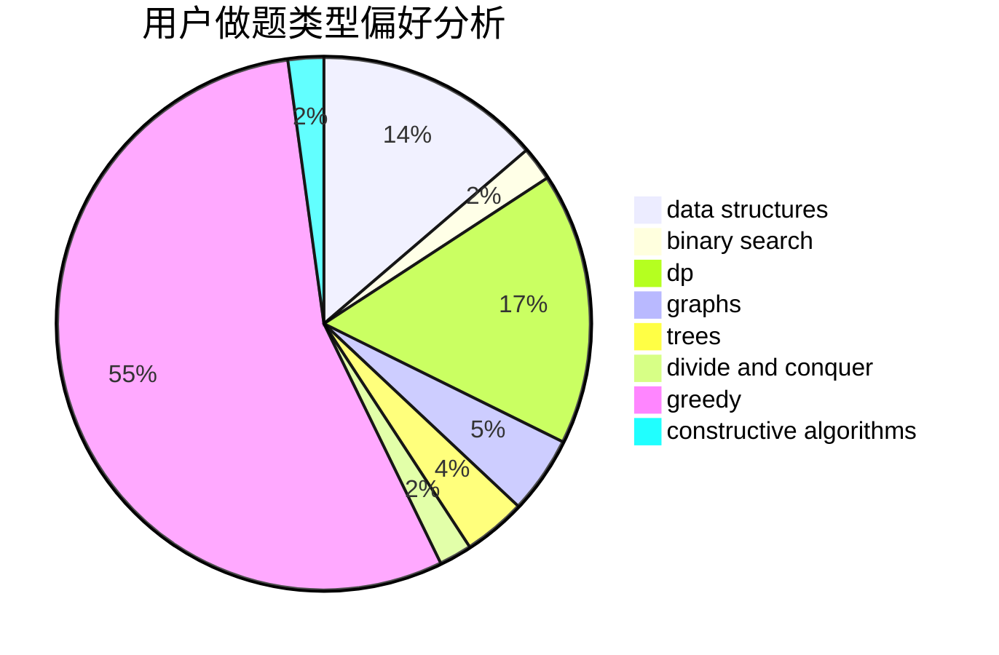
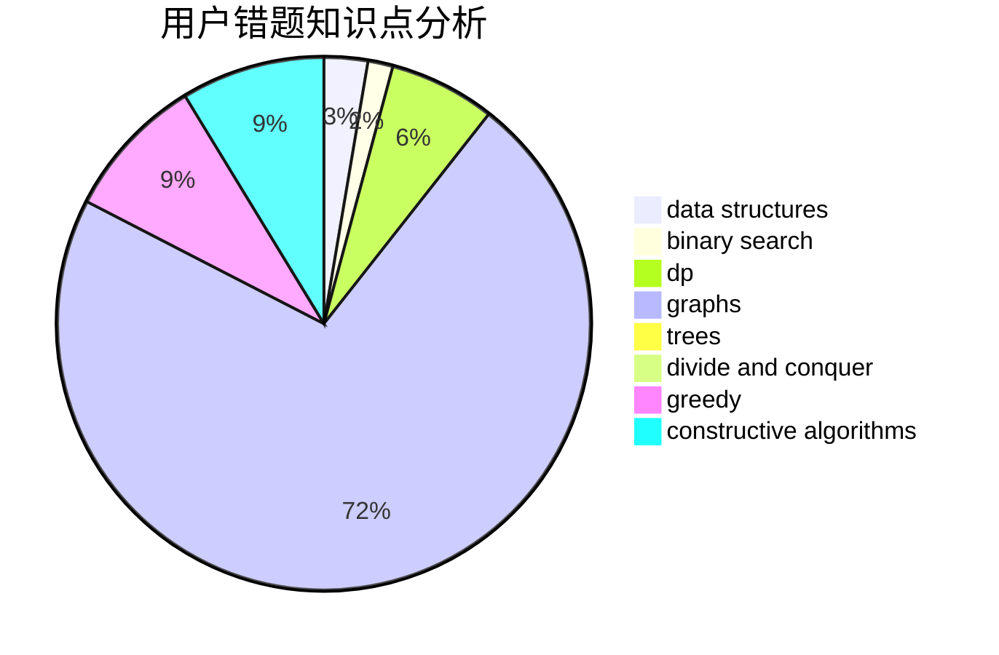

# endless-chase

<!-- tabs:start -->

#### **用户提交结果分析**

#### **用户做题类型偏好分析**

#### **用户错题知识点分析**

<!-- tabs:end -->
# 推荐题目
[1484B](https://codeforces.com/contest/1484/problem/B)		dsu,graphs,sortings,trees		  
[185A](https://codeforces.com/contest/185/problem/A)		math		  
[1473G](https://codeforces.com/contest/1473/problem/G)		combinatorics,
                        dp,
                        fft,
                        math		  
[13573](https://codeforces.com/contest/1357/problem/3)		dsu,graphs,sortings,trees		  
[814C](https://codeforces.com/contest/814/problem/C)		brute force,
                        dp,
                        strings,
                        two pointers		  
[736D](https://codeforces.com/contest/736/problem/D)		math,
                        matrices		  
[954C](https://codeforces.com/contest/954/problem/C)		implementation		  
[835E](https://codeforces.com/contest/835/problem/E)		binary search,
                        constructive algorithms,
                        interactive		  
[897B](https://codeforces.com/contest/897/problem/B)		brute force		  
[630R](https://codeforces.com/contest/630/problem/R)		games,
                        math		  
