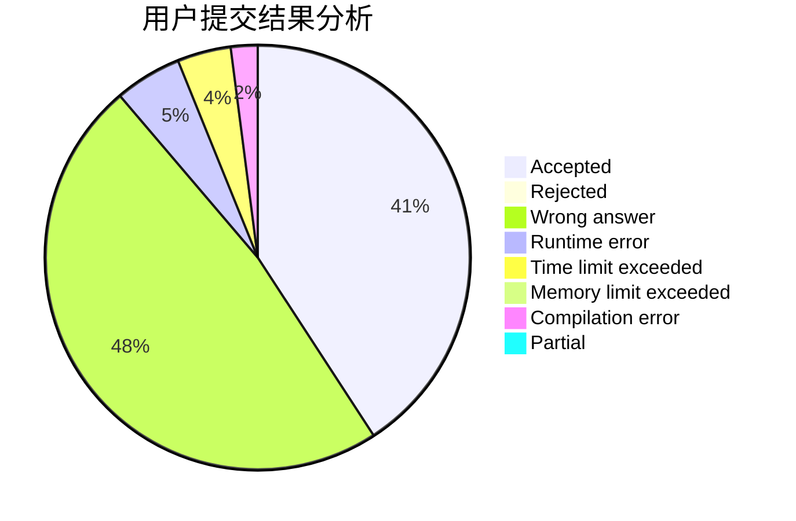
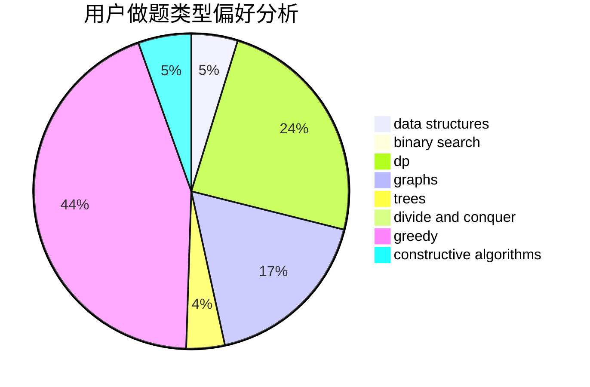
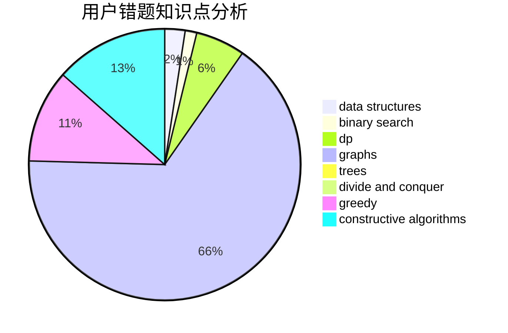

# endless-chase

<!-- tabs:start -->

#### **用户提交结果分析**

#### **用户做题类型偏好分析**

#### **用户错题知识点分析**

<!-- tabs:end -->
# 推荐题目
[1475E](https://codeforces.com/contest/1475/problem/E)		combinatorics,
                        math,
                        sortings		  
[160B](https://codeforces.com/contest/160/problem/B)		greedy,
                        sortings		  
[1466G](https://codeforces.com/contest/1466/problem/G)		combinatorics,
                        divide and conquer,
                        hashing,
                        math,
                        string suffix structures,
                        strings		  
[134B](https://codeforces.com/contest/134/problem/B)		brute force,
                        dfs and similar,
                        math,
                        number theory		  
[7B](https://codeforces.com/contest/7/problem/B)		implementation		  
[719C](https://codeforces.com/contest/719/problem/C)		dsu,graphs,sortings,trees		  
[932C](https://codeforces.com/contest/932/problem/C)		brute force,
                        constructive algorithms		  
[816D](https://codeforces.com/contest/816/problem/D)		dsu,graphs,sortings,trees		  
[876F](https://codeforces.com/contest/876/problem/F)		dsu,graphs,sortings,trees		  
[611G](https://codeforces.com/contest/611/problem/G)		geometry,
                        two pointers		  
