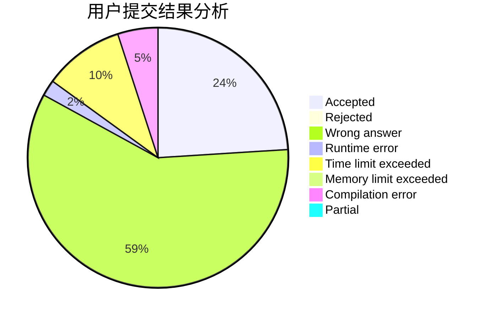
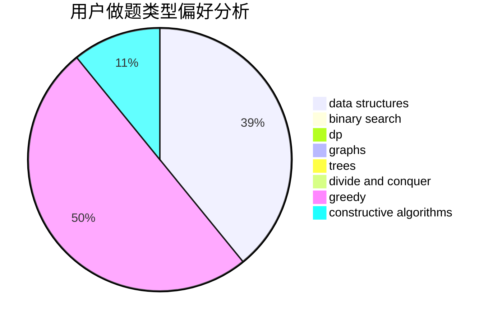
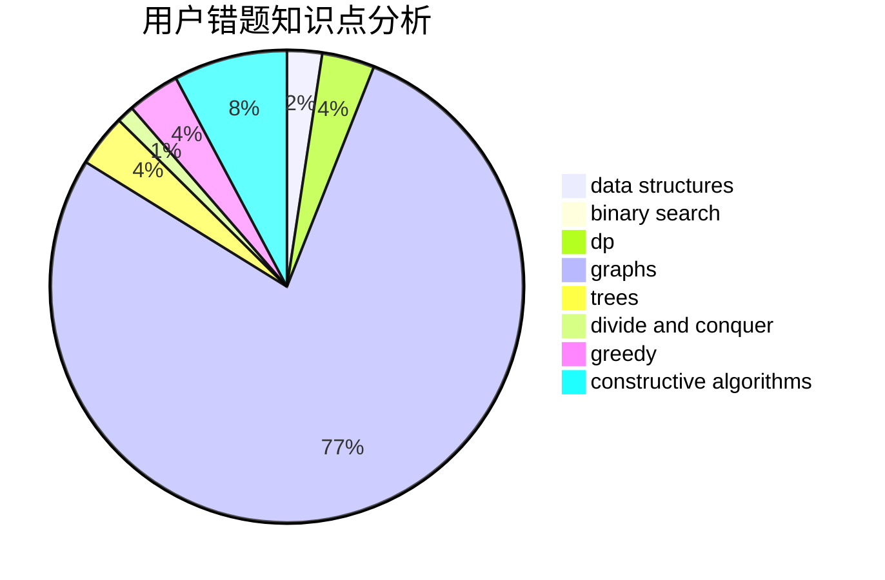

# enterdawn

<!-- tabs:start -->

#### **用户提交结果分析**

#### **用户做题类型偏好分析**

#### **用户错题知识点分析**

<!-- tabs:end -->
# 推荐题目
[1179B](https://codeforces.com/contest/1179/problem/B)		constructive algorithms		  
[993A](https://codeforces.com/contest/993/problem/A)		geometry,
                        implementation		  
[1098F](https://codeforces.com/contest/1098/problem/F)		string suffix structures,
                        strings		  
[919F](https://codeforces.com/contest/919/problem/F)		games,
                        graphs,
                        shortest paths		  
[1349A](https://codeforces.com/contest/1349/problem/A)		data structures,
                        math,
                        number theory		  
[1098D](https://codeforces.com/contest/1098/problem/D)		data structures		  
[1425H](https://codeforces.com/contest/1425/problem/H)		constructive algorithms		  
[1490C](https://codeforces.com/contest/1490/problem/C)		binary search,
                        brute force,
                        brute force,
                        math		  
[1497B](https://codeforces.com/contest/1497/problem/B)		constructive algorithms,
                        greedy,
                        math		  
[1491C](https://codeforces.com/contest/1491/problem/C)		brute force,
                        data structures,
                        dp,
                        greedy,
                        implementation		  
