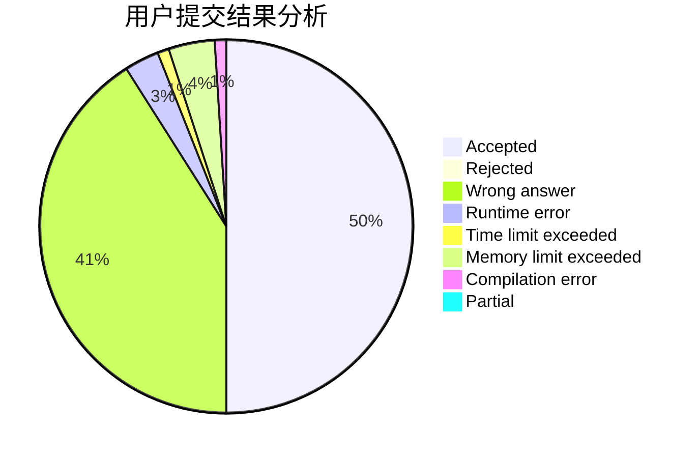
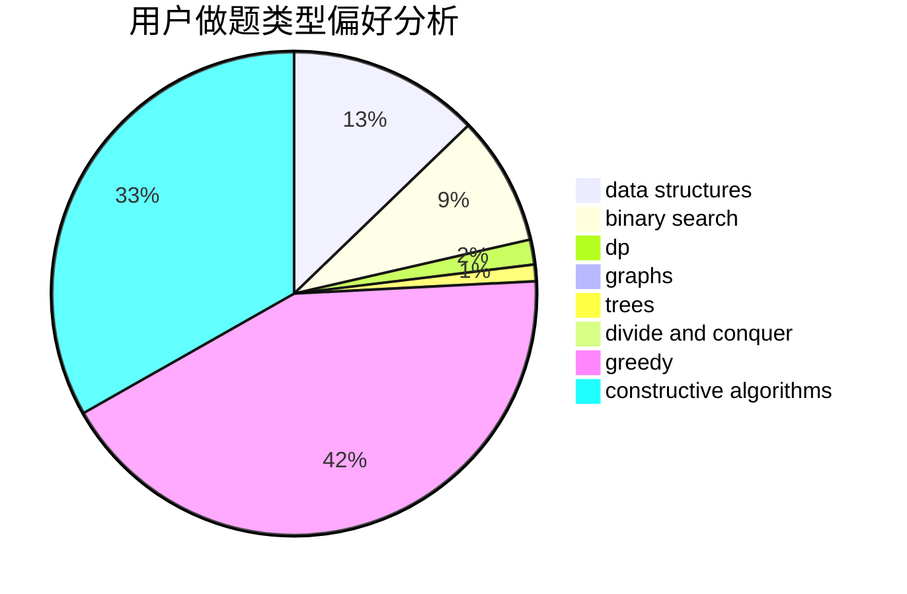

# AsilenceBTF

<!-- tabs:start -->

#### **用户提交结果分析**

#### **用户做题类型偏好分析**

#### **用户错题知识点分析**

<!-- tabs:end -->
# 推荐题目
[1361B](https://codeforces.com/contest/1361/problem/B)		greedy,
                        implementation,
                        math,
                        sortings		  
[431D](https://codeforces.com/contest/431/problem/D)		binary search,
                        bitmasks,
                        combinatorics,
                        dp,
                        math		  
[1346B](https://codeforces.com/contest/1346/problem/B)		*special problem,
                        greedy		  
[432D](https://codeforces.com/contest/432/problem/D)		dp,
                        string suffix structures,
                        strings,
                        two pointers		  
[1290B](https://codeforces.com/contest/1290/problem/B)		binary search,
                        constructive algorithms,
                        data structures,
                        strings,
                        two pointers		  
[431E](https://codeforces.com/contest/431/problem/E)		binary search,
                        data structures,
                        ternary search		  
[1144D](https://codeforces.com/contest/1144/problem/D)		constructive algorithms,
                        greedy		  
[434A](https://codeforces.com/contest/434/problem/A)		dsu,graphs,sortings,trees		  
[1361A](https://codeforces.com/contest/1361/problem/A)		constructive algorithms,
                        graphs,
                        greedy,
                        sortings		  
[434C](https://codeforces.com/contest/434/problem/C)		dsu,graphs,sortings,trees		  
