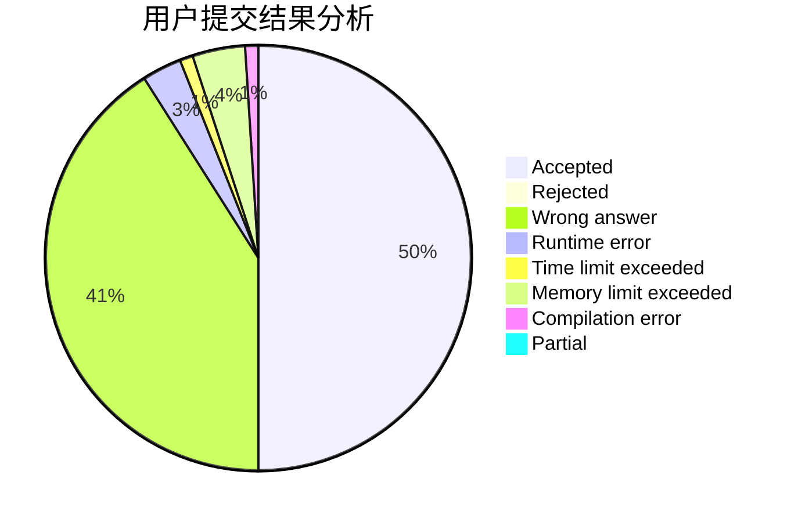
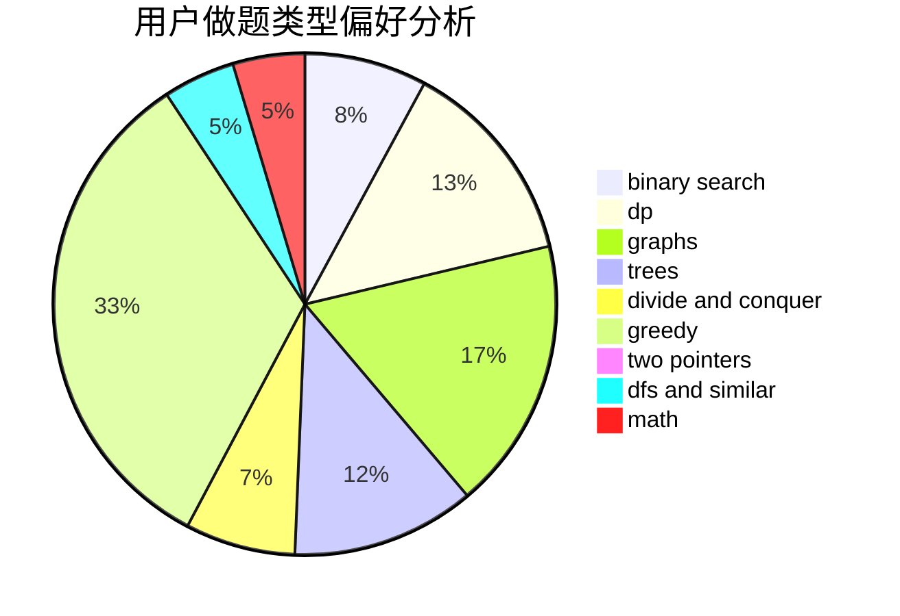

# AsilenceBTF

<!-- tabs:start -->

#### **用户提交结果分析**

#### **用户做题类型偏好分析**

<!-- tabs:end -->
# 推荐题目
[1369B](https://codeforces.com/contest/1369/problem/B)
[453B](https://codeforces.com/contest/453/problem/B)
[1353C](https://codeforces.com/contest/1353/problem/C)
[453D](https://codeforces.com/contest/453/problem/D)
[1296D](https://codeforces.com/contest/1296/problem/D)
[453C](https://codeforces.com/contest/453/problem/C)
[1146E](https://codeforces.com/contest/1146/problem/E)
[454A](https://codeforces.com/contest/454/problem/A)
[1369A](https://codeforces.com/contest/1369/problem/A)
[455B](https://codeforces.com/contest/455/problem/B)
