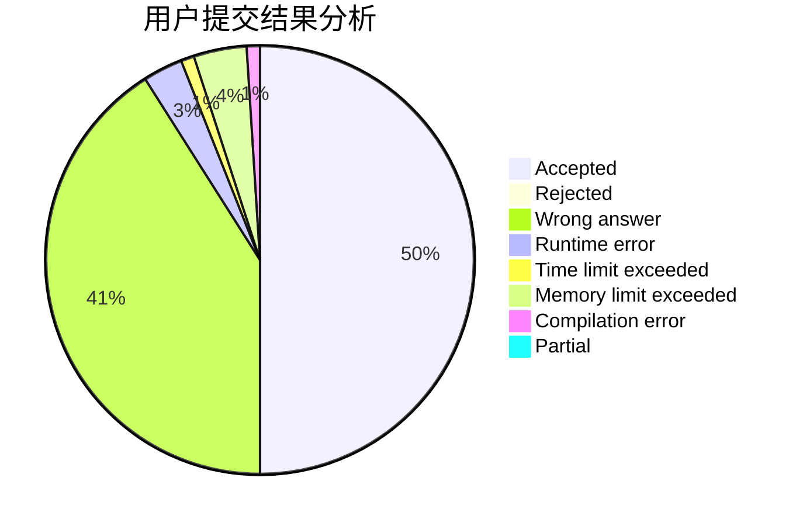
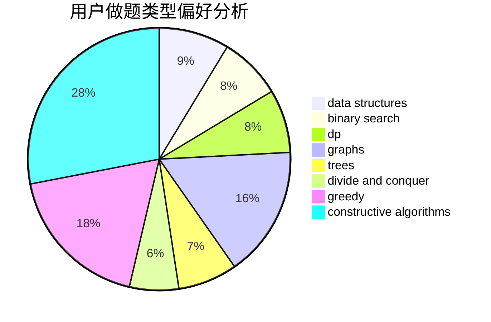

# AsilenceBTF

<!-- tabs:start -->

#### **用户提交结果分析**

#### **用户做题类型偏好分析**

#### **用户错题知识点分析**

<!-- tabs:end -->
# 推荐题目
[1369B](https://codeforces.com/contest/1369/problem/B)		greedy,
                        implementation,
                        strings		  
[453B](https://codeforces.com/contest/453/problem/B)		bitmasks,
                        brute force,
                        dp		  
[1353C](https://codeforces.com/contest/1353/problem/C)		math		  
[453D](https://codeforces.com/contest/453/problem/D)		dp,
                        matrices		  
[1296D](https://codeforces.com/contest/1296/problem/D)		greedy,
                        sortings		  
[453C](https://codeforces.com/contest/453/problem/C)		constructive algorithms,
                        dfs and similar,
                        graphs		  
[1146E](https://codeforces.com/contest/1146/problem/E)		bitmasks,
                        data structures,
                        divide and conquer,
                        implementation		  
[454A](https://codeforces.com/contest/454/problem/A)		implementation		  
[1369A](https://codeforces.com/contest/1369/problem/A)		geometry,
                        math		  
[455B](https://codeforces.com/contest/455/problem/B)		dfs and similar,
                        dp,
                        games,
                        implementation,
                        strings,
                        trees		  
