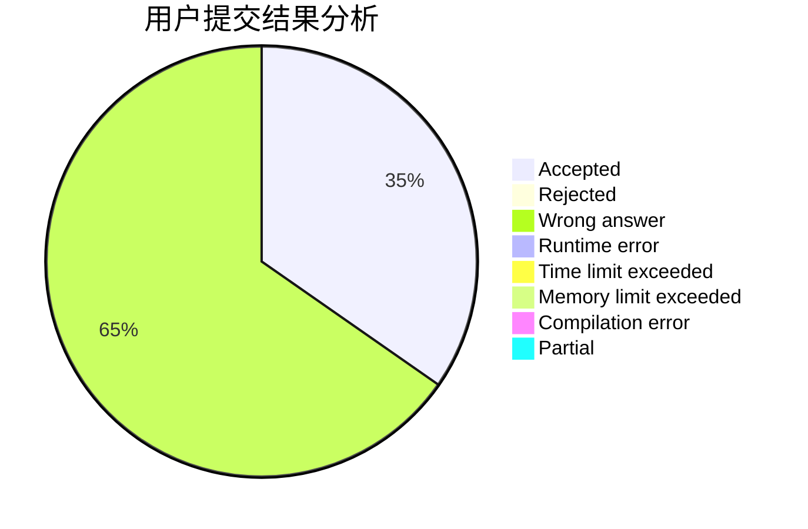
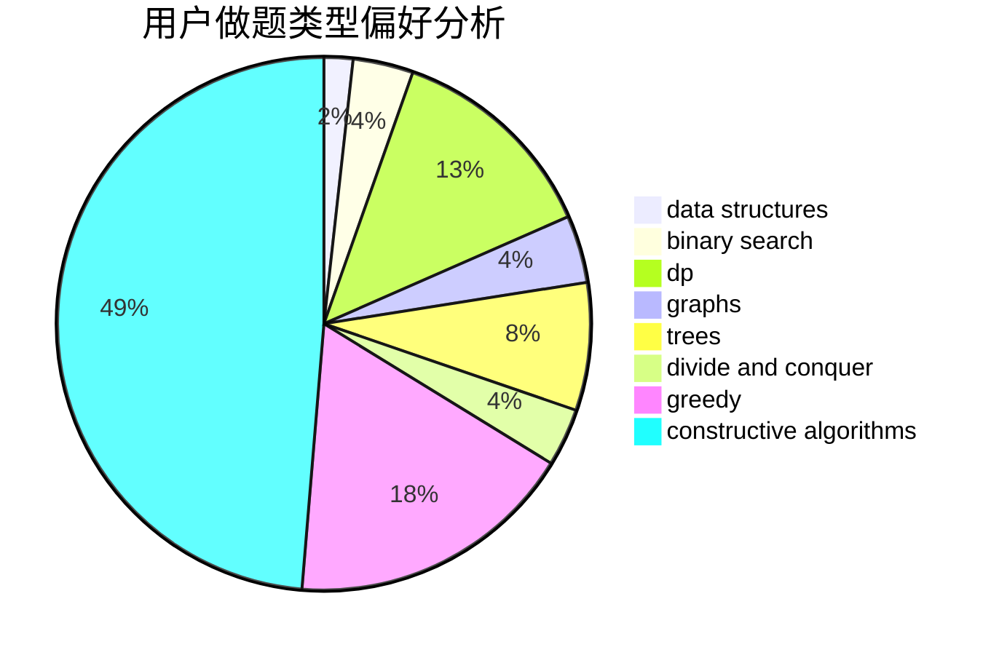
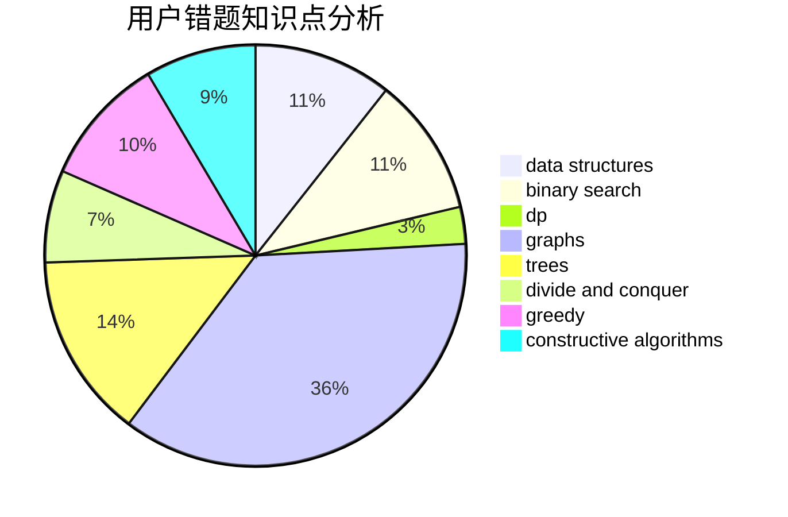

# epee_no_front

<!-- tabs:start -->

#### **用户提交结果分析**

#### **用户做题类型偏好分析**

#### **用户错题知识点分析**

<!-- tabs:end -->
# 推荐题目
[759E](https://codeforces.com/contest/759/problem/E)		dsu,graphs,sortings,trees		  
[1154C](https://codeforces.com/contest/1154/problem/C)		implementation,
                        math		  
[1491A](https://codeforces.com/contest/1491/problem/A)		brute force,
                        greedy,
                        implementation		  
[457D](https://codeforces.com/contest/457/problem/D)		combinatorics,
                        math,
                        probabilities		  
[215D](https://codeforces.com/contest/215/problem/D)		greedy		  
[581D](https://codeforces.com/contest/581/problem/D)		bitmasks,
                        brute force,
                        constructive algorithms,
                        geometry,
                        implementation,
                        math		  
[791C](https://codeforces.com/contest/791/problem/C)		dsu,graphs,sortings,trees		  
[1223E](https://codeforces.com/contest/1223/problem/E)		dp,
                        sortings,
                        trees		  
[471C](https://codeforces.com/contest/471/problem/C)		binary search,
                        brute force,
                        greedy,
                        math		  
[1067A](https://codeforces.com/contest/1067/problem/A)		dp		  
