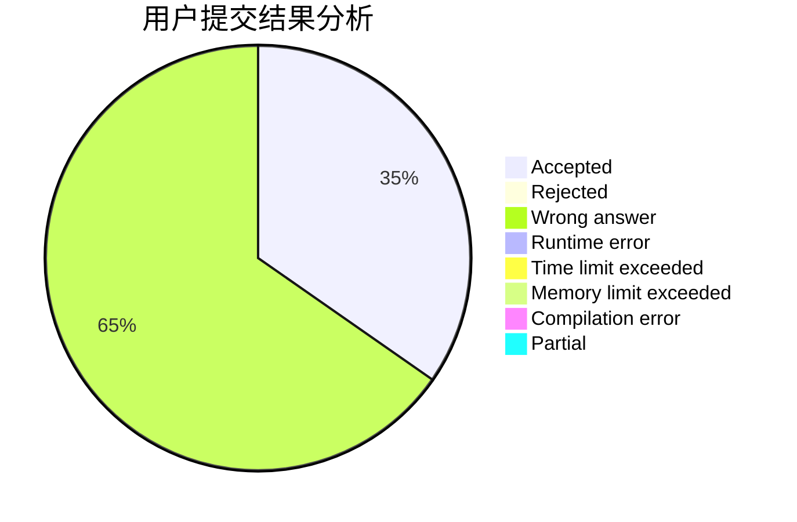
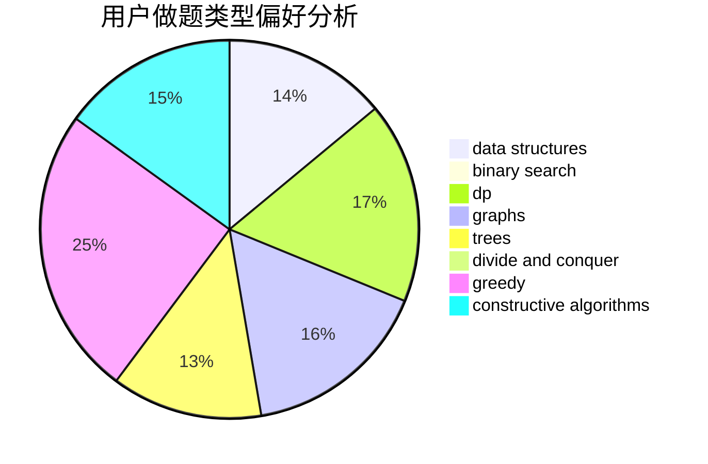
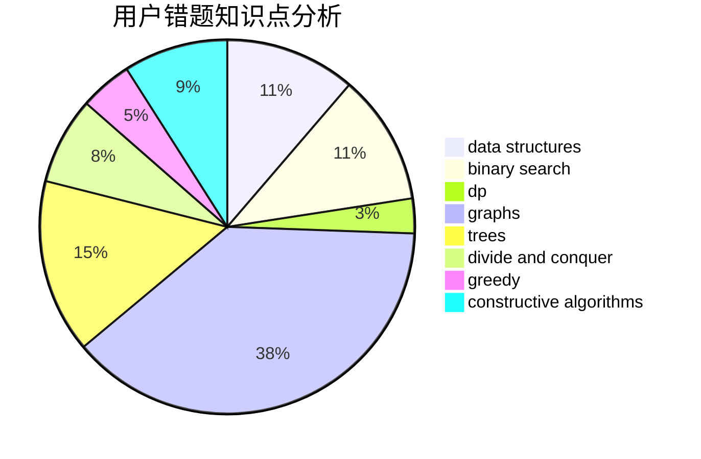

# epee_no_front

<!-- tabs:start -->

#### **用户提交结果分析**

#### **用户做题类型偏好分析**

#### **用户错题知识点分析**

<!-- tabs:end -->
# 推荐题目
[779C](https://codeforces.com/contest/779/problem/C)		constructive algorithms,
                        greedy,
                        sortings		  
[1156C](https://codeforces.com/contest/1156/problem/C)		binary search,
                        greedy,
                        sortings,
                        ternary search,
                        two pointers		  
[1499G](https://codeforces.com/contest/1499/problem/G)		data structures,
                        graphs,
                        interactive		  
[477D](https://codeforces.com/contest/477/problem/D)		dp,
                        strings		  
[235A](https://codeforces.com/contest/235/problem/A)		number theory		  
[602A](https://codeforces.com/contest/602/problem/A)		brute force,
                        implementation		  
[807A](https://codeforces.com/contest/807/problem/A)		implementation,
                        sortings		  
[1230D](https://codeforces.com/contest/1230/problem/D)		dsu,graphs,sortings,trees		  
[48A](https://codeforces.com/contest/48/problem/A)		implementation,
                        schedules		  
[1067D](https://codeforces.com/contest/1067/problem/D)		dp,
                        greedy,
                        math,
                        probabilities		  
