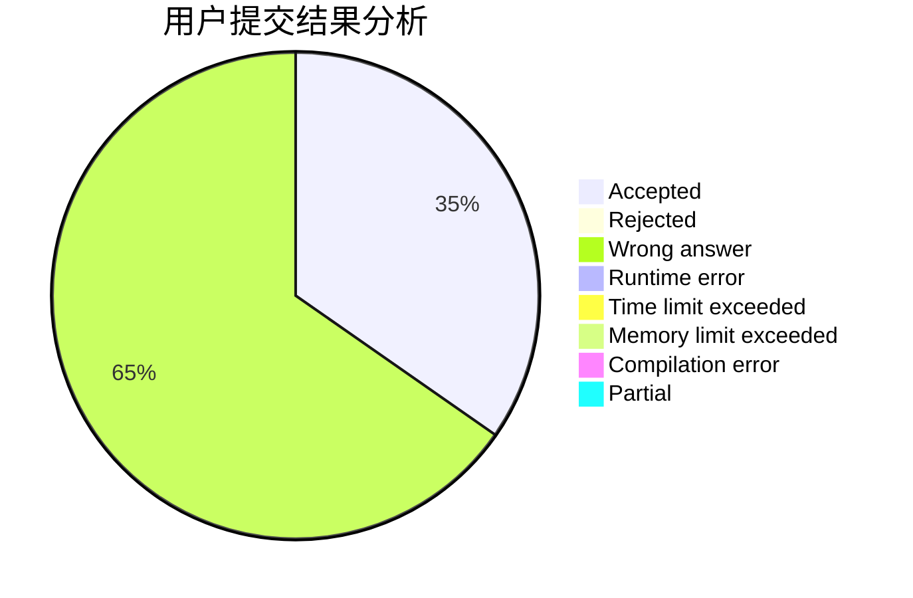
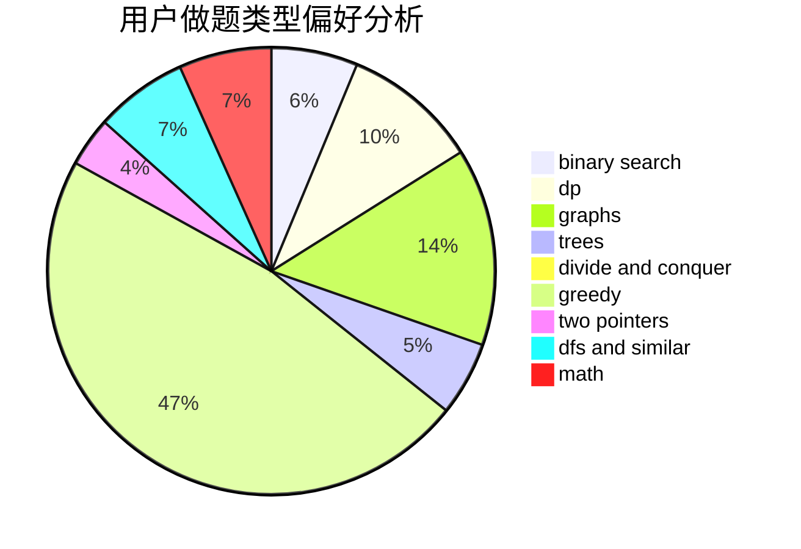

# epee_no_front

<!-- tabs:start -->

#### **用户提交结果分析**

#### **用户做题类型偏好分析**

<!-- tabs:end -->
# 推荐题目
[779C](https://codeforces.com/contest/779/problem/C)
[1156C](https://codeforces.com/contest/1156/problem/C)
[1499G](https://codeforces.com/contest/1499/problem/G)
[477D](https://codeforces.com/contest/477/problem/D)
[235A](https://codeforces.com/contest/235/problem/A)
[602A](https://codeforces.com/contest/602/problem/A)
[807A](https://codeforces.com/contest/807/problem/A)
[1230D](https://codeforces.com/contest/1230/problem/D)
[48A](https://codeforces.com/contest/48/problem/A)
[1067D](https://codeforces.com/contest/1067/problem/D)
