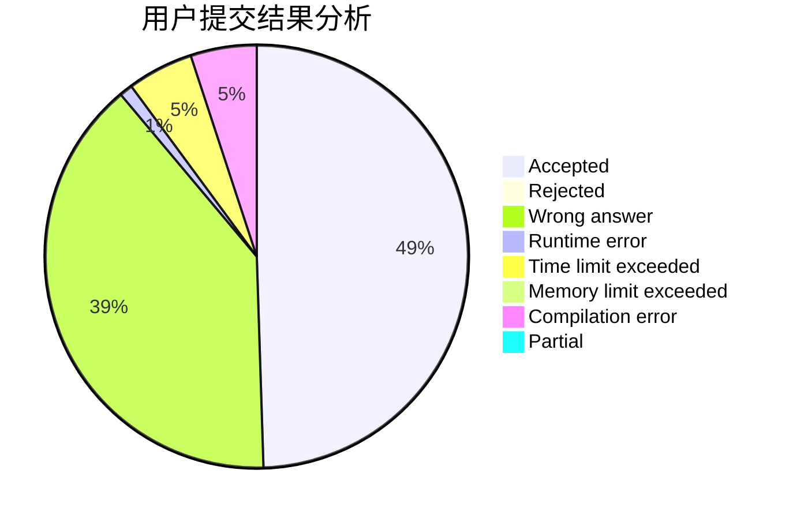
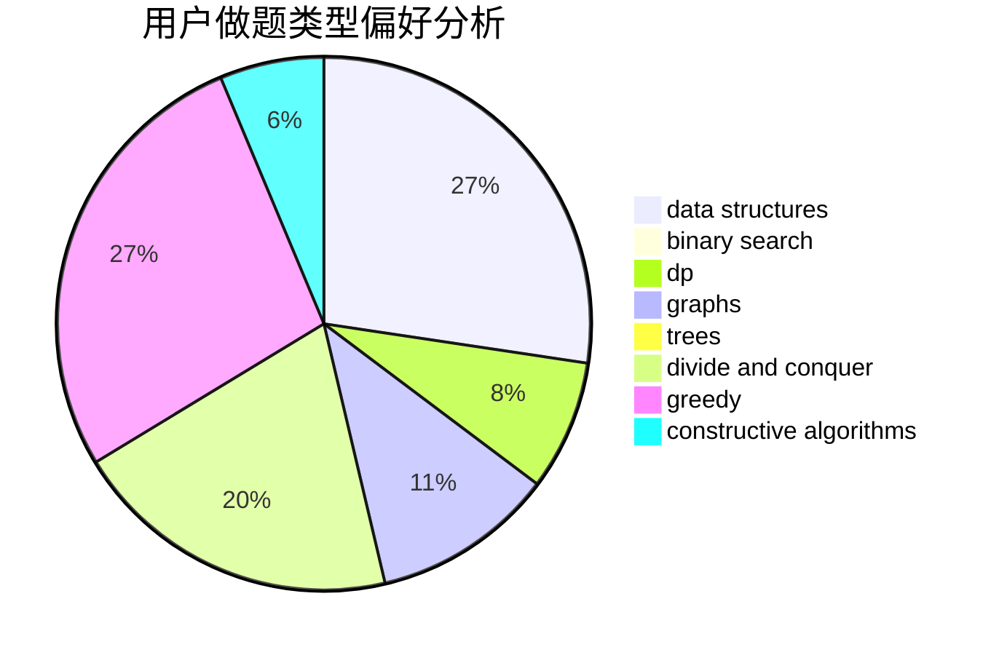
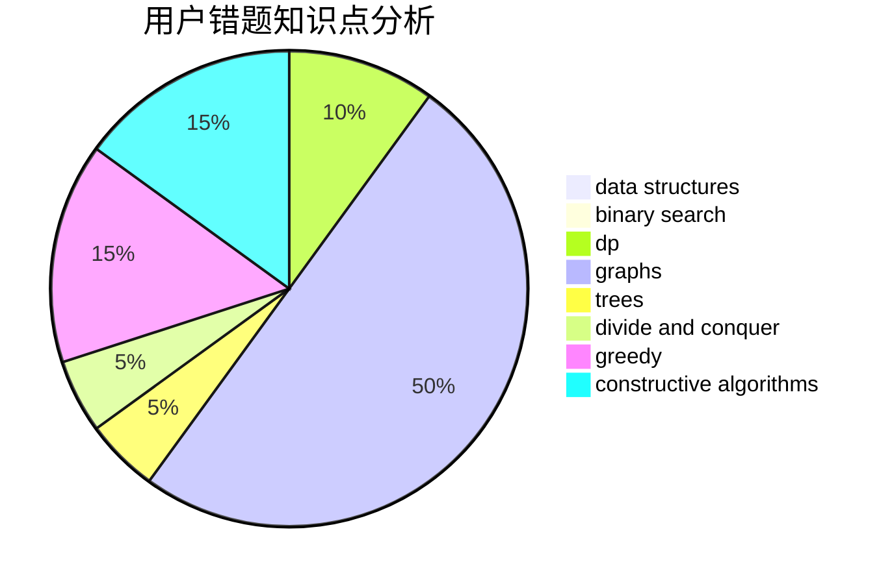

# epic01

<!-- tabs:start -->

#### **用户提交结果分析**

#### **用户做题类型偏好分析**

#### **用户错题知识点分析**

<!-- tabs:end -->
# 推荐题目
[982D](https://codeforces.com/contest/982/problem/D)		brute force,
                        data structures,
                        dsu,
                        trees		  
[898D](https://codeforces.com/contest/898/problem/D)		greedy		  
[913C](https://codeforces.com/contest/913/problem/C)		bitmasks,
                        dp,
                        greedy		  
[888D](https://codeforces.com/contest/888/problem/D)		combinatorics,
                        dp,
                        math		  
[622F](https://codeforces.com/contest/622/problem/F)		math		  
[938B](https://codeforces.com/contest/938/problem/B)		brute force,
                        greedy		  
[497B](https://codeforces.com/contest/497/problem/B)		dsu,graphs,sortings,trees		  
[696F](https://codeforces.com/contest/696/problem/F)		binary search,
                        geometry,
                        two pointers		  
[418E](https://codeforces.com/contest/418/problem/E)		data structures		  
[1190C](https://codeforces.com/contest/1190/problem/C)		brute force,
                        games,
                        greedy		  
