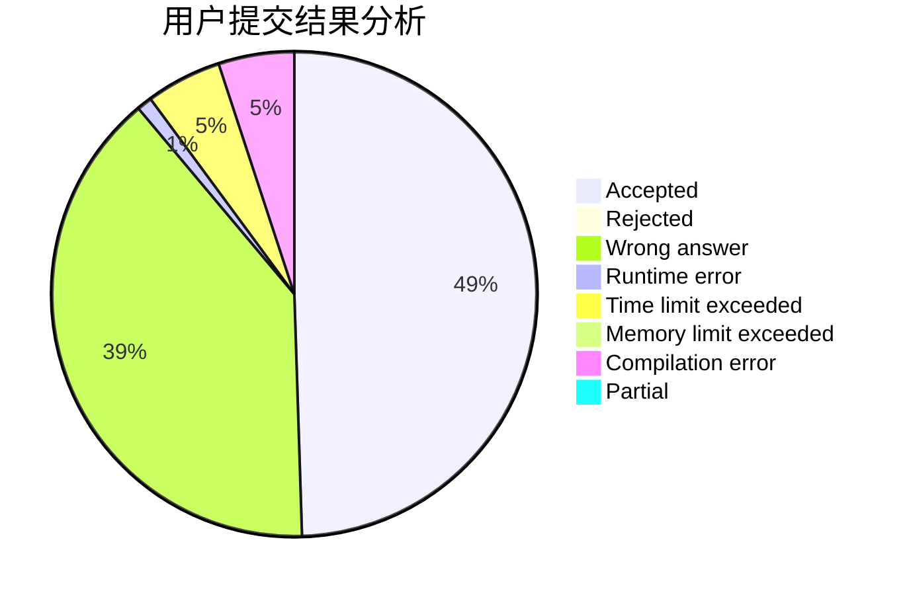
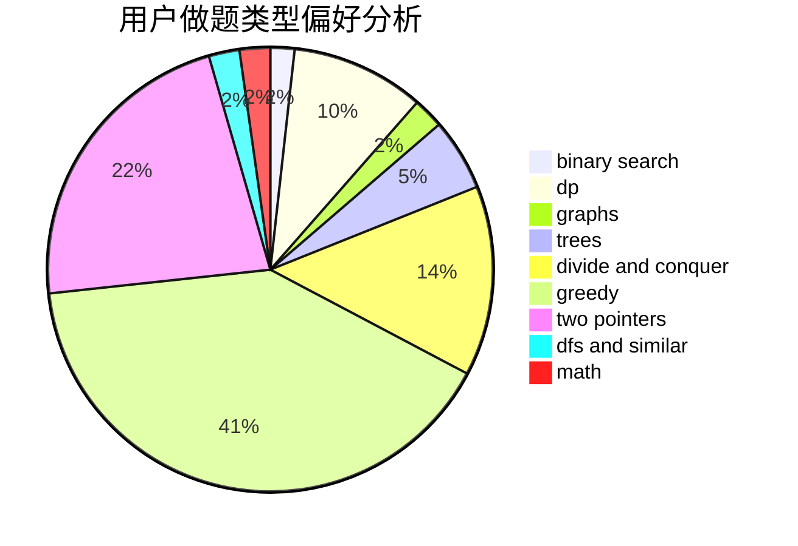

# epic01

<!-- tabs:start -->

#### **用户提交结果分析**

#### **用户做题类型偏好分析**

<!-- tabs:end -->
# 推荐题目
[998B](https://codeforces.com/contest/998/problem/B)
[914F](https://codeforces.com/contest/914/problem/F)
[932A](https://codeforces.com/contest/932/problem/A)
[908B](https://codeforces.com/contest/908/problem/B)
[650E](https://codeforces.com/contest/650/problem/E)
[95A](https://codeforces.com/contest/95/problem/A)
[516C](https://codeforces.com/contest/516/problem/C)
[713D](https://codeforces.com/contest/713/problem/D)
[444D](https://codeforces.com/contest/444/problem/D)
[1196A](https://codeforces.com/contest/1196/problem/A)
