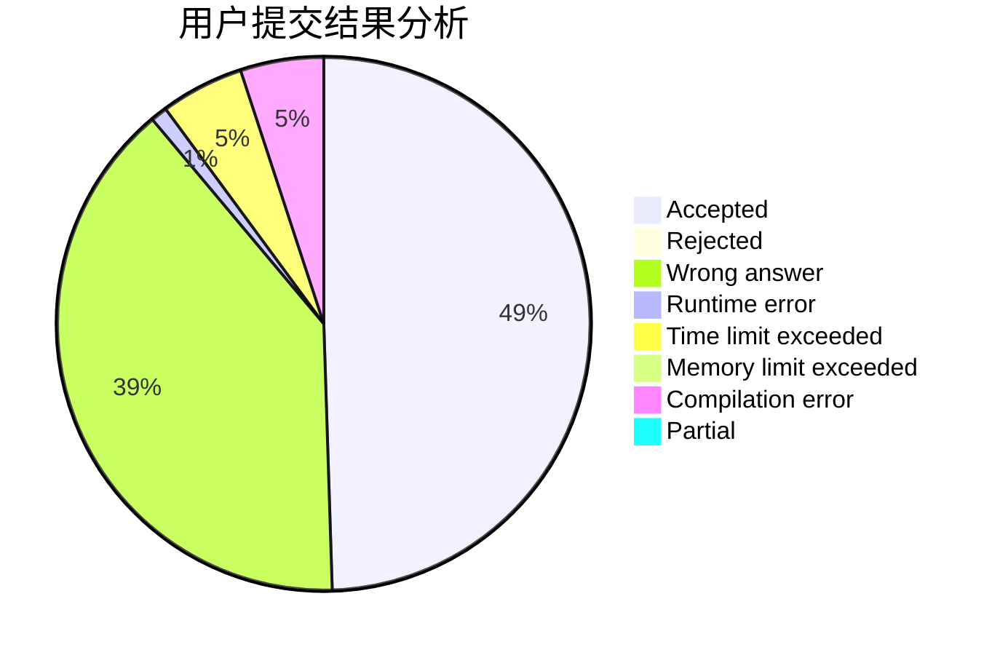
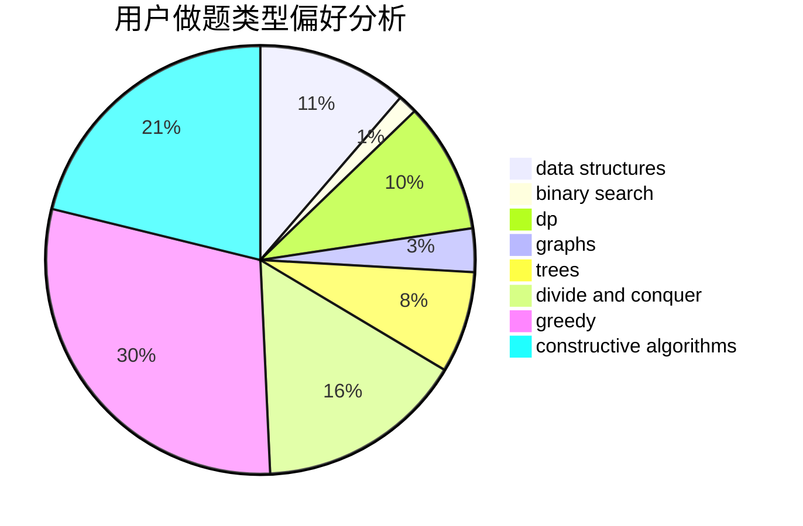

# epic01

<!-- tabs:start -->

#### **用户提交结果分析**

#### **用户做题类型偏好分析**

#### **用户错题知识点分析**

<!-- tabs:end -->
# 推荐题目
[998B](https://codeforces.com/contest/998/problem/B)		dp,
                        greedy,
                        sortings		  
[914F](https://codeforces.com/contest/914/problem/F)		bitmasks,
                        brute force,
                        data structures,
                        string suffix structures,
                        strings		  
[932A](https://codeforces.com/contest/932/problem/A)		constructive algorithms		  
[908B](https://codeforces.com/contest/908/problem/B)		brute force,
                        implementation		  
[650E](https://codeforces.com/contest/650/problem/E)		data structures,
                        dfs and similar,
                        dsu,
                        greedy,
                        trees		  
[95A](https://codeforces.com/contest/95/problem/A)		implementation,
                        strings		  
[516C](https://codeforces.com/contest/516/problem/C)		dsu,graphs,sortings,trees		  
[713D](https://codeforces.com/contest/713/problem/D)		binary search,
                        data structures		  
[444D](https://codeforces.com/contest/444/problem/D)		binary search,
                        hashing,
                        strings,
                        two pointers		  
[1196A](https://codeforces.com/contest/1196/problem/A)		brute force,
                        constructive algorithms,
                        math		  
