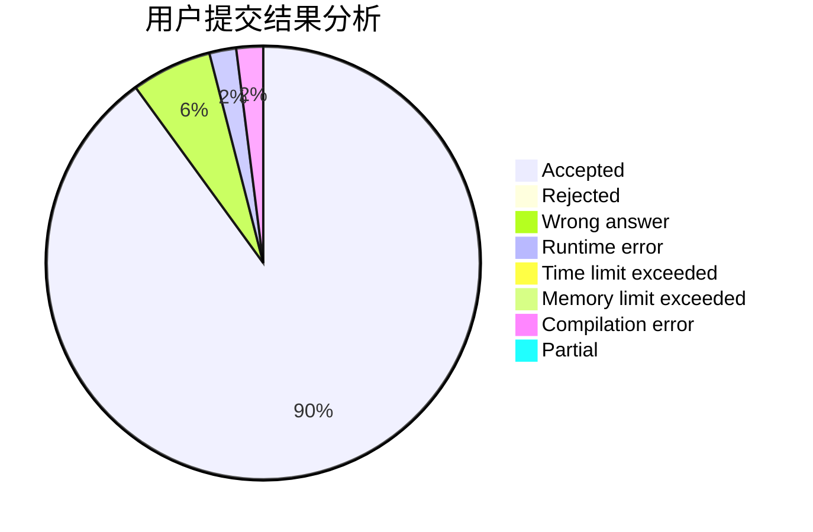
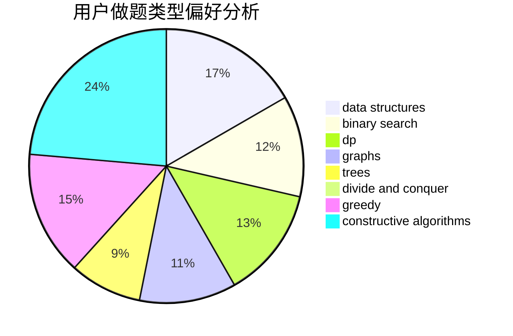

# epii10

<!-- tabs:start -->

#### **用户提交结果分析**

#### **用户做题类型偏好分析**

#### **用户错题知识点分析**

<!-- tabs:end -->
# 推荐题目
[825G](https://codeforces.com/contest/825/problem/G)		dfs and similar,
                        graphs,
                        trees		  
[705C](https://codeforces.com/contest/705/problem/C)		dsu,graphs,sortings,trees		  
[703C](https://codeforces.com/contest/703/problem/C)		geometry,
                        implementation		  
[1254D](https://codeforces.com/contest/1254/problem/D)		data structures,
                        probabilities,
                        trees		  
[1143F](https://codeforces.com/contest/1143/problem/F)		dsu,graphs,sortings,trees		  
[1091E](https://codeforces.com/contest/1091/problem/E)		binary search,
                        data structures,
                        graphs,
                        greedy,
                        implementation,
                        math,
                        sortings		  
[1102B](https://codeforces.com/contest/1102/problem/B)		greedy,
                        sortings		  
[1487C](https://codeforces.com/contest/1487/problem/C)		brute force,
                        constructive algorithms,
                        dfs and similar,
                        graphs,
                        greedy,
                        implementation,
                        math		  
[1100F](https://codeforces.com/contest/1100/problem/F)		data structures,
                        divide and conquer,
                        greedy,
                        math		  
[1377A1](https://codeforces.com/contest/1377A/problem/1)		dsu,graphs,sortings,trees		  
