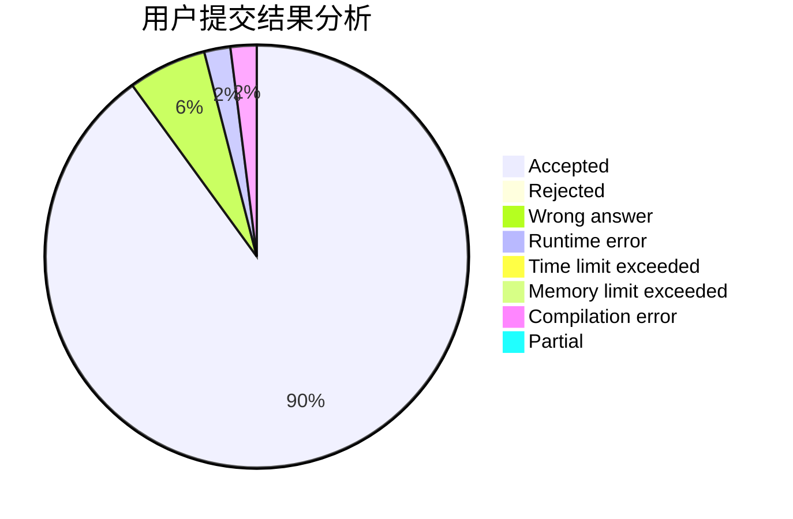
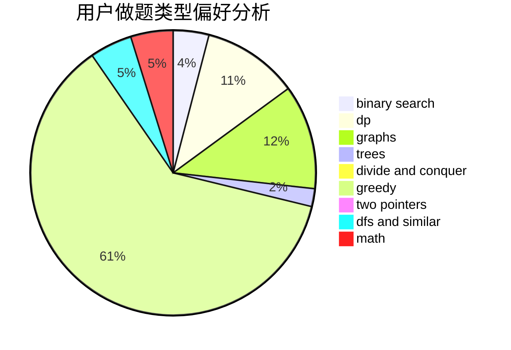

# epii10

<!-- tabs:start -->

#### **用户提交结果分析**

#### **用户做题类型偏好分析**

<!-- tabs:end -->
# 推荐题目
[845C](https://codeforces.com/contest/845/problem/C)
[724E](https://codeforces.com/contest/724/problem/E)
[722D](https://codeforces.com/contest/722/problem/D)
[12621](https://codeforces.com/contest/1262/problem/1)
[1146A](https://codeforces.com/contest/1146/problem/A)
[1091H](https://codeforces.com/contest/1091/problem/H)
[1102E](https://codeforces.com/contest/1102/problem/E)
[1494F](https://codeforces.com/contest/1494/problem/F)
[1101C](https://codeforces.com/contest/1101/problem/C)
[1386B](https://codeforces.com/contest/1386/problem/B)
