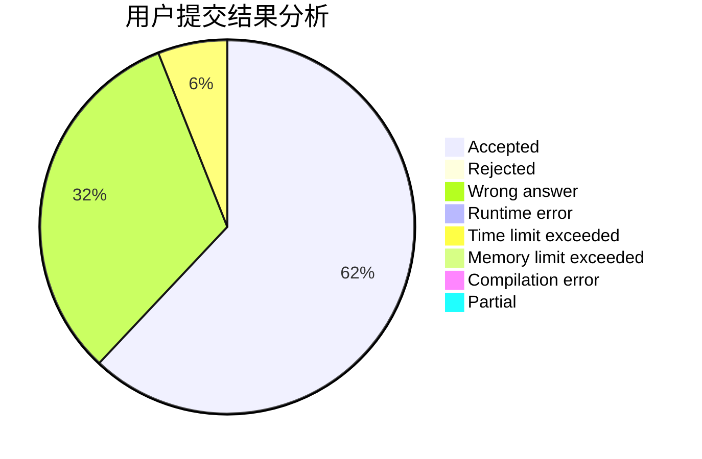
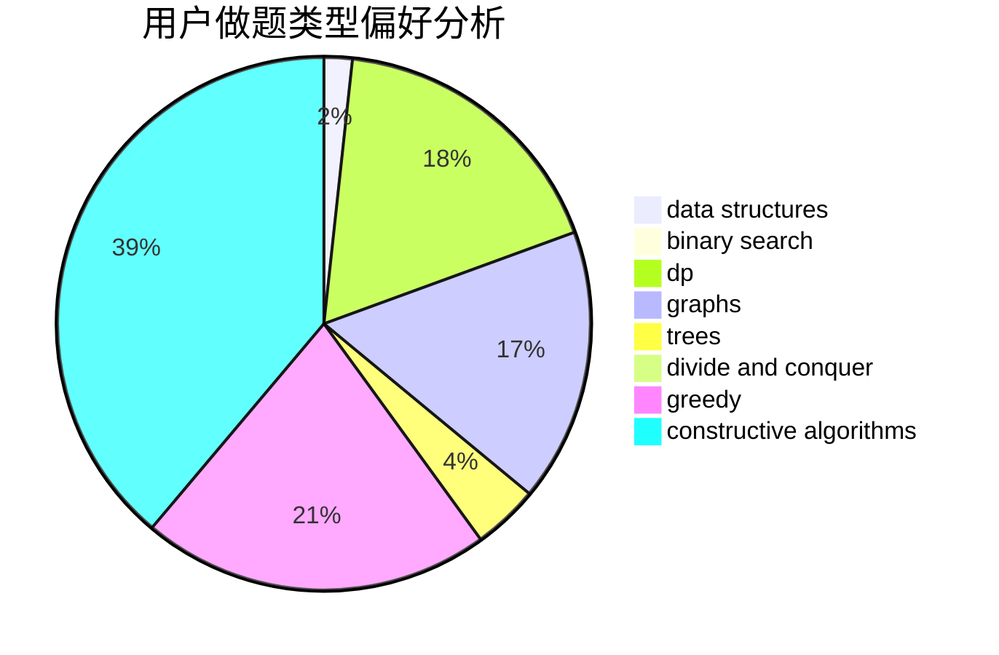
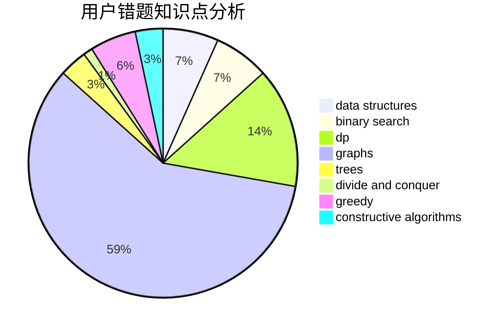

# er1

<!-- tabs:start -->

#### **用户提交结果分析**

#### **用户做题类型偏好分析**

#### **用户错题知识点分析**

<!-- tabs:end -->
# 推荐题目
[497D](https://codeforces.com/contest/497/problem/D)		brute force,
                        geometry,
                        math		  
[1310C](https://codeforces.com/contest/1310/problem/C)		binary search,
                        dp,
                        strings		  
[1039A](https://codeforces.com/contest/1039/problem/A)		constructive algorithms,
                        data structures,
                        greedy,
                        math		  
[875A](https://codeforces.com/contest/875/problem/A)		brute force,
                        math		  
[720D](https://codeforces.com/contest/720/problem/D)		data structures,
                        dp,
                        sortings		  
[1013D](https://codeforces.com/contest/1013/problem/D)		dsu,graphs,sortings,trees		  
[509A](https://codeforces.com/contest/509/problem/A)		brute force,
                        implementation		  
[599D](https://codeforces.com/contest/599/problem/D)		brute force,
                        math		  
[731E](https://codeforces.com/contest/731/problem/E)		dp,
                        games		  
[632B](https://codeforces.com/contest/632/problem/B)		brute force,
                        constructive algorithms		  
