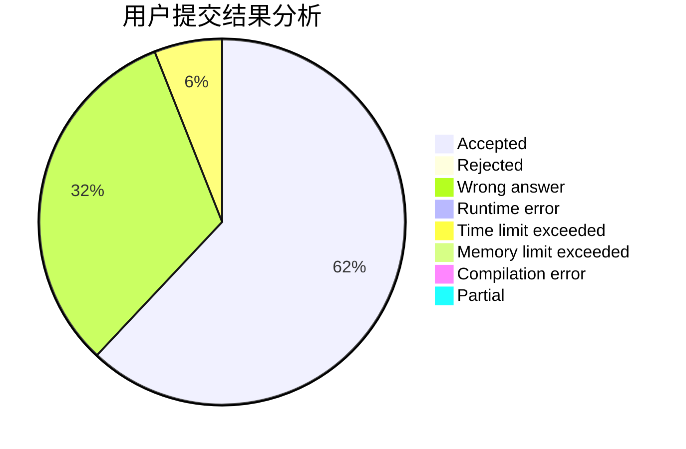
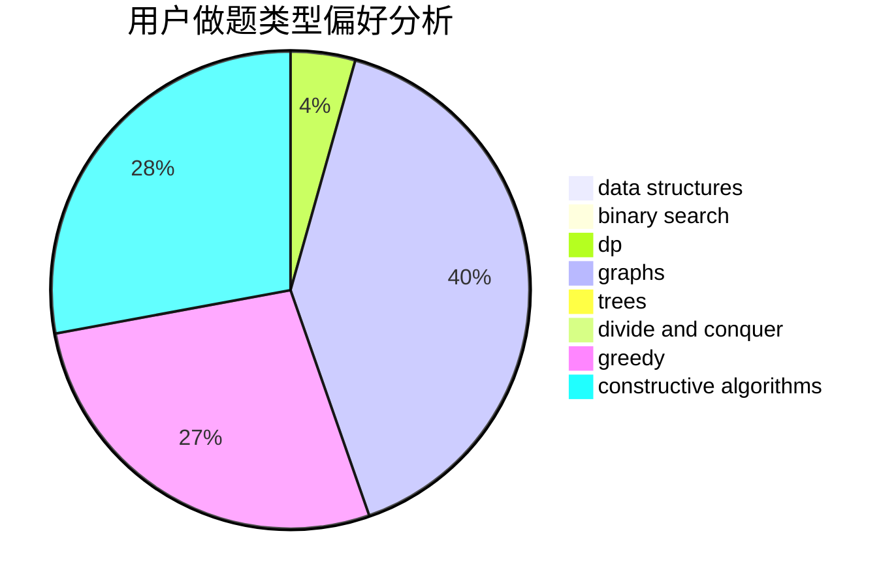
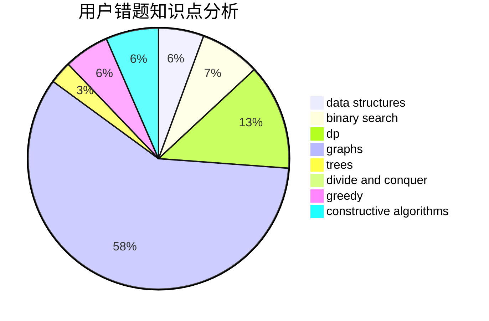

# er1

<!-- tabs:start -->

#### **用户提交结果分析**

#### **用户做题类型偏好分析**

#### **用户错题知识点分析**

<!-- tabs:end -->
# 推荐题目
[477D](https://codeforces.com/contest/477/problem/D)		dp,
                        strings		  
[1300E](https://codeforces.com/contest/1300/problem/E)		dsu,graphs,sortings,trees		  
[1038C](https://codeforces.com/contest/1038/problem/C)		greedy,
                        sortings		  
[855F](https://codeforces.com/contest/855/problem/F)		binary search,
                        data structures		  
[702A](https://codeforces.com/contest/702/problem/A)		dp,
                        greedy,
                        implementation		  
[1013A](https://codeforces.com/contest/1013/problem/A)		math		  
[489A](https://codeforces.com/contest/489/problem/A)		greedy,
                        implementation,
                        sortings		  
[578B](https://codeforces.com/contest/578/problem/B)		brute force,
                        greedy		  
[712C](https://codeforces.com/contest/712/problem/C)		greedy,
                        math		  
[612E](https://codeforces.com/contest/612/problem/E)		combinatorics,
                        constructive algorithms,
                        dfs and similar,
                        graphs,
                        math		  
