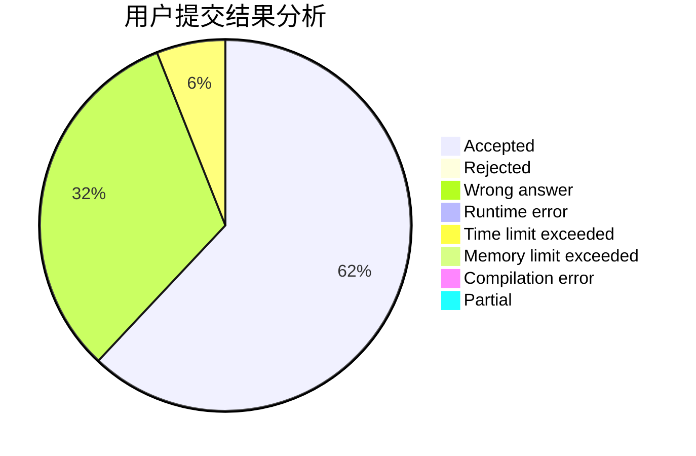
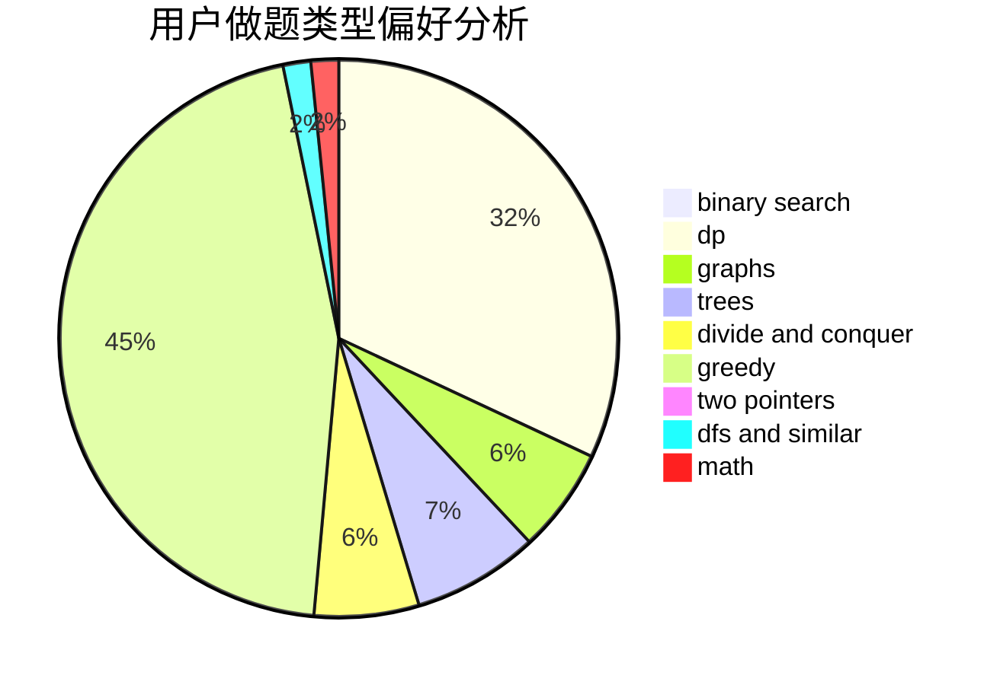

# er1

<!-- tabs:start -->

#### **用户提交结果分析**

#### **用户做题类型偏好分析**

<!-- tabs:end -->
# 推荐题目
[497D](https://codeforces.com/contest/497/problem/D)
[1310C](https://codeforces.com/contest/1310/problem/C)
[1039A](https://codeforces.com/contest/1039/problem/A)
[875A](https://codeforces.com/contest/875/problem/A)
[720D](https://codeforces.com/contest/720/problem/D)
[1013D](https://codeforces.com/contest/1013/problem/D)
[509A](https://codeforces.com/contest/509/problem/A)
[599D](https://codeforces.com/contest/599/problem/D)
[731E](https://codeforces.com/contest/731/problem/E)
[632B](https://codeforces.com/contest/632/problem/B)
