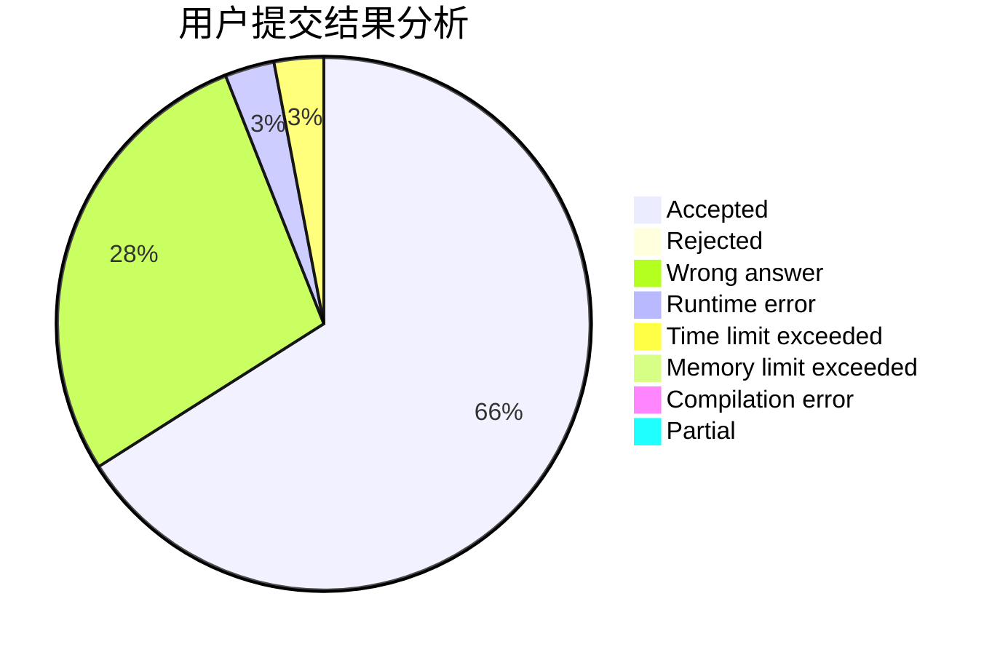
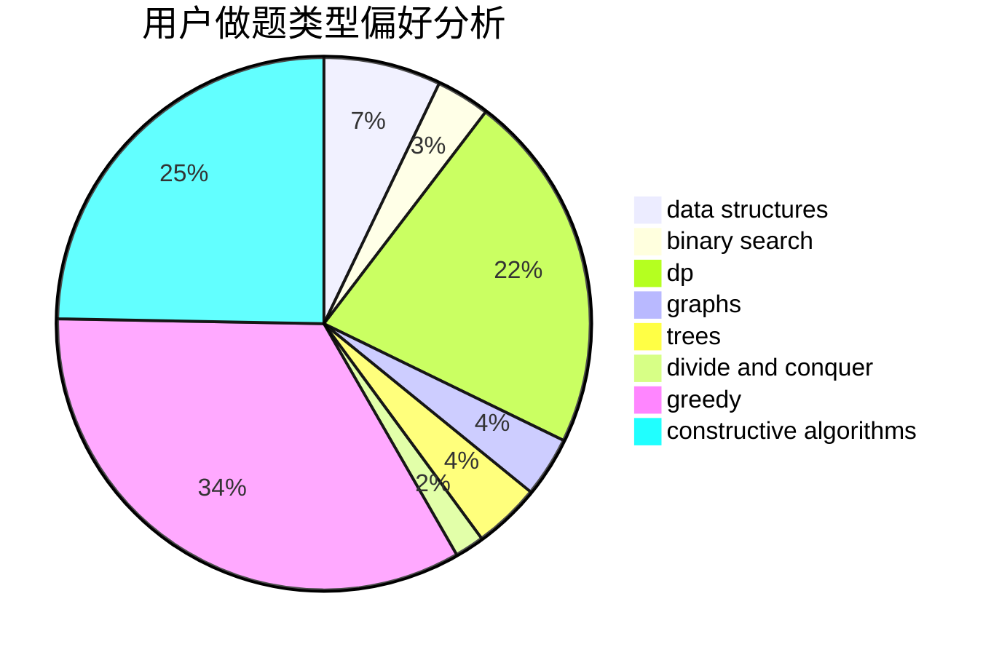

# ertuan

<!-- tabs:start -->

#### **用户提交结果分析**

#### **用户做题类型偏好分析**

#### **用户错题知识点分析**

<!-- tabs:end -->
# 推荐题目
[1428B](https://codeforces.com/contest/1428/problem/B)		graphs,
                        implementation		  
[1391B](https://codeforces.com/contest/1391/problem/B)		brute force,
                        greedy,
                        implementation		  
[1225E](https://codeforces.com/contest/1225/problem/E)		binary search,
                        dp		  
[1178C](https://codeforces.com/contest/1178/problem/C)		combinatorics,
                        greedy,
                        math		  
[870A](https://codeforces.com/contest/870/problem/A)		brute force,
                        implementation		  
[1278A](https://codeforces.com/contest/1278/problem/A)		brute force,
                        implementation,
                        strings		  
[932B](https://codeforces.com/contest/932/problem/B)		binary search,
                        data structures,
                        dfs and similar		  
[258A](https://codeforces.com/contest/258/problem/A)		greedy,
                        math		  
[1151C](https://codeforces.com/contest/1151/problem/C)		constructive algorithms,
                        math		  
[1293D](https://codeforces.com/contest/1293/problem/D)		dsu,graphs,sortings,trees		  
