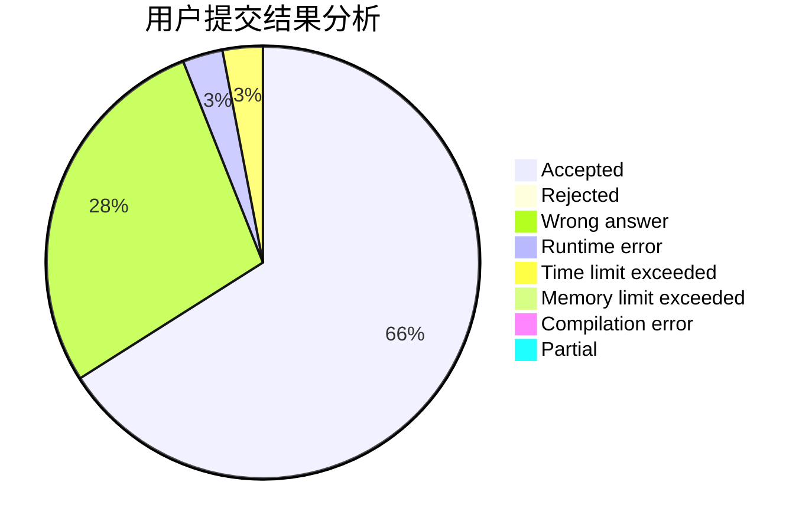
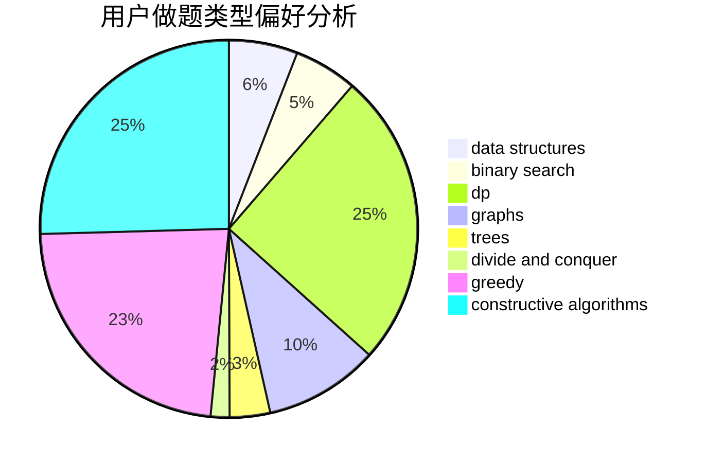

# ertuan

<!-- tabs:start -->

#### **用户提交结果分析**

#### **用户做题类型偏好分析**

#### **用户错题知识点分析**

<!-- tabs:end -->
# 推荐题目
[1420D](https://codeforces.com/contest/1420/problem/D)		combinatorics,
                        data structures,
                        sortings		  
[1381A1](https://codeforces.com/contest/1381A/problem/1)		constructive algorithms,
                        data structures,
                        strings		  
[1218C](https://codeforces.com/contest/1218/problem/C)		dp		  
[1175C](https://codeforces.com/contest/1175/problem/C)		binary search,
                        brute force,
                        greedy		  
[851D](https://codeforces.com/contest/851/problem/D)		dsu,graphs,sortings,trees		  
[1269A](https://codeforces.com/contest/1269/problem/A)		brute force,
                        math		  
[913D](https://codeforces.com/contest/913/problem/D)		binary search,
                        brute force,
                        data structures,
                        greedy,
                        sortings		  
[235B](https://codeforces.com/contest/235/problem/B)		dp,
                        math,
                        probabilities		  
[1149E](https://codeforces.com/contest/1149/problem/E)		games,
                        graphs		  
[1286C1](https://codeforces.com/contest/1286C/problem/1)		brute force,
                        constructive algorithms,
                        interactive,
                        math		  
