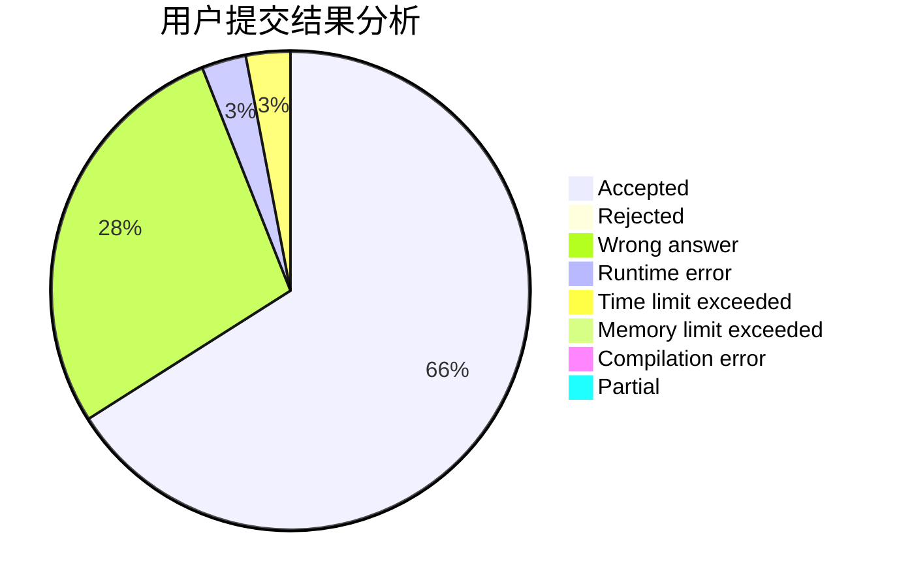
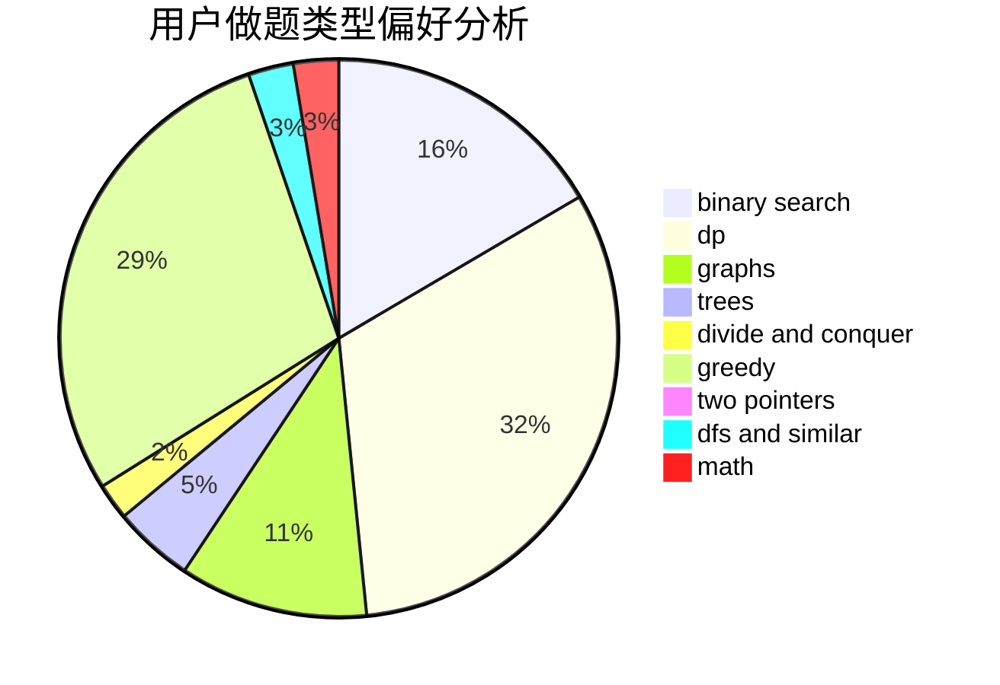

# ertuan

<!-- tabs:start -->

#### **用户提交结果分析**

#### **用户做题类型偏好分析**

<!-- tabs:end -->
# 推荐题目
[1428B](https://codeforces.com/contest/1428/problem/B)
[1391B](https://codeforces.com/contest/1391/problem/B)
[1225E](https://codeforces.com/contest/1225/problem/E)
[1178C](https://codeforces.com/contest/1178/problem/C)
[870A](https://codeforces.com/contest/870/problem/A)
[1278A](https://codeforces.com/contest/1278/problem/A)
[932B](https://codeforces.com/contest/932/problem/B)
[258A](https://codeforces.com/contest/258/problem/A)
[1151C](https://codeforces.com/contest/1151/problem/C)
[1293D](https://codeforces.com/contest/1293/problem/D)
