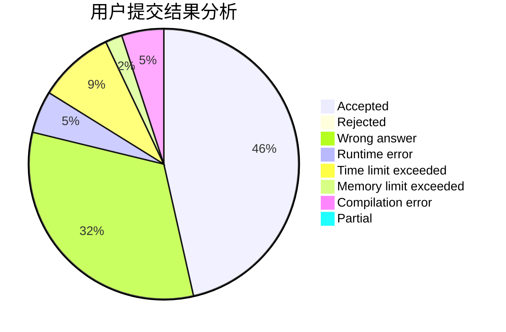
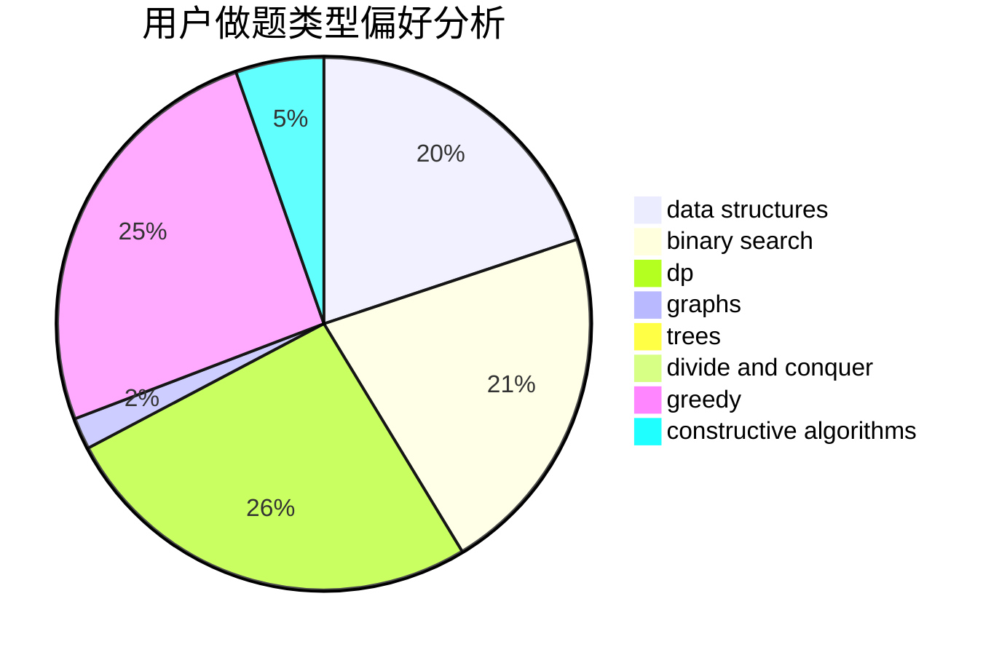
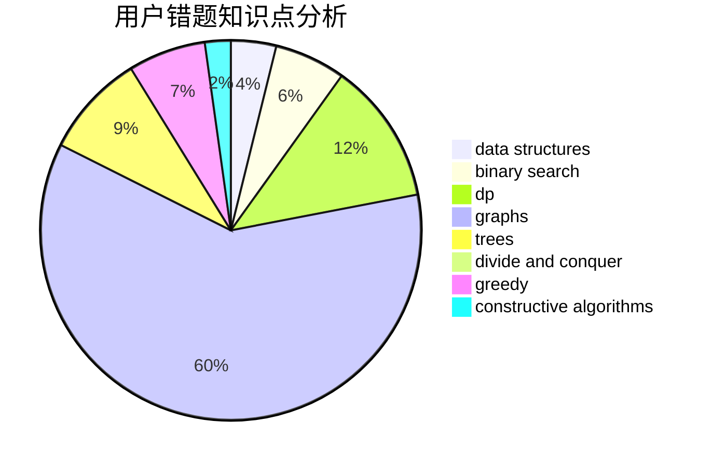

# evenny

<!-- tabs:start -->

#### **用户提交结果分析**

#### **用户做题类型偏好分析**

#### **用户错题知识点分析**

<!-- tabs:end -->
# 推荐题目
[669C](https://codeforces.com/contest/669/problem/C)		dsu,graphs,sortings,trees		  
[872B](https://codeforces.com/contest/872/problem/B)		dsu,graphs,sortings,trees		  
[1262A](https://codeforces.com/contest/1262/problem/A)		dsu,graphs,sortings,trees		  
[272E](https://codeforces.com/contest/272/problem/E)		combinatorics,
                        constructive algorithms,
                        graphs		  
[774G](https://codeforces.com/contest/774/problem/G)		*special problem,
                        number theory		  
[1357D5](https://codeforces.com/contest/1357D/problem/5)		nan		  
[674F](https://codeforces.com/contest/674/problem/F)		dsu,graphs,sortings,trees		  
[477E](https://codeforces.com/contest/477/problem/E)		data structures		  
[1217D](https://codeforces.com/contest/1217/problem/D)		constructive algorithms,
                        dfs and similar,
                        graphs		  
[712E](https://codeforces.com/contest/712/problem/E)		data structures,
                        math,
                        probabilities		  
