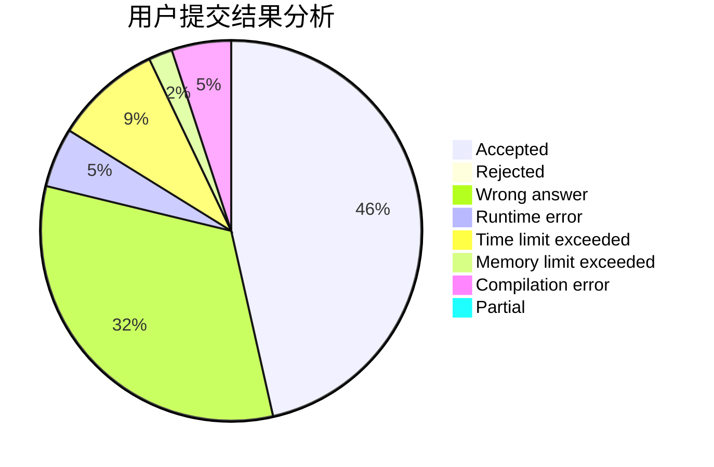
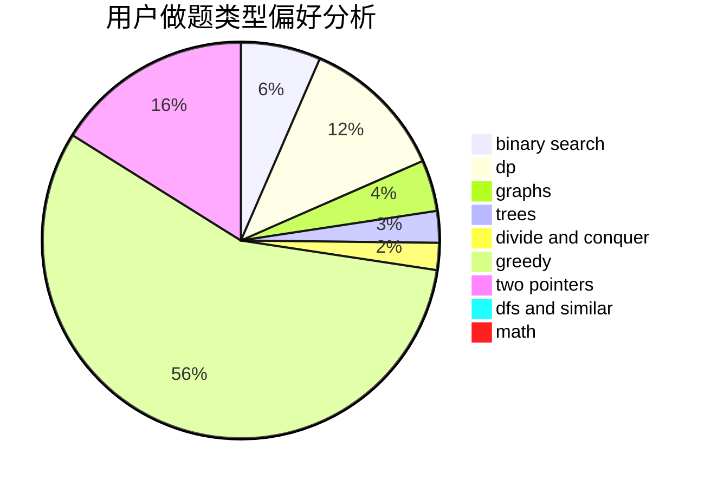

# evenny

<!-- tabs:start -->

#### **用户提交结果分析**

#### **用户做题类型偏好分析**

<!-- tabs:end -->
# 推荐题目
[691C](https://codeforces.com/contest/691/problem/C)
[893D](https://codeforces.com/contest/893/problem/D)
[1267I](https://codeforces.com/contest/1267/problem/I)
[288E](https://codeforces.com/contest/288/problem/E)
[793F](https://codeforces.com/contest/793/problem/F)
[1365G](https://codeforces.com/contest/1365/problem/G)
[699C](https://codeforces.com/contest/699/problem/C)
[497E](https://codeforces.com/contest/497/problem/E)
[1225A](https://codeforces.com/contest/1225/problem/A)
[732A](https://codeforces.com/contest/732/problem/A)
