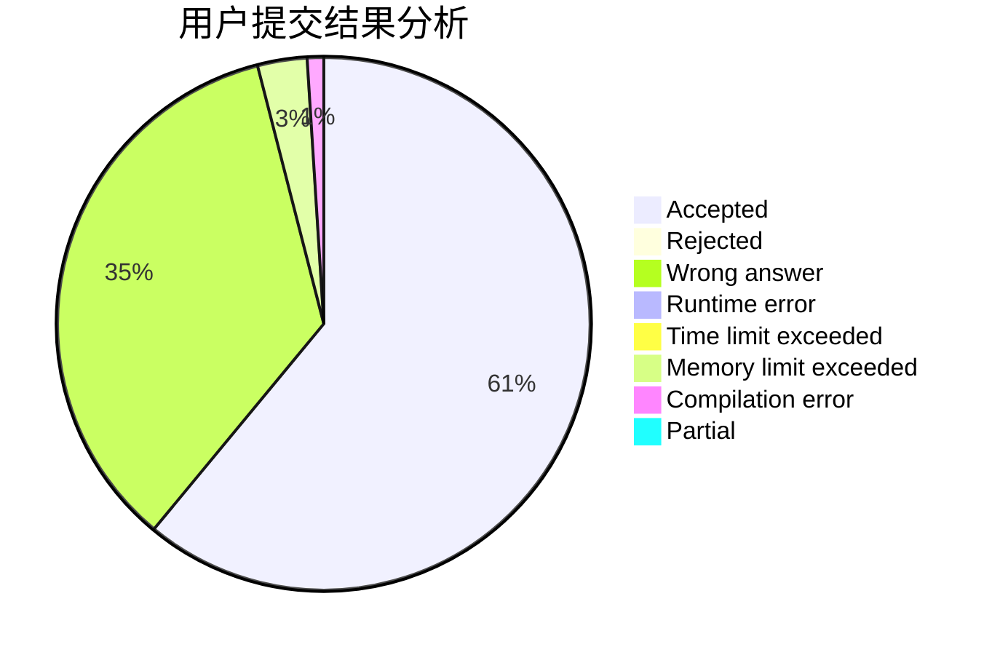
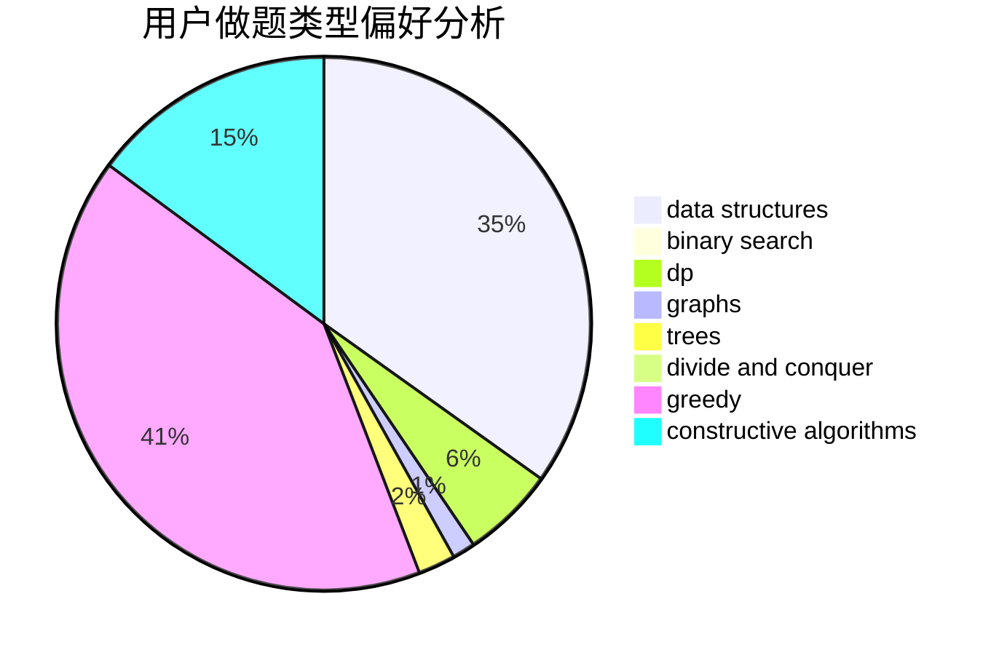

# expect2004

<!-- tabs:start -->

#### **用户提交结果分析**

#### **用户做题类型偏好分析**

#### **用户错题知识点分析**

<!-- tabs:end -->
# 推荐题目
[962A](https://codeforces.com/contest/962/problem/A)		implementation		  
[1197B](https://codeforces.com/contest/1197/problem/B)		greedy,
                        implementation		  
[1294F](https://codeforces.com/contest/1294/problem/F)		dfs and similar,
                        dp,
                        greedy,
                        trees		  
[691D](https://codeforces.com/contest/691/problem/D)		dfs and similar,
                        dsu,
                        math		  
[174B](https://codeforces.com/contest/174/problem/B)		dp,
                        greedy,
                        implementation		  
[1236B](https://codeforces.com/contest/1236/problem/B)		combinatorics,
                        math		  
[1386B](https://codeforces.com/contest/1386/problem/B)		*special problem,
                        data structures,
                        geometry,
                        math,
                        sortings		  
[778D](https://codeforces.com/contest/778/problem/D)		constructive algorithms		  
[810C](https://codeforces.com/contest/810/problem/C)		dsu,graphs,sortings,trees		  
[1070M](https://codeforces.com/contest/1070/problem/M)		constructive algorithms,
                        divide and conquer,
                        geometry		  
