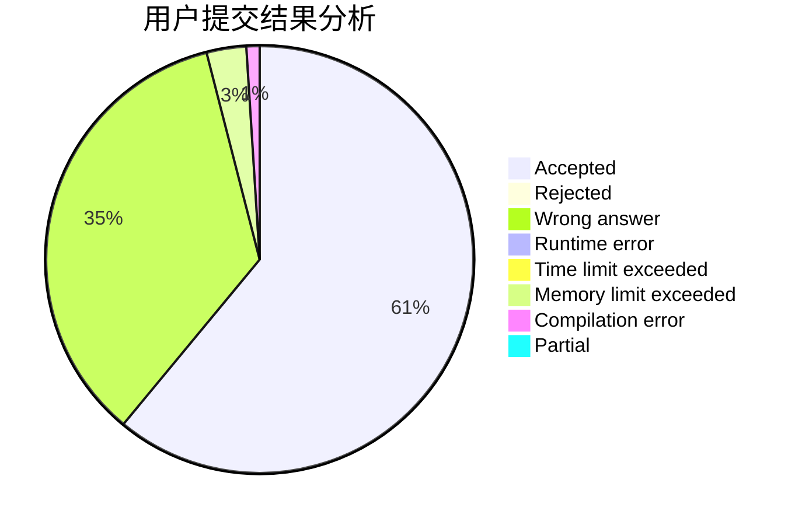
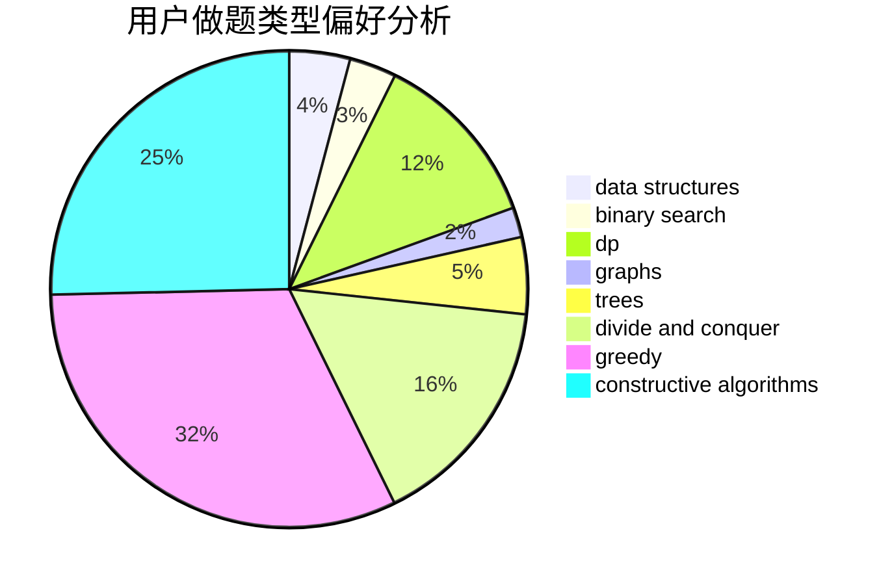

# expect2004
<!-- tabs:start -->
#### **用户提交结果分析**

#### **用户做题类型偏好分析**

#### **用户错题知识点分析**

<!-- tabs:end -->
# 推荐题目
[Swapping Problem](http://codeforces.com/problemset/problem/1513/F)		brute force,
                        constructive algorithms,
                        data structures,
                        sortings		  
[Huawei Graph Mining Challenge](https://codeforces.com/contest/1377/problem/A1)		nan		  
[Nash Matrix](http://codeforces.com/problemset/problem/1316/D)		constructive algorithms,
                        dfs and similar,
                        graphs,
                        implementation		  
[Optimal Subsequences (Hard Version)](http://codeforces.com/problemset/problem/1227/D2)		data structures,
                        greedy		  
[Little Artem and Dance](https://codeforces.com/contest/669/problem/D)		brute force,
                        constructive algorithms,
                        implementation		  
[Bubble Cup hypothesis](https://codeforces.com/contest/1424/problem/I)		bitmasks,
                        constructive algorithms,
                        dp,
                        math		  
[Travel Card](https://codeforces.com/contest/759/problem/B)		binary search,
                        dp		  
[Alena And The Heater](http://codeforces.com/problemset/problem/940/D)		binary search,
                        implementation		  
[Beautiful Fibonacci Problem](http://codeforces.com/problemset/problem/1264/F)		constructive algorithms,
                        number theory		  
[Streets and Avenues in Berhattan](http://codeforces.com/problemset/problem/1070/J)		dp		  
<!-- tabs:start -->
#### **data structures**
[Swapping Problem](http://codeforces.com/problemset/problem/1513/F)		brute force,
                        constructive algorithms,
                        data structures,
                        sortings		  
[Huawei Graph Mining Challenge](http://codeforces.com/problemset/problem/1227/D2)		data structures,
                        greedy		  
[Nash Matrix](http://codeforces.com/problemset/problem/863/D)		data structures,
                        implementation		  
[Optimal Subsequences (Hard Version)](https://codeforces.com/contest/1150/problem/E)		data structures,
                        implementation,
                        trees		  
[Little Artem and Dance](http://codeforces.com/problemset/problem/1264/C)		data structures,
                        probabilities		  
[Bubble Cup hypothesis](https://codeforces.com/contest/205/problem/D)		binary search,
                        data structures		  
[Travel Card](http://codeforces.com/problemset/problem/1444/C)		data structures,
                        dfs and similar,
                        dsu,
                        graphs		  
[Alena And The Heater](http://codeforces.com/problemset/problem/731/D)		brute force,
                        data structures,
                        greedy,
                        sortings		  
[Beautiful Fibonacci Problem](http://codeforces.com/problemset/problem/1407/D)		data structures,
                        dp,
                        graphs		  
[Streets and Avenues in Berhattan](http://codeforces.com/problemset/problem/644/B)		*special problem,
                        constructive algorithms,
                        data structures,
                        two pointers		  
#### **binary search**
[Swapping Problem](https://codeforces.com/contest/759/problem/B)		binary search,
                        dp		  
[Huawei Graph Mining Challenge](http://codeforces.com/problemset/problem/940/D)		binary search,
                        implementation		  
[Nash Matrix](https://codeforces.com/contest/205/problem/D)		binary search,
                        data structures		  
[Optimal Subsequences (Hard Version)](http://codeforces.com/problemset/problem/701/C)		binary search,
                        strings,
                        two pointers		  
[Little Artem and Dance](http://codeforces.com/problemset/problem/1010/A)		binary search,
                        math		  
[Bubble Cup hypothesis](http://codeforces.com/problemset/problem/1355/C)		binary search,
                        implementation,
                        math,
                        two pointers		  
[Travel Card](http://codeforces.com/problemset/problem/1492/C)		binary search,
                        data structures,
                        dp,
                        greedy,
                        two pointers		  
[Alena And The Heater](http://codeforces.com/problemset/problem/1463/D)		binary search,
                        constructive algorithms,
                        greedy,
                        two pointers		  
[Beautiful Fibonacci Problem](http://codeforces.com/problemset/problem/1490/G)		binary search,
                        data structures,
                        math		  
[Streets and Avenues in Berhattan](http://codeforces.com/problemset/problem/1479/D)		binary search,
                        bitmasks,
                        brute force,
                        data structures,
                        probabilities,
                        trees		  
#### **dp**
[Swapping Problem](https://codeforces.com/contest/1424/problem/I)		bitmasks,
                        constructive algorithms,
                        dp,
                        math		  
[Huawei Graph Mining Challenge](https://codeforces.com/contest/759/problem/B)		binary search,
                        dp		  
[Nash Matrix](http://codeforces.com/problemset/problem/1070/J)		dp		  
[Optimal Subsequences (Hard Version)](http://codeforces.com/problemset/problem/1209/E1)		bitmasks,
                        brute force,
                        dp,
                        greedy,
                        sortings		  
[Little Artem and Dance](https://codeforces.com/contest/1287/problem/C)		dp,
                        greedy,
                        sortings		  
[Bubble Cup hypothesis](http://codeforces.com/problemset/problem/219/C)		brute force,
                        dp,
                        greedy		  
[Travel Card](http://codeforces.com/problemset/problem/877/B)		brute force,
                        dp		  
[Alena And The Heater](http://codeforces.com/problemset/problem/1268/E)		dp		  
[Beautiful Fibonacci Problem](http://codeforces.com/problemset/problem/1105/E)		bitmasks,
                        brute force,
                        dp,
                        meet-in-the-middle		  
[Streets and Avenues in Berhattan](http://codeforces.com/problemset/problem/1407/D)		data structures,
                        dp,
                        graphs		  
#### **graph**
[Swapping Problem](http://codeforces.com/problemset/problem/1316/D)		constructive algorithms,
                        dfs and similar,
                        graphs,
                        implementation		  
[Huawei Graph Mining Challenge](https://codeforces.com/contest/1471/problem/D)		bitmasks,
                        graphs,
                        hashing,
                        math,
                        number theory		  
[Nash Matrix](https://codeforces.com/contest/218/problem/C)		brute force,
                        dfs and similar,
                        dsu,
                        graphs		  
[Optimal Subsequences (Hard Version)](http://codeforces.com/problemset/problem/949/C)		dfs and similar,
                        graphs		  
[Little Artem and Dance](http://codeforces.com/problemset/problem/1444/C)		data structures,
                        dfs and similar,
                        dsu,
                        graphs		  
[Bubble Cup hypothesis](https://codeforces.com/contest/1047/problem/D)		brute force,
                        constructive algorithms,
                        flows,
                        graph matchings		  
[Travel Card](http://codeforces.com/problemset/problem/132/E)		flows,
                        graphs		  
[Alena And The Heater](http://codeforces.com/problemset/problem/1407/D)		data structures,
                        dp,
                        graphs		  
[Beautiful Fibonacci Problem](http://codeforces.com/problemset/problem/1010/F)		fft,
                        graphs,
                        trees		  
[Streets and Avenues in Berhattan](http://codeforces.com/problemset/problem/1468/M)		data structures,
                        graphs,
                        implementation		  
#### **trees**
[Swapping Problem](https://codeforces.com/contest/1150/problem/E)		data structures,
                        implementation,
                        trees		  
[Huawei Graph Mining Challenge](http://codeforces.com/problemset/problem/1010/F)		fft,
                        graphs,
                        trees		  
[Nash Matrix](http://codeforces.com/problemset/problem/342/E)		data structures,
                        divide and conquer,
                        trees		  
[Optimal Subsequences (Hard Version)](http://codeforces.com/problemset/problem/1479/D)		binary search,
                        bitmasks,
                        brute force,
                        data structures,
                        probabilities,
                        trees		  
[Little Artem and Dance](http://codeforces.com/problemset/problem/1511/C)		brute force,
                        data structures,
                        implementation,
                        trees		  
[Bubble Cup hypothesis](http://codeforces.com/problemset/problem/1499/F)		combinatorics,
                        dfs and similar,
                        dp,
                        trees		  
[Travel Card](http://codeforces.com/problemset/problem/1491/E)		brute force,
                        dfs and similar,
                        divide and conquer,
                        number theory,
                        trees		  
[Alena And The Heater](http://codeforces.com/problemset/problem/1466/D)		data structures,
                        greedy,
                        sortings,
                        trees		  
[Beautiful Fibonacci Problem](http://codeforces.com/problemset/problem/1495/D)		combinatorics,
                        dfs and similar,
                        graphs,
                        math,
                        shortest paths,
                        trees		  
[Streets and Avenues in Berhattan](http://codeforces.com/problemset/problem/1303/G)		data structures,
                        divide and conquer,
                        geometry,
                        trees		  
#### **divide and conquer**
[Swapping Problem](http://codeforces.com/problemset/problem/342/E)		data structures,
                        divide and conquer,
                        trees		  
[Huawei Graph Mining Challenge](http://codeforces.com/problemset/problem/1461/D)		binary search,
                        brute force,
                        data structures,
                        divide and conquer,
                        implementation,
                        sortings		  
[Nash Matrix](http://codeforces.com/problemset/problem/1466/G)		combinatorics,
                        divide and conquer,
                        hashing,
                        math,
                        string suffix structures,
                        strings		  
[Optimal Subsequences (Hard Version)](http://codeforces.com/problemset/problem/1490/D)		dfs and similar,
                        divide and conquer,
                        implementation		  
[Little Artem and Dance](https://codeforces.com/contest/1483/problem/C)		data structures,
                        divide and conquer,
                        dp		  
[Bubble Cup hypothesis](http://codeforces.com/problemset/problem/1491/E)		brute force,
                        dfs and similar,
                        divide and conquer,
                        number theory,
                        trees		  
[Travel Card](http://codeforces.com/problemset/problem/1303/G)		data structures,
                        divide and conquer,
                        geometry,
                        trees		  
[Alena And The Heater](http://codeforces.com/problemset/problem/1494/D)		constructive algorithms,
                        data structures,
                        dfs and similar,
                        divide and conquer,
                        dsu,
                        greedy,
                        sortings,
                        trees		  
[Beautiful Fibonacci Problem](http://codeforces.com/problemset/problem/1482/E)		data structures,
                        divide and conquer,
                        dp		  
[Streets and Avenues in Berhattan](http://codeforces.com/problemset/problem/566/C)		dfs and similar,
                        divide and conquer,
                        trees		  
#### **greedy**
[Swapping Problem](http://codeforces.com/problemset/problem/1227/D2)		data structures,
                        greedy		  
[Huawei Graph Mining Challenge](http://codeforces.com/problemset/problem/1209/E1)		bitmasks,
                        brute force,
                        dp,
                        greedy,
                        sortings		  
[Nash Matrix](https://codeforces.com/contest/1287/problem/C)		dp,
                        greedy,
                        sortings		  
[Optimal Subsequences (Hard Version)](http://codeforces.com/problemset/problem/219/C)		brute force,
                        dp,
                        greedy		  
[Little Artem and Dance](http://codeforces.com/problemset/problem/873/C)		greedy,
                        two pointers		  
[Bubble Cup hypothesis](http://codeforces.com/problemset/problem/794/C)		games,
                        greedy,
                        sortings		  
[Travel Card](http://codeforces.com/problemset/problem/731/D)		brute force,
                        data structures,
                        greedy,
                        sortings		  
[Alena And The Heater](http://codeforces.com/problemset/problem/538/H)		2-sat,
                        data structures,
                        dfs and similar,
                        greedy		  
[Beautiful Fibonacci Problem](https://codeforces.com/contest/1240/problem/B)		dp,
                        greedy,
                        two pointers		  
[Streets and Avenues in Berhattan](http://codeforces.com/problemset/problem/1197/D)		dp,
                        greedy,
                        math		  
#### **constructive algorithms**
[Swapping Problem](http://codeforces.com/problemset/problem/1513/F)		brute force,
                        constructive algorithms,
                        data structures,
                        sortings		  
[Huawei Graph Mining Challenge](http://codeforces.com/problemset/problem/1316/D)		constructive algorithms,
                        dfs and similar,
                        graphs,
                        implementation		  
[Nash Matrix](https://codeforces.com/contest/669/problem/D)		brute force,
                        constructive algorithms,
                        implementation		  
[Optimal Subsequences (Hard Version)](https://codeforces.com/contest/1424/problem/I)		bitmasks,
                        constructive algorithms,
                        dp,
                        math		  
[Little Artem and Dance](http://codeforces.com/problemset/problem/1264/F)		constructive algorithms,
                        number theory		  
[Bubble Cup hypothesis](https://codeforces.com/contest/1047/problem/D)		brute force,
                        constructive algorithms,
                        flows,
                        graph matchings		  
[Travel Card](http://codeforces.com/problemset/problem/644/B)		*special problem,
                        constructive algorithms,
                        data structures,
                        two pointers		  
[Alena And The Heater](http://codeforces.com/problemset/problem/1513/B)		bitmasks,
                        combinatorics,
                        constructive algorithms,
                        math		  
[Beautiful Fibonacci Problem](http://codeforces.com/problemset/problem/1392/E)		bitmasks,
                        constructive algorithms,
                        interactive,
                        math		  
[Streets and Avenues in Berhattan](http://codeforces.com/problemset/problem/1400/C)		2-sat,
                        brute force,
                        constructive algorithms,
                        greedy		  
#### **sortings**
[Swapping Problem](http://codeforces.com/problemset/problem/1513/F)		brute force,
                        constructive algorithms,
                        data structures,
                        sortings		  
[Huawei Graph Mining Challenge](http://codeforces.com/problemset/problem/1209/E1)		bitmasks,
                        brute force,
                        dp,
                        greedy,
                        sortings		  
[Nash Matrix](https://codeforces.com/contest/1287/problem/C)		dp,
                        greedy,
                        sortings		  
[Optimal Subsequences (Hard Version)](http://codeforces.com/problemset/problem/794/C)		games,
                        greedy,
                        sortings		  
[Little Artem and Dance](http://codeforces.com/problemset/problem/731/D)		brute force,
                        data structures,
                        greedy,
                        sortings		  
[Bubble Cup hypothesis](https://codeforces.com/contest/1496/problem/C)		geometry,
                        greedy,
                        math,
                        sortings		  
[Travel Card](http://codeforces.com/problemset/problem/1495/A)		geometry,
                        greedy,
                        math,
                        sortings		  
[Alena And The Heater](http://codeforces.com/problemset/problem/1497/A)		brute force,
                        data structures,
                        greedy,
                        sortings		  
[Beautiful Fibonacci Problem](http://codeforces.com/problemset/problem/1427/A)		math,
                        sortings		  
[Streets and Avenues in Berhattan](http://codeforces.com/problemset/problem/1461/D)		binary search,
                        brute force,
                        data structures,
                        divide and conquer,
                        implementation,
                        sortings		  
<!-- tabs:end -->
