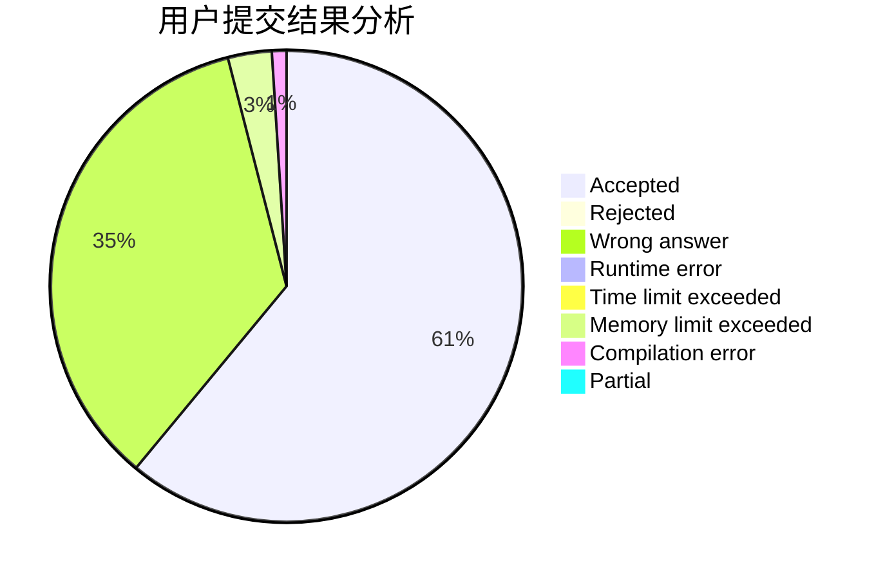
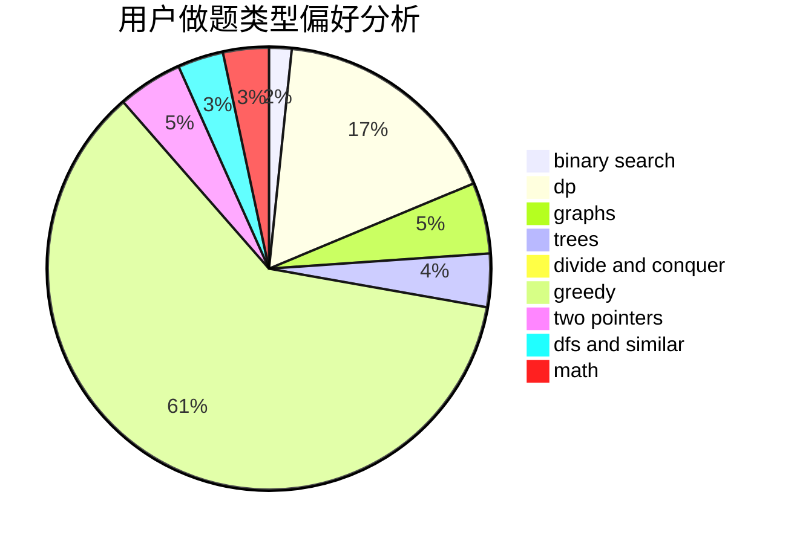

# expect2004

<!-- tabs:start -->

#### **用户提交结果分析**

#### **用户做题类型偏好分析**

<!-- tabs:end -->
# 推荐题目
[962A](https://codeforces.com/contest/962/problem/A)
[1197B](https://codeforces.com/contest/1197/problem/B)
[1294F](https://codeforces.com/contest/1294/problem/F)
[691D](https://codeforces.com/contest/691/problem/D)
[174B](https://codeforces.com/contest/174/problem/B)
[1236B](https://codeforces.com/contest/1236/problem/B)
[1386B](https://codeforces.com/contest/1386/problem/B)
[778D](https://codeforces.com/contest/778/problem/D)
[810C](https://codeforces.com/contest/810/problem/C)
[1070M](https://codeforces.com/contest/1070/problem/M)
