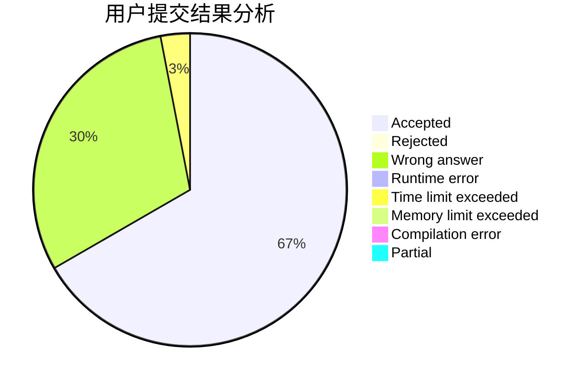
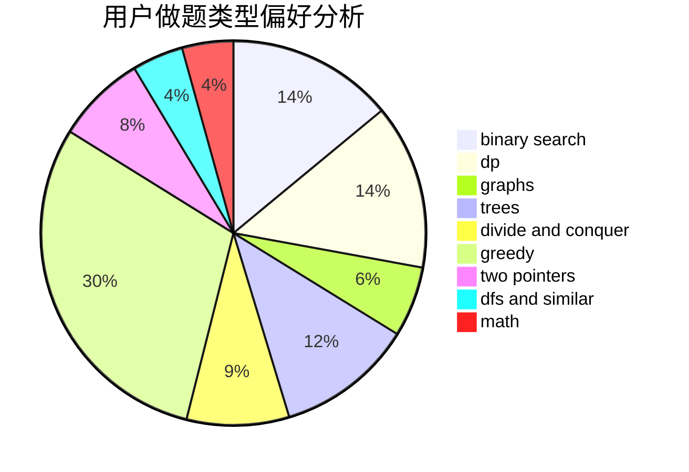

# expwmh

<!-- tabs:start -->

#### **用户提交结果分析**

#### **用户做题类型偏好分析**

<!-- tabs:end -->
# 推荐题目
[893D](https://codeforces.com/contest/893/problem/D)
[1295E](https://codeforces.com/contest/1295/problem/E)
[777E](https://codeforces.com/contest/777/problem/E)
[1088B](https://codeforces.com/contest/1088/problem/B)
[521A](https://codeforces.com/contest/521/problem/A)
[771C](https://codeforces.com/contest/771/problem/C)
[938D](https://codeforces.com/contest/938/problem/D)
[900B](https://codeforces.com/contest/900/problem/B)
[38E](https://codeforces.com/contest/38/problem/E)
[543C](https://codeforces.com/contest/543/problem/C)
