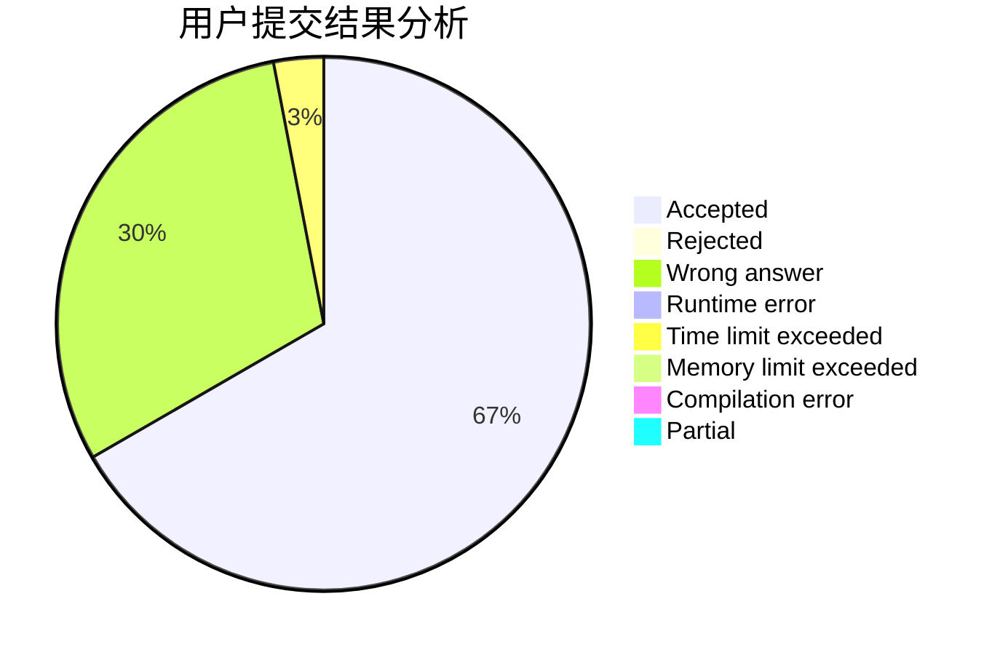
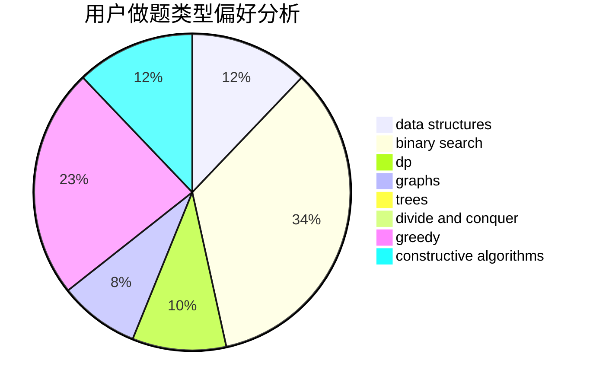
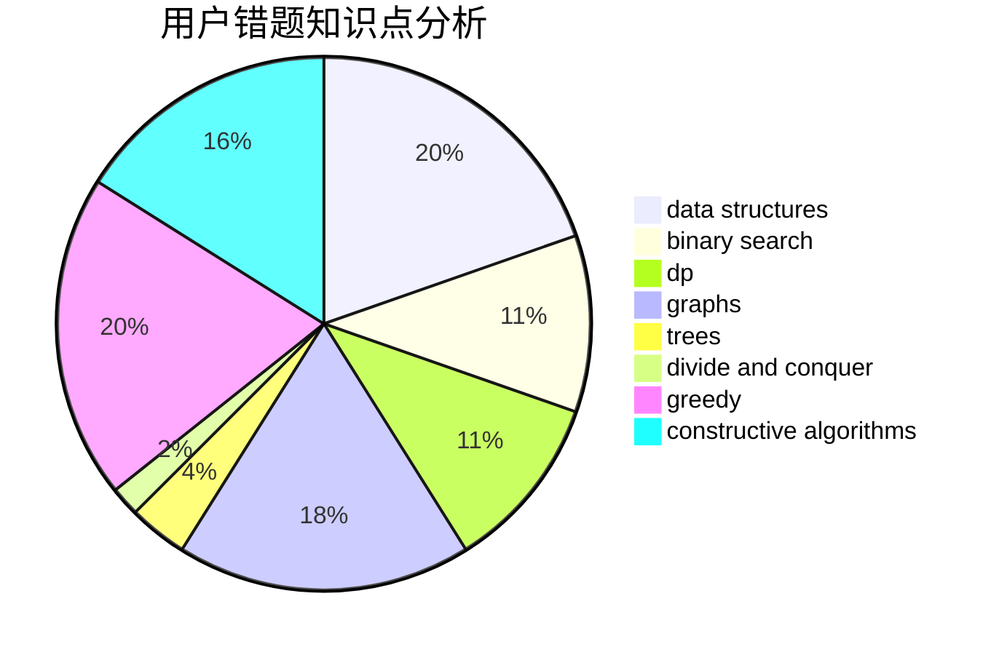

# expwmh

<!-- tabs:start -->

#### **用户提交结果分析**

#### **用户做题类型偏好分析**

#### **用户错题知识点分析**

<!-- tabs:end -->
# 推荐题目
[872B](https://codeforces.com/contest/872/problem/B)		dsu,graphs,sortings,trees		  
[1288C](https://codeforces.com/contest/1288/problem/C)		combinatorics,
                        dp		  
[758E](https://codeforces.com/contest/758/problem/E)		dfs and similar,
                        dp,
                        graphs,
                        greedy,
                        trees		  
[1087E](https://codeforces.com/contest/1087/problem/E)		dsu,graphs,sortings,trees		  
[500A](https://codeforces.com/contest/500/problem/A)		dfs and similar,
                        graphs,
                        implementation		  
[750G](https://codeforces.com/contest/750/problem/G)		bitmasks,
                        brute force,
                        combinatorics,
                        dp		  
[918A](https://codeforces.com/contest/918/problem/A)		brute force,
                        implementation		  
[883C](https://codeforces.com/contest/883/problem/C)		binary search,
                        implementation		  
[364A](https://codeforces.com/contest/364/problem/A)		combinatorics,
                        data structures,
                        implementation		  
[516C](https://codeforces.com/contest/516/problem/C)		dsu,graphs,sortings,trees		  
