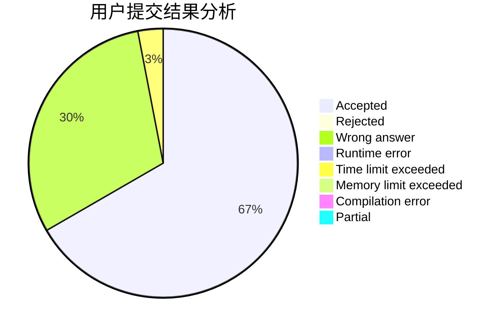
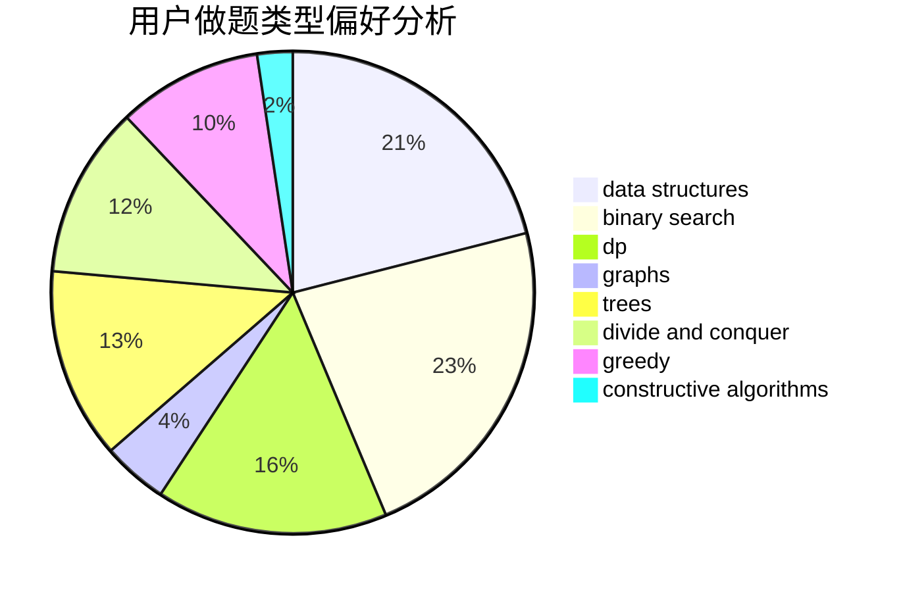
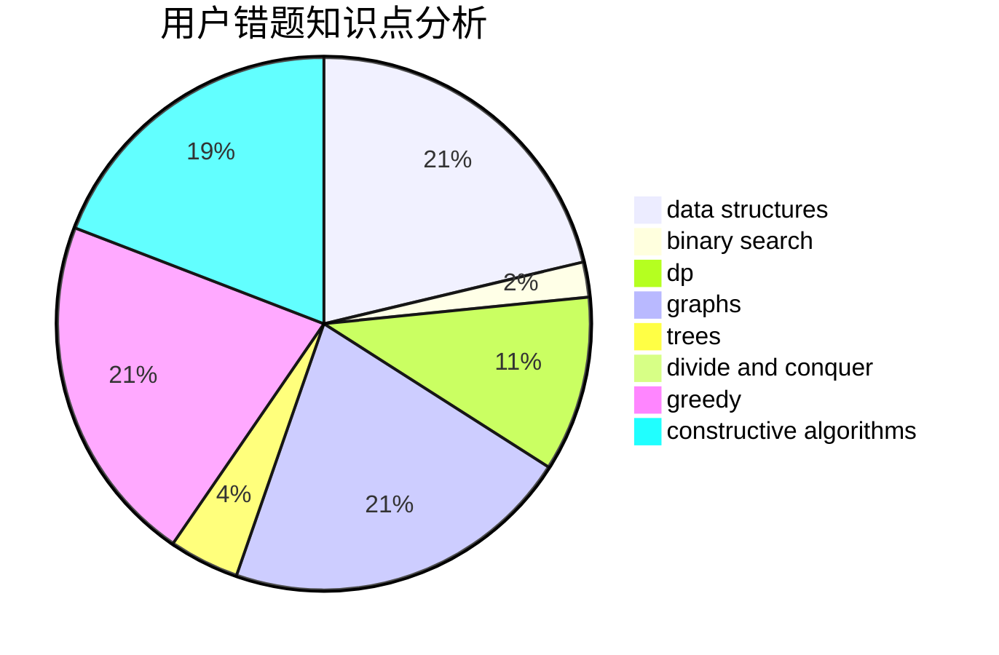

# expwmh

<!-- tabs:start -->

#### **用户提交结果分析**

#### **用户做题类型偏好分析**

#### **用户错题知识点分析**

<!-- tabs:end -->
# 推荐题目
[893D](https://codeforces.com/contest/893/problem/D)		data structures,
                        dp,
                        greedy,
                        implementation		  
[1295E](https://codeforces.com/contest/1295/problem/E)		data structures,
                        divide and conquer		  
[777E](https://codeforces.com/contest/777/problem/E)		brute force,
                        data structures,
                        dp,
                        greedy,
                        sortings		  
[1088B](https://codeforces.com/contest/1088/problem/B)		implementation,
                        sortings		  
[521A](https://codeforces.com/contest/521/problem/A)		dsu,graphs,sortings,trees		  
[771C](https://codeforces.com/contest/771/problem/C)		dfs and similar,
                        dp,
                        trees		  
[938D](https://codeforces.com/contest/938/problem/D)		data structures,
                        graphs,
                        shortest paths		  
[900B](https://codeforces.com/contest/900/problem/B)		math,
                        number theory		  
[38E](https://codeforces.com/contest/38/problem/E)		dp,
                        sortings		  
[543C](https://codeforces.com/contest/543/problem/C)		bitmasks,
                        dp		  
